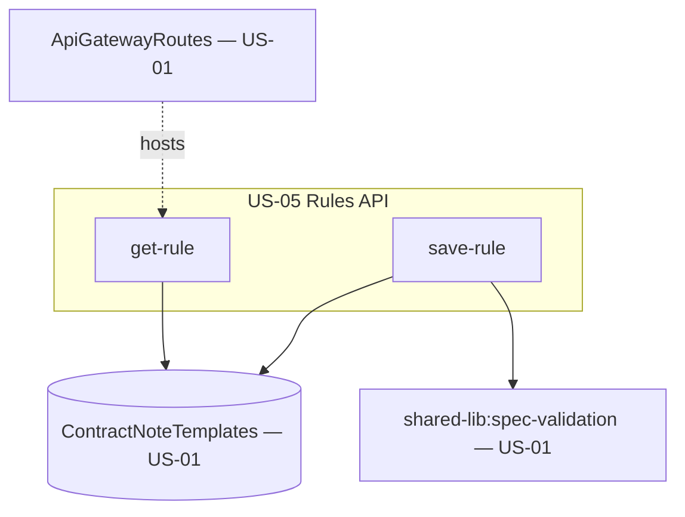

# Design Document

**Story US-05 — Template selection rules API**

> Mini-spec derived from parent spec **contract-note-template-management**, story **US-05**.
> This design is an excerpt of the parent design scoped to this story's components.

## Overview

US-05 implements the Rules API — two handlers that read and write a template's
selection Specification (a `RULE` record on the shared table). Saving validates the
tree with the shared `spec-validation` utility from US-01 and rejects malformed trees
with node-path errors. This is the persistence half of rule configuration; render-time
evaluation lives in US-06 and the tree editor UI in US-09.

## Architecture

This story owns the Rules API layer, attached to the US-01 route surface. It reads and
writes a single record shape and delegates well-formedness checks to the shared
validator.

## Components and Interfaces

### lambda:rules-handlers

| Method | Path | Handler | Description |
|--------|------|---------|-------------|
| GET | /contract-note-templates/{id}/rule | get-rule | Return the specification JSON tree |
| PUT | /contract-note-templates/{id}/rule | save-rule | Validate then persist the specification |

`save-rule` validates via `spec-validation`; on failure it returns 400 with the
incomplete node paths and does not write. On success it persists the specification map
to the `TEMPLATE#{id}` / `RULE` record.

### Interfaces consumed (dependencies)

- `shared-lib:types` (US-01) — the `SpecificationNode` union.
- `shared-lib:spec-validation` (US-01) — tree well-formedness validation on save.
- `data-table:ContractNoteTemplates` (US-01) — the `RULE` record.
- `cdk-construct:ApiGatewayRoutes` (US-01) — the routes these handlers bind to.

### Touch points with other stories

- **US-06 Render pipeline** reads the saved specification and evaluates it against
  contract data (first-match-wins across templates).
- **US-09 RulesConfigComponent** is the tree editor that calls get/save-rule; the same
  editor is reused for variant rules (US-04/US-09).

## Data Models

This story creates no new tables. It reads/writes the Rule record on the shared table:

| Attribute | Type | Description |
|-----------|------|-------------|
| PK | String | `TEMPLATE#{templateId}` |
| SK | String | `RULE` |
| specification | Map | JSON specification tree |
| updatedAt | String | ISO 8601 timestamp |
| updatedBy | String | Cognito username |

The specification tree uses `{ type, leftOperand, rightOperand }` for AND/OR,
`{ type, operand }` for NOT, `{ type, field, value }` for EQUALS/LESS_THAN/MORE_THAN,
and `{ type, field, values }` for IN.

## Correctness Properties

These are carried from the parent spec; this story's handlers validate them.

### Property 20: Specification tree serialization round-trip

*For any* valid specification tree, serializing to JSON and deserializing (as done on
save then get) SHALL produce an equivalent tree. **Validates: Requirements 10.2, 10.3, 10.4**

### Property 21: Specification validation rejects malformed trees

*For any* structurally incomplete specification tree, save SHALL fail validation and
identify the incomplete nodes. **Validates: Requirements 10.5**

## Error Handling

| Scenario | Handling | HTTP Status |
|----------|----------|-------------|
| Malformed specification tree | Validation errors with node paths | 400 |
| Template not found | Not found error | 404 |
| DynamoDB write failure | Log error, return 500 | 500 |

## Testing Strategy

- Property tests (fast-check) for Properties 20 and 21, exercised through the save/get
  round-trip and malformed-tree rejection.
- Unit tests for save-rule validation error mapping and get-rule 404 handling.
