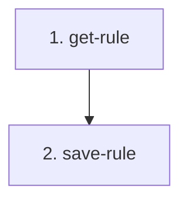

# Implementation Plan: Template selection rules API

> Mini-spec derived from parent spec **contract-note-template-management**, story **US-05**.
> Implement only after US-01 (foundation) is complete — reuses the shared
> spec-validation utility and attaches to the US-01 route surface.

## Overview

Implement the two Rules API handlers: get a template's selection specification, and
validate-then-save it. A small wave-2 story that unblocks render-time template
selection (US-06) and the rules editor UI (US-09).

## Tasks

- [ ] 1. Implement `get-rule` handler
  - Fetch the rule record by `TEMPLATE#{id}` / `RULE`; return the specification JSON tree
  - _Requirements: 1_

- [ ] 2. Implement `save-rule` handler
  - Validate the specification tree with the shared `spec-validation` utility (US-01)
  - Return 400 with node-path errors if malformed; persist the validated specification
    otherwise
  - _Requirements: 1_

## Task Dependency Graph



Execution waves (tasks in the same wave have no dependency on each other and may run in parallel):

```json
{
  "waves": [
    { "wave": 1, "tasks": ["1"] },
    { "wave": 2, "tasks": ["2"] }
  ]
}
```

## Upstream story dependencies

US-01 — provides `shared-lib:types`, `shared-lib:spec-validation`,
`data-table:ContractNoteTemplates` and `cdk-construct:ApiGatewayRoutes`.

## Notes

- Task requirement ids are local; they annotate their parent requirement ids for
  traceability back to `contract-note-template-management`.
- Specification well-formedness (Properties 20/21) is validated by the shared utility
  from US-01; render-time evaluation of the saved rule lives in US-06.
