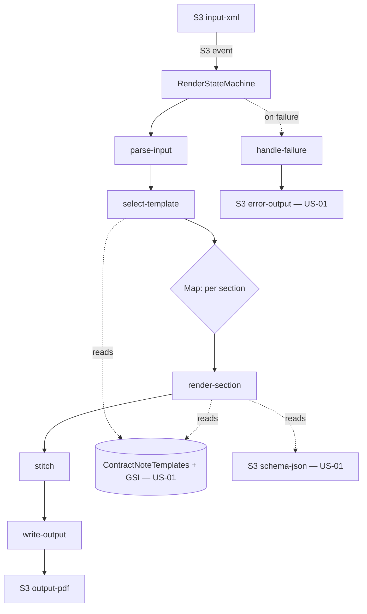

# Design Document

**Story US-06 — Render pipeline (Step Functions)**

> Mini-spec derived from parent spec **contract-note-template-management**, story **US-06**.
> This design is an excerpt of the parent design scoped to this story's components.

## Overview

US-06 implements the `render-contract-note` Step Functions state machine that replaces
the legacy CreateHtml + html-to-pdf steps. It is triggered by an XML file arriving in
the input bucket and coordinates single-purpose Lambdas: parse input, select template
(first-match-wins), render each section in a Map state (resolving pinned version and
variant, rendering with @pdfme/generator), stitch with pdf-lib, and write the output —
routing to a failure handler that writes an error record and no partial output.

## Architecture

This story owns the render orchestration and its Lambdas, plus the input/output
buckets. It reads templates, sections, variants and rules from the shared table and
schema JSON from the `schema-json` bucket, and writes errors to the `error-output`
bucket (all from US-01).

The Map state processes sections independently with per-section retry, so a transient
failure on one section does not require re-running the whole document, and many-section
documents are not bound by a single Lambda's limits.

## Components and Interfaces

### state-machine:RenderStateMachine

States: `ParseInput` → `SelectTemplate` → `RenderSections` (Map) → `Stitch` →
`WriteOutput`, with a `HandleFailure` catch on any state. Started by the S3 input event.

### shared-lib:spec-evaluator

Recursive evaluator of a `SpecificationNode` against contract data: `EQUALS` (field ===
value), `IN` (value ∈ values), `LESS_THAN`/`MORE_THAN` (numeric), `AND`/`OR`/`NOT`
(logical). Reused for both template selection and variant-rule selection.

### lambda:parse-input

Parses the dropped XML into a JSON contract-data object preserving all fields.

### lambda:select-template

Fetches templates in priority order via the GSI, evaluates each specification with the
evaluator, returns the first match (first-match-wins); logs and halts if none match.

### lambda:render-section

Runs inside the Map state per section: resolves the reference's `pinnedVersionId`;
if the section has variants, evaluates each `Variant_Rule` in order and takes the first
match (else the default); fetches that variant version's schema JSON from S3; renders
via @pdfme/generator (text/multiVariableText/table plugins, NotoSans). Halts on failure.

### lambda:stitch

Concatenates section PDFs in section order with pdf-lib, T&C pages last.

### lambda:write-output

Writes the stitched PDF to the output bucket.

### lambda:handle-failure

On any state failure after retries, writes a JSON error record to the error bucket and
ensures no partial output PDF is written.

### Interfaces consumed (dependencies)

- `shared-lib:types` (US-01) — `SpecificationNode`, `Section`, `SectionVariant`, records.
- `data-table:ContractNoteTemplates` + `gsi:PriorityIndex` (US-01) — templates, sections,
  variants, rules; priority-ordered evaluation.
- `s3-bucket:schema-json` (US-01) — variant/version schema JSON to render.
- `s3-bucket:error-output` (US-01) — failure records.

### Touch points with other stories

- **US-05** persists the template selection rule this pipeline evaluates.
- **US-04** persists the pinned versions and ordered variants/rules this pipeline resolves.
- **US-10** wires the S3 trigger, IAM and deployment for this state machine.

## Data Models

This story defines no metadata records; it reads templates, sections, variants,
versions and rules from the shared table and schema JSON from S3. It creates two
buckets:

- `s3-bucket:input-xml` — incoming contract XML (pipeline entry point).
- `s3-bucket:output-pdf` — final stitched PDFs.

Error records written to the `error-output` bucket contain `timestamp`, `inputFile`,
`stage` (template-selection | section-render | stitching | output-write), `templateId`,
`sectionId`, `error` and `context`.

## Correctness Properties

These are carried from the parent spec; this story's components validate them.

### Property 22: First-match-wins template selection

*For any* ordered set of templates with specifications and any contract data, selection
SHALL pick the lowest-priority template whose specification is true, and no other.
**Validates: Requirements 5.3, 11.1, 11.2**

### Property 23: Specification operator evaluation correctness

*For any* contract data and leaf node: EQUALS true iff field equals value; IN true iff
value in set; LESS_THAN true iff field < threshold; MORE_THAN true iff field > threshold.
**Validates: Requirements 11.4, 11.5, 11.6**

### Property 24: Independent section rendering produces valid PDF

*For any* section with valid schema JSON and complete input data, rendering with
@pdfme/generator SHALL produce a non-empty valid PDF buffer. **Validates: Requirements 12.1**

### Property 25: PDF stitching preserves page count

*For any* list of valid PDF buffers, stitching them in order with pdf-lib SHALL produce
a single PDF whose page count equals the sum of the inputs'. **Validates: Requirements 13.1, 13.2**

### Property 26: XML-to-JSON parsing produces valid data structure

*For any* valid contract XML, parsing SHALL produce a JSON object containing all fields
present in the XML. **Validates: Requirements 14.2**

### Property 27: Pipeline failure produces no output

*For any* processing that fails at any stage, the output bucket SHALL NOT contain a file
for that contract note. **Validates: Requirements 14.4**

### Property 34: Render resolves the pinned version

*For any* section render, the schema JSON used SHALL be the one for the reference's
pinnedVersionId (not necessarily the latest). **Validates: Requirements 18.6**

### Property 35: Variant first-match-wins with default fallback

*For any* section with ordered variants and any contract data, render SHALL select the
first variant whose rule is true, else the default. **Validates: Requirements 19.4, 19.5**

### Property 36: Section with no variants preserves single-variant behaviour

*For any* section with no variants, rendering SHALL use the section's own schema.
**Validates: Requirements 19.8**

### Property 37: No-match with no default halts

*For any* section with variants, no match and no default, the pipeline SHALL log an
error and produce no output PDF. **Validates: Requirements 19.6**

### Property 38: Per-section failure isolation and no partial output

*For any* run where a section-level Map state fails after retries, the state machine
SHALL route to the failure state and write no output PDF. **Validates: Requirements 20.2, 20.3**

## Error Handling

| Scenario | Handling |
|----------|----------|
| No matching template | Log error with contract summary to error bucket; halt |
| Section schema fetch fails (S3) | Log with section + template id; halt; error bucket |
| Section render fails (pdf-me) | Log with section, template, pdf-me error; halt; error bucket |
| No variant match and no default | Log with section id; halt; error bucket |
| PDF stitching fails (pdf-lib) | Log with template id; halt; error bucket |
| XML parse failure | Log with filename; error bucket |
| Output S3 write failure | Log; error bucket |

All failures write a JSON error record (timestamp, inputFile, stage, templateId,
sectionId, error, context) and never leave a partial output PDF.

## Testing Strategy

- Property tests (fast-check) for Properties 22, 23, 24, 25, 26, 27, 34, 35, 36, 37, 38.
- Unit tests: evaluator per-operator cases, first-match-wins with known rule sets, XML
  parse of known inputs, stitch page-count, variant selection order and default fallback.
- Integration tests (US-10 owns full E2E): drop XML → PDF in output; invalid XML → error
  record, no output.
