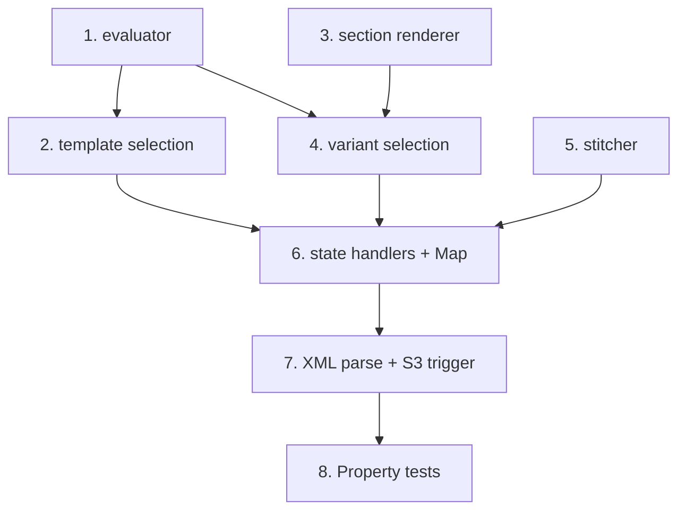

# Implementation Plan: Render pipeline (Step Functions)

> Mini-spec derived from parent spec **contract-note-template-management**, story **US-06**.
> Implement only after US-01 (foundation) is complete. It consumes the rules (US-05) and
> pinned-version/variant data (US-04) through the shared table at render time.

## Overview

Implement the Step Functions render pipeline: XML parse, first-match-wins template
selection, per-section render inside a Map state (pinned-version resolution + variant
selection + @pdfme/generator), pdf-lib stitching, output write, and a failure handler
that writes an error record with no partial output. Wave-4 story; its state machine is
wired into deployment by US-10.

## Tasks

- [ ] 1. Implement the specification evaluator
  - Recursive evaluator: EQUALS, IN, LESS_THAN, MORE_THAN, AND, OR, NOT against contract data
  - _Requirements: 1_

- [ ] 2. Implement template selection (first-match-wins)
  - Fetch templates in priority order via the GSI; evaluate each specification; return the
    first match; log and halt if none match
  - _Requirements: 1_

- [ ] 3. Implement section renderer + pinned-version resolution
  - Resolve the reference's pinnedVersionId; fetch that version's schema JSON; render via
    @pdfme/generator with text/multiVariableText/table plugins and NotoSans; halt on failure
  - _Requirements: 2_

- [ ] 4. Implement section variant selection (first match, default fallback)
  - Evaluate each Variant_Rule in variant order; take the first match, else the default;
    if none match and no default, log an error and halt; sections with no variants use the
    section's own schema
  - _Requirements: 2_

- [ ] 5. Implement the PDF stitcher (pdf-lib)
  - Concatenate section PDFs in order, T&C pages last
  - _Requirements: 3_

- [ ] 6. Implement Step Functions state handlers + Map state + failure state
  - Split into parse/select-template/render-section/stitch/write-output/handle-failure;
    render-section runs in the Map state as a retryable unit; failure after retries routes
    to handle-failure with no partial output; record per-run outcome
  - _Requirements: 5_

- [ ] 7. Implement XML-to-JSON parse + S3 trigger
  - Parse incoming XML into JSON; start on the S3 input event; write output PDF on success;
    on failure write an error record to the error bucket and no partial output
  - _Requirements: 4_

- [ ]* 8. Write property tests: evaluation, variants, stitching, failure isolation
  - Property 22 (first-match template), 23 (operator correctness), 24 (valid section PDF),
    25 (stitch page count), 26 (XML parse), 27 (failure = no output), 34 (pinned version),
    35 (variant first-match + default), 36 (no-variants behaviour), 37 (no-match halts),
    38 (per-section failure isolation)
  - _Requirements: 1, 2, 3, 4, 5_

## Task Dependency Graph



Execution waves (tasks in the same wave have no dependency on each other and may run in parallel):

```json
{
  "waves": [
    { "wave": 1, "tasks": ["1", "3", "5"] },
    { "wave": 2, "tasks": ["2", "4"] },
    { "wave": 3, "tasks": ["6"] },
    { "wave": 4, "tasks": ["7"] },
    { "wave": 5, "tasks": ["8"] }
  ]
}
```

## Upstream story dependencies

US-01 — `shared-lib:types`, `data-table:ContractNoteTemplates`, `gsi:PriorityIndex`,
`s3-bucket:schema-json`, `s3-bucket:error-output`. At render time it reads the rules
(US-05) and pinned-version/variant data (US-04) from the shared table.

## Notes

- Tasks marked with `*` are optional (property tests) and can be deferred for a faster MVP.
- Task requirement ids are local; they annotate their parent requirement ids for
  traceability back to `contract-note-template-management`.
- The evaluator (task 1) is shared by template selection (task 2) and variant selection
  (task 4). Deployment wiring (IAM, S3 trigger) is completed in US-10.
