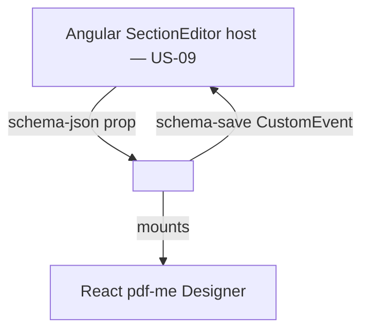

# Design Document

**Story US-07 — pdf-me Designer web component**

> Mini-spec derived from parent spec **contract-note-template-management**, story **US-07**.
> This design is an excerpt of the parent design scoped to this story's components.

## Overview

US-07 implements a thin Web Component wrapper around the React pdf-me Designer. Using a
custom element (`<pdfme-designer>`) avoids an Angular-React bridge library, isolates the
React dependency in its own on-demand bundle, and exposes a simple attribute-in /
event-out contract that any host framework can drive.

## Architecture

This story owns a standalone frontend bundle. It has no server or shared-type
dependency; it is pure presentation packaging. The Angular host (US-09) loads the bundle
on demand and communicates via a property and a CustomEvent.



## Components and Interfaces

### web-component:pdfme-designer

A custom element that:

1. Loads the React pdf-me Designer component (from a lazily loaded bundle).
2. Accepts a `schema-json` attribute/property for the initial schema.
3. Mounts the React root on `connectedCallback`; unmounts it on `disconnectedCallback`.
4. Dispatches a `schema-save` CustomEvent with the updated schema JSON on save.

Supported schema types: text, multiVariableText, table — with per-field position
(x, y), dimensions (width, height), font settings and alignment.

### Interfaces consumed (dependencies)

None — US-07 is a wave-1 story. It relies only on the React pdf-me Designer library it
bundles.

### Touch points with other stories

- **US-09 SectionEditorComponent** hosts this element inside an Angular modal, feeds it
  schema JSON from the Section API (US-03) and persists the `schema-save` payload.

## Data Models

This story defines no persisted data. It reads and emits the pdf-me Schema JSON
structure (owned by US-01's shared types / US-03's storage):

```json
{
  "schemas": [
    [
      { "name": "customerName", "type": "text", "position": { "x": 20, "y": 50 },
        "width": 150, "height": 12, "fontSize": 10, "fontName": "NotoSans",
        "alignment": "left" }
    ]
  ]
}
```

Each `schemas` entry is one page; fields within a page are pdf-me schema elements.

## Correctness Properties

This story's slice is UI packaging; the schema round-trip property below is the parent
property it participates in (the persisted round-trip is validated in US-03).

### Property 15: Schema JSON save/load round-trip

*For any* valid schema JSON passed in via `schema-json`, editing and saving SHALL emit an
equivalent, well-formed schema JSON structure via `schema-save`. **Validates: Requirements 7.1, 7.3**

## Error Handling

- If the designer bundle fails to load or mount, the component SHALL surface a failure
  state so the host (US-09) can show an error with a retry option (parent Requirement 7.5).
- Malformed incoming `schema-json` is handled defensively by initialising an empty
  designer rather than crashing the host page.

## Testing Strategy

- Unit tests for the custom element lifecycle (mount on connect, unmount on disconnect)
  and the `schema-save` event payload.
- A schema round-trip test (Property 15) feeding schema JSON in and asserting an
  equivalent structure is emitted on save.
- Manual/visual verification of the on-demand bundle load in the host modal (US-09).
