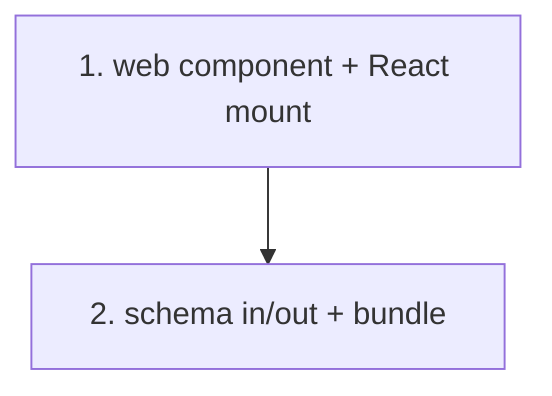

# Implementation Plan: pdf-me Designer web component

> Mini-spec derived from parent spec **contract-note-template-management**, story **US-07**.
> This is a wave-1 story with no upstream dependencies; it can be built in parallel with
> the backend foundation (US-01).

## Overview

Build the `<pdfme-designer>` Web Component wrapping the React pdf-me Designer: schema
JSON in via a property, updated schema JSON out via a `schema-save` CustomEvent, React
root mounted/unmounted with the element lifecycle, packaged as an on-demand bundle. The
Angular host that consumes it is delivered in US-09.

## Tasks

- [ ] 1. Build the `<pdfme-designer>` web component wrapping the React pdf-me Designer
  - Custom element that loads and mounts the React Designer on connectedCallback and
    unmounts on disconnectedCallback
  - Support text, multiVariableText and table schema types with position, dimensions,
    font and alignment
  - _Requirements: 1_

- [ ] 2. Wire schema-json in / schema-save event out; on-demand bundle load
  - Accept a `schema-json` attribute/property for initial state; dispatch a `schema-save`
    CustomEvent with the updated schema on save
  - Build as a separate bundle loaded on demand when the section editor opens
  - _Requirements: 1_

## Task Dependency Graph



Execution waves (tasks in the same wave have no dependency on each other and may run in parallel):

```json
{
  "waves": [
    { "wave": 1, "tasks": ["1"] },
    { "wave": 2, "tasks": ["2"] }
  ]
}
```

## Upstream story dependencies

None — this is a wave-1 story. Downstream, US-09's SectionEditorComponent hosts this
element.

## Notes

- Task requirement ids are local; they annotate their parent requirement ids for
  traceability back to `contract-note-template-management`.
- Being dependency-free, this story can proceed alongside the backend foundation.
