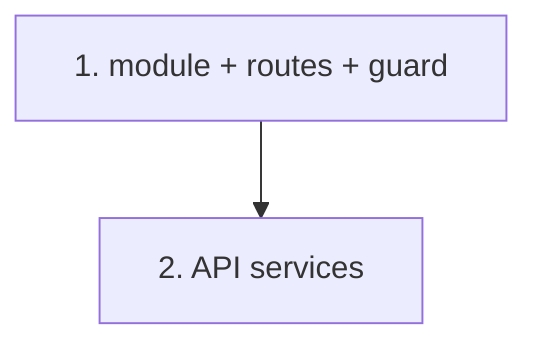

# Implementation Plan: Angular module, routing & services

> Mini-spec derived from parent spec **contract-note-template-management**, story **US-08**.
> Implement after the API stories (US-02/03/04/05) so the services have real endpoints to
> call; depends on the shared types from US-01.

## Overview

Create the `ContractNoteModule` with routes and a Cognito-group route guard, and
implement `TemplateService`, `SectionService` and `RulesService` wired to the API
Gateway endpoints. Wave-4 story that gives the US-09 screens their routing and data layer.

## Tasks

- [ ] 1. Create ContractNoteModule with routes + Cognito group route guard
  - Module at `portal/src/app/components/contract-notes/`; routes for template list,
    template edit, shared sections, rules config
  - Route guard: redirect unauthenticated to login; access-denied for authenticated
    users without the required Cognito group
  - _Requirements: 1_

- [ ] 2. Implement TemplateService, SectionService, RulesService wired to the API
  - TemplateService: list/create/get/update/delete/reorder
  - SectionService: section CRUD + reorder; schema get/save; version list/get/revert;
    shared-section CRUD + references; publish; variants + variant rules
  - RulesService: get/save specification for a template (reusable for variant rules)
  - Type payloads with the shared interfaces; target the API Gateway endpoints
  - _Requirements: 2_

## Task Dependency Graph



Execution waves (tasks in the same wave have no dependency on each other and may run in parallel):

```json
{
  "waves": [
    { "wave": 1, "tasks": ["1"] },
    { "wave": 2, "tasks": ["2"] }
  ]
}
```

## Upstream story dependencies

- US-01 — `shared-lib:types`.
- US-02 — `api-endpoint:GET /contract-note-templates` (template endpoints).
- US-03 — `sections-crud`, `section-versions`, `shared-sections-crud`.
- US-04 — `section-publish`, `section-variants-crud`, `variant-rule`.
- US-05 — `template-rule`.

## Notes

- Task requirement ids are local; they annotate their parent requirement ids for
  traceability back to `contract-note-template-management`.
- The portal sidebar navigation entry that links into this module is added in US-10.
