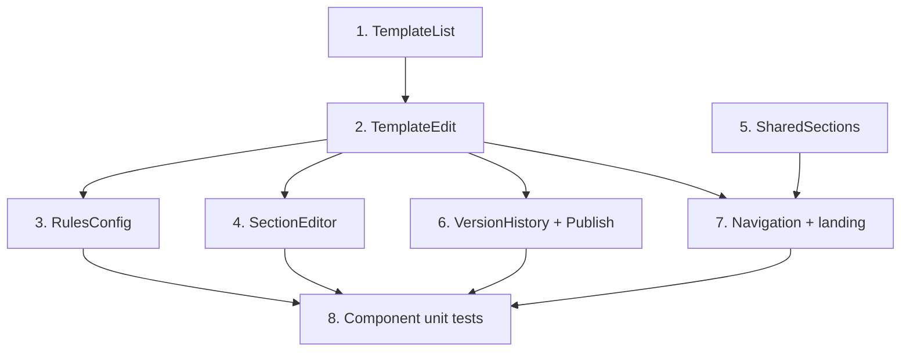

# Implementation Plan: Angular screens & components

> Mini-spec derived from parent spec **contract-note-template-management**, story **US-09**.
> Implement after US-08 (module + services) and US-07 (pdf-me designer). Wave-5 story.

## Overview

Build the full set of contract-note admin screens and components: template list and edit
landing pages, the recursive rules editor, the section editor modal hosting the pdf-me
designer, shared sections library, version history and publish surfaces, inline variants
manager, and navigation. All data comes from the US-08 services.

## Tasks

- [ ] 1. Implement TemplateListComponent (landing page)
  - Table with name/description/section-count/priority, reorder, create/edit/delete/
    configure-rules, empty state, deletion confirmation
  - _Requirements: 1_

- [ ] 2. Implement TemplateEditComponent + change log + variant list
  - Name/description form (required + duplicate validation), ordered section list with
    add/remove/reorder (new/shared/T&C), per-section version badge + history button,
    collapsible change log panel
  - _Requirements: 1_

- [ ] 3. Implement RulesConfigComponent (shared by template + variant rules)
  - Recursive tree editor (AND/OR/NOT + EQUALS/LESS_THAN/MORE_THAN/IN), add/remove nodes,
    leaf config, validation with incomplete-node highlighting
  - _Requirements: 2_

- [ ] 4. Implement SectionEditorComponent host (modal)
  - Host `<pdfme-designer>`, load schema from the API, save on `schema-save`, error/retry
    state if the designer fails to load
  - _Requirements: 3_

- [ ] 5. Implement SharedSectionsComponent + detail
  - List shared sections (name/type/reference count), referencing templates, create/edit/
    delete with referenced-deletion warnings
  - _Requirements: 4_

- [ ] 6. Implement SectionVersionHistoryComponent + SectionPublishComponent
  - Version history (current highlighted; previous with preview/revert); publish a chosen
    version to linked templates with update-available indicators and confirmation
  - _Requirements: 3_

- [ ] 7. Implement Navigation + landing pages (page vs modal)
  - Full landing pages for Template List and Shared Sections Library with Cognito-gated
    nav entry points; section editor and version history as modals within a landing page
  - _Requirements: 4_

- [ ]* 8. Component unit tests
  - TemplateList rendering/empty state/actions; RulesConfig tree manipulation + validation;
    SectionEditor lifecycle/events; SectionVariants ordering/default; SectionPublish
    publish-to-all confirmation
  - _Requirements: 1, 2, 3, 4_

## Task Dependency Graph



Execution waves (tasks in the same wave have no dependency on each other and may run in parallel):

```json
{
  "waves": [
    { "wave": 1, "tasks": ["1", "5"] },
    { "wave": 2, "tasks": ["2"] },
    { "wave": 3, "tasks": ["3", "4", "6", "7"] },
    { "wave": 4, "tasks": ["8"] }
  ]
}
```

## Upstream story dependencies

- US-08 — `ContractNoteModule`, `TemplateService`, `SectionService`, `RulesService`.
- US-07 — `web-component:pdfme-designer` (hosted by the section editor).

## Notes

- Tasks marked with `*` are optional (unit tests) and can be deferred for a faster MVP.
- Task requirement ids are local; they annotate their parent requirement ids for
  traceability back to `contract-note-template-management`.
- The portal sidebar entry routing into this navigation is added in US-10.
