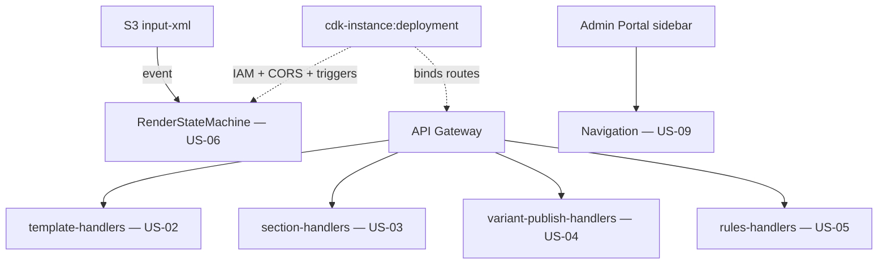

# Design Document

**Story US-10 — Integration wiring & end-to-end validation**

> Mini-spec derived from parent spec **contract-note-template-management**, story **US-10**.
> This design is an excerpt of the parent design scoped to this story's components.

## Overview

US-10 is the integration story. It provisions the CDK deployment that ties the feature
together: least-privilege IAM for every Lambda and the render state machine, the S3
input-event trigger for the state machine, API Gateway route-to-handler bindings, CORS
for the portal origin, and the Cognito-gated portal sidebar entry. It adds the end-to-end
tests that validate the full pipeline. It builds nothing new functionally; it connects
what the other stories produced.

## Architecture

This story owns the deployment/wiring layer that sits over every other story's outputs.

## Components and Interfaces

### cdk-instance:deployment

The CDK app/stack that:

1. Grants least-privilege IAM to each Lambda and the state machine for DynamoDB and S3.
2. Wires the S3 input-bucket notification (via S3 notification / EventBridge) to start a
   render execution.
3. Binds API Gateway routes to the correct Lambda handlers and configures CORS for the
   Admin Portal origin.
4. Adds the Cognito-gated portal sidebar navigation entry linking to the template list.
5. Ships the end-to-end integration tests.

### Interfaces consumed (dependencies)

- `lambda:template-handlers` (US-02), `lambda:section-handlers` (US-03),
  `lambda:variant-publish-handlers` (US-04), `lambda:rules-handlers` (US-05) — bound to
  API Gateway routes.
- `state-machine:RenderStateMachine` (US-06) — started by the S3 event.
- `frontend-component:Navigation` (US-09) — surfaced in the portal sidebar.

### Touch points with other stories

- Consumes deployable units from every backend story and the frontend navigation; it is
  the terminal node of the delivery graph (nothing depends on it).

## Data Models

This story defines no data models. It configures access to the existing table and buckets
(from US-01) and the resources of the stories it wires.

## Correctness Properties

Integration correctness is validated end-to-end rather than as a unit property; the
parent's Property 27 is exercised here across real service boundaries.

### Property 27: Pipeline failure produces no output

*For any* processing that fails at any stage, the output bucket SHALL NOT contain a file
for that contract note — verified end-to-end with an invalid XML input.
**Validates: Requirements 14.4**

## Error Handling

| Scenario | Handling |
|----------|----------|
| Invalid XML dropped | Error record in error bucket; no output PDF (verified by E2E test) |
| IAM misconfiguration | Deployment fails fast; no partially wired stack published |
| API route/handler mismatch | Caught by route-binding assertions in the CDK tests |
| CORS misconfiguration | Portal requests fail preflight; caught in integration checks |

## Testing Strategy

- CDK synth/assertion tests: IAM grants present, S3 notification wired to the state
  machine, routes bound to the right handlers, CORS configured for the portal origin.
- End-to-end integration tests: drop valid XML → PDF in output bucket; drop invalid XML →
  error record in error bucket, no output PDF (Property 27).
- Manual verification of the Cognito-gated sidebar entry visibility.
