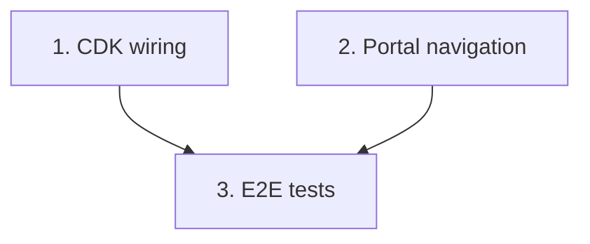

# Implementation Plan: Integration wiring & end-to-end validation

> Mini-spec derived from parent spec **contract-note-template-management**, story **US-10**.
> Implement last — after every backend handler, the render state machine and the frontend
> navigation exist. Wave-6 story.

## Overview

Wire the feature into a deployable whole with CDK: least-privilege IAM, the S3-triggered
render state machine, API Gateway route-to-handler bindings and CORS, plus the
Cognito-gated portal sidebar entry. Add end-to-end tests proving the pipeline works and
fails safely. This is the terminal story of the delivery graph.

## Tasks

- [ ] 1. CDK deployment wiring: IAM, S3-triggered state machine, API routes, CORS
  - Grant least-privilege IAM to each Lambda and the state machine for DynamoDB/S3
  - Wire the S3 input-event to start a Render_State_Machine execution
  - Bind API Gateway routes to the correct handlers; configure CORS for the portal origin
  - _Requirements: 1_

- [ ] 2. Portal sidebar navigation entry (Cognito-gated)
  - Add a sidebar menu item linking to the template list route, gated by Cognito group
  - _Requirements: 2_

- [ ]* 3. End-to-end pipeline integration tests
  - Drop valid XML → verify PDF appears in the output bucket
  - Drop invalid XML → verify an error record in the error bucket and no output PDF
  - _Requirements: 3_

## Task Dependency Graph



Execution waves (tasks in the same wave have no dependency on each other and may run in parallel):

```json
{
  "waves": [
    { "wave": 1, "tasks": ["1", "2"] },
    { "wave": 2, "tasks": ["3"] }
  ]
}
```

## Upstream story dependencies

- US-02 — `lambda:template-handlers`
- US-03 — `lambda:section-handlers`
- US-04 — `lambda:variant-publish-handlers`
- US-05 — `lambda:rules-handlers`
- US-06 — `state-machine:RenderStateMachine`
- US-09 — `frontend-component:Navigation`

## Notes

- Tasks marked with `*` are optional (E2E tests) and can be deferred for a faster MVP.
- Task requirement ids are local; they annotate their parent requirement ids for
  traceability back to `contract-note-template-management`.
- This is the terminal story: nothing depends on it. Completing it means the whole parent
  spec is delivered.
