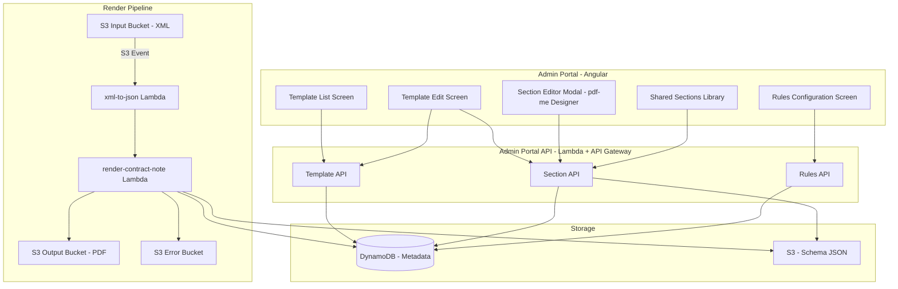
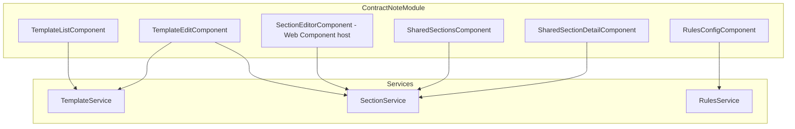

# Design Document: Contract Note Template Management

## Overview

This design covers Estimate 1 of the Bryt Energy Contract Note Rework: a template management system within the existing BrytAdminPortal that replaces the current developer-dependent SVG/HTML pipeline with a visual, business-user-managed approach using pdf-me.

The system introduces:
1. An Angular module in the Admin Portal for CRUD operations on templates, sections, and shared sections
2. A rules engine UI for configuring specification-pattern-based template selection
3. An embedded pdf-me Designer (React component via Web Component wrapper) for visual section editing
4. A serverless render pipeline (Lambda) that evaluates rules, renders sections with @pdfme/generator, and stitches PDFs with pdf-lib
5. DynamoDB for template/section metadata and S3 for schema JSON storage

The architecture maintains the existing S3-triggered pipeline entry point but replaces the internal rendering mechanism entirely.

## Architecture

### High-Level System Architecture



### Key Architecture Decisions

| Decision | Choice | Rationale |
|----------|--------|-----------|
| pdf-me Designer embedding | Web Component wrapper around React | Avoids Angular-React bridge library overhead; isolates React dependency; standard web platform approach |
| Template metadata storage | DynamoDB | Matches existing Admin Portal pattern; supports fast ordered queries via GSI |
| Schema JSON storage | S3 | Schema JSON can be large; S3 is cost-effective for blob storage; decouples metadata from content |
| Render pipeline | Single Lambda (not Step Functions) | Simpler for section-render-and-stitch; retains S3 trigger; avoids Step Function coordination overhead for a synchronous flow |
| Rules engine | Server-side evaluation in render Lambda | Rules evaluate against runtime contract data; no client-side evaluation needed |
| Section stitching | pdf-lib | Already proven in PoC; lightweight; handles page concatenation well |
| Priority ordering | Explicit `priority` integer field | Simple to reorder; DynamoDB GSI on priority enables ordered scan |

### Deployment Architecture

The solution deploys as:
- New Angular module within existing Admin Portal (same CloudFront + S3 hosting)
- New Lambda functions behind existing API Gateway
- New DynamoDB table for template/section metadata
- New S3 bucket for schema JSON definitions
- Modified render pipeline Lambda replacing the CreateHtml + html-to-pdf steps

## Components and Interfaces

### Frontend Components (Angular)



#### TemplateListComponent
- Displays ordered table of templates (name, description, section count, priority)
- Drag-and-drop or up/down buttons for reordering
- Actions: Create, Edit, Delete, Configure Rules
- Empty state when no templates exist

#### TemplateEditComponent
- Form for template name and description
- Section list showing ordered sections with add/remove/reorder
- Ability to add new section, add existing shared section, or attach T&Cs
- Section click opens SectionEditorComponent modal

#### RulesConfigComponent
- Visual tree editor for specification pattern
- Node types: AND, OR, NOT (logical), EQUALS, LESS_THAN, MORE_THAN, IN (comparison)
- Add/remove nodes, configure leaf values (field name, operator, value)
- Validation before save (well-formed tree check)

#### SectionEditorComponent
- Hosts the pdf-me Designer React component via a custom Web Component (`<pdfme-designer>`)
- Receives schema JSON on open, emits updated schema JSON on save
- Modal presentation with save/cancel actions

#### SharedSectionsComponent
- List of all shared sections with name, type (standard/T&C), and reference count
- Detail panel showing which templates reference a shared section
- Create/edit/delete actions with referencing-template warnings

### Backend API (Lambda Functions)

#### Template API (`lambdas-rest-api/contract-note-templates/`)

| Method | Path | Handler | Description |
|--------|------|---------|-------------|
| GET | /contract-note-templates | list-templates | Returns all templates ordered by priority |
| POST | /contract-note-templates | create-template | Creates template at lowest priority |
| GET | /contract-note-templates/{id} | get-template | Returns template with section list |
| PUT | /contract-note-templates/{id} | update-template | Updates name/description |
| DELETE | /contract-note-templates/{id} | delete-template | Deletes template, reorders remaining |
| PUT | /contract-note-templates/reorder | reorder-templates | Batch update priority order |

#### Section API (`lambdas-rest-api/contract-note-sections/`)

| Method | Path | Handler | Description |
|--------|------|---------|-------------|
| GET | /contract-note-templates/{id}/sections | list-sections | Returns sections for template in order |
| POST | /contract-note-templates/{id}/sections | add-section | Adds section to template |
| DELETE | /contract-note-templates/{id}/sections/{sectionId} | remove-section | Removes section from template |
| PUT | /contract-note-templates/{id}/sections/reorder | reorder-sections | Reorders sections within template |
| GET | /contract-note-sections/{id}/schema | get-section-schema | Returns schema JSON from S3 |
| PUT | /contract-note-sections/{id}/schema | save-section-schema | Saves schema JSON to S3 |
| GET | /contract-note-sections/shared | list-shared-sections | Lists all shared sections |
| POST | /contract-note-sections/shared | create-shared-section | Creates a new shared section |
| PUT | /contract-note-sections/shared/{id} | update-shared-section | Updates shared section metadata |
| DELETE | /contract-note-sections/shared/{id} | delete-shared-section | Deletes shared section (with ref check) |
| GET | /contract-note-sections/shared/{id}/references | get-shared-section-refs | Returns templates referencing this section |

#### Rules API (`lambdas-rest-api/contract-note-rules/`)

| Method | Path | Handler | Description |
|--------|------|---------|-------------|
| GET | /contract-note-templates/{id}/rule | get-rule | Returns specification JSON for template |
| PUT | /contract-note-templates/{id}/rule | save-rule | Validates and saves specification JSON |

### Render Pipeline Lambda

The `render-contract-note` Lambda replaces the existing CreateHtml + html-to-pdf steps:

```
Input: JSON contract data (from xml-to-json)
Process:
  1. Fetch all templates from DynamoDB ordered by priority
  2. Evaluate each template's specification against contract data (first match wins)
  3. For matched template, fetch ordered sections
  4. For each section, fetch schema JSON from S3
  5. Render each section independently via @pdfme/generator
  6. Stitch all section PDFs together via pdf-lib
  7. Write final PDF to output S3 bucket
Output: Stitched PDF in S3
```

### Web Component: pdfme-designer

A thin Web Component wrapper that:
1. Loads the React pdf-me Designer component
2. Accepts `schema-json` attribute (or property) for initial state
3. Dispatches `schema-save` CustomEvent with updated schema JSON
4. Handles lifecycle (mount/unmount React root on connectedCallback/disconnectedCallback)

Built as a separate bundle (React + pdf-me Designer), loaded on-demand when the section editor modal opens.


## Data Models

### DynamoDB Table: `ContractNoteTemplates`

Single-table design with PK/SK pattern.

#### Template Record

| Attribute | Type | Description |
|-----------|------|-------------|
| PK | String | `TEMPLATE#{templateId}` |
| SK | String | `METADATA` |
| templateId | String | UUID |
| name | String | Template display name (unique) |
| description | String | Template description |
| priority | Number | Evaluation priority (1 = highest) |
| sectionCount | Number | Denormalised count of sections |
| createdAt | String | ISO 8601 timestamp |
| updatedAt | String | ISO 8601 timestamp |
| createdBy | String | Cognito username |

#### Section Record (template-owned)

| Attribute | Type | Description |
|-----------|------|-------------|
| PK | String | `TEMPLATE#{templateId}` |
| SK | String | `SECTION#{sortOrder}#{sectionId}` |
| sectionId | String | UUID |
| name | String | Section display name |
| sortOrder | Number | Position within template |
| isShared | Boolean | Whether this references a shared section |
| sharedSectionId | String | (optional) Reference to shared section |
| schemaS3Key | String | S3 key for schema JSON |
| createdAt | String | ISO 8601 timestamp |
| updatedAt | String | ISO 8601 timestamp |

#### Shared Section Record

| Attribute | Type | Description |
|-----------|------|-------------|
| PK | String | `SHARED_SECTION#{sectionId}` |
| SK | String | `METADATA` |
| sectionId | String | UUID |
| name | String | Section display name |
| isTermsAndConditions | Boolean | Whether this is a T&C section |
| schemaS3Key | String | S3 key for schema JSON |
| createdAt | String | ISO 8601 timestamp |
| updatedAt | String | ISO 8601 timestamp |
| createdBy | String | Cognito username |

#### Shared Section Reference Record

| Attribute | Type | Description |
|-----------|------|-------------|
| PK | String | `SHARED_SECTION#{sectionId}` |
| SK | String | `REF#{templateId}` |
| templateId | String | Template using this shared section |
| templateName | String | Denormalised for display |

#### Rule Record

| Attribute | Type | Description |
|-----------|------|-------------|
| PK | String | `TEMPLATE#{templateId}` |
| SK | String | `RULE` |
| specification | Map | JSON specification tree (see below) |
| updatedAt | String | ISO 8601 timestamp |
| updatedBy | String | Cognito username |

#### GSI: PriorityIndex

| Key | Attribute |
|-----|-----------|
| GSI PK | `ALL_TEMPLATES` (constant) |
| GSI SK | `priority` (Number) |

Enables: Query all templates ordered by priority in a single query.

### Specification Tree JSON Structure

```json
{
  "type": "AND",
  "leftOperand": {
    "type": "EQUALS",
    "field": "offer.producttype",
    "value": "Fixed"
  },
  "rightOperand": {
    "type": "OR",
    "leftOperand": {
      "type": "IN",
      "field": "offer.region",
      "values": ["North", "South"]
    },
    "rightOperand": {
      "type": "MORE_THAN",
      "field": "offer.mpancount",
      "value": 5
    }
  }
}
```

Node types:
- **AND/OR**: `{ type, leftOperand, rightOperand }` — binary logical
- **NOT**: `{ type, operand }` — unary logical
- **EQUALS**: `{ type, field, value }` — exact match
- **LESS_THAN/MORE_THAN**: `{ type, field, value }` — numeric comparison
- **IN**: `{ type, field, values }` — set membership

### S3 Schema JSON Structure

Stored at `s3://{schema-bucket}/{sectionId}/schema.json`:

```json
{
  "schemas": [
    [
      {
        "name": "customerName",
        "type": "text",
        "position": { "x": 20, "y": 50 },
        "width": 150,
        "height": 12,
        "fontSize": 10,
        "fontName": "NotoSans",
        "alignment": "left"
      },
      {
        "name": "propertyTable",
        "type": "table",
        "position": { "x": 10, "y": 100 },
        "width": 190,
        "height": 400
      }
    ]
  ]
}
```

Each entry in the `schemas` array represents one page of the section. Fields within a page define the pdf-me schema elements.

### TypeScript Interfaces

```typescript
// Specification Tree
type LogicalOperator = 'AND' | 'OR' | 'NOT';
type ComparisonOperator = 'EQUALS' | 'LESS_THAN' | 'MORE_THAN' | 'IN';

interface AndOrNode {
  type: 'AND' | 'OR';
  leftOperand: SpecificationNode;
  rightOperand: SpecificationNode;
}

interface NotNode {
  type: 'NOT';
  operand: SpecificationNode;
}

interface ComparisonNode {
  type: 'EQUALS' | 'LESS_THAN' | 'MORE_THAN';
  field: string;
  value: string | number;
}

interface InNode {
  type: 'IN';
  field: string;
  values: (string | number)[];
}

type SpecificationNode = AndOrNode | NotNode | ComparisonNode | InNode;

// Template
interface Template {
  templateId: string;
  name: string;
  description: string;
  priority: number;
  sectionCount: number;
  createdAt: string;
  updatedAt: string;
  createdBy: string;
}

// Section
interface Section {
  sectionId: string;
  name: string;
  sortOrder: number;
  isShared: boolean;
  sharedSectionId?: string;
  schemaS3Key: string;
}

// Shared Section
interface SharedSection {
  sectionId: string;
  name: string;
  isTermsAndConditions: boolean;
  schemaS3Key: string;
  referenceCount?: number;
}
```


## Correctness Properties

*A property is a characteristic or behavior that should hold true across all valid executions of a system — essentially, a formal statement about what the system should do. Properties serve as the bridge between human-readable specifications and machine-verifiable correctness guarantees.*

### Property 1: Template listing returns priority-ordered results

*For any* set of templates stored in the system, listing all templates SHALL return them sorted by priority in ascending order (lowest priority number first).

**Validates: Requirements 1.1, 1.2**

### Property 2: Template creation round-trip

*For any* valid template name and description, creating a template and then fetching it by ID SHALL return the same name and description that were provided.

**Validates: Requirements 2.1**

### Property 3: New templates get lowest priority

*For any* existing set of N templates, creating a new template SHALL assign it priority N+1 (appended to end).

**Validates: Requirements 2.2**

### Property 4: Duplicate name rejection

*For any* template name that already exists in the system, attempting to create a new template with that same name SHALL fail with a validation error.

**Validates: Requirements 2.3**

### Property 5: Required field validation

*For any* template creation request with one or more missing required fields, the system SHALL return validation errors identifying exactly the missing fields.

**Validates: Requirements 2.4**

### Property 6: Template update round-trip

*For any* existing template and valid updated name/description, saving the update and then fetching the template SHALL return the new values.

**Validates: Requirements 3.1, 3.2**

### Property 7: Sections returned in sort order

*For any* template with sections, fetching the template's sections SHALL return them ordered by sortOrder ascending.

**Validates: Requirements 3.3**

### Property 8: Template deletion maintains contiguous priority

*For any* set of N templates with contiguous priorities 1..N, deleting one template SHALL result in the remaining N-1 templates having contiguous priorities 1..N-1.

**Validates: Requirements 4.2**

### Property 9: Shared sections survive template deletion

*For any* template that references shared sections, deleting that template SHALL not affect the existence or content of those shared sections.

**Validates: Requirements 4.3**

### Property 10: Priority reorder produces contiguous ordering

*For any* valid reorder operation on templates, the resulting priorities SHALL be contiguous integers starting from 1, and the relative order SHALL match the requested order.

**Validates: Requirements 5.1, 5.2**

### Property 11: Section addition appends to end

*For any* template with N sections, adding a new section SHALL result in N+1 sections where the new section has the highest sortOrder.

**Validates: Requirements 6.1**

### Property 12: Section removal maintains contiguous order

*For any* template with N sections, removing one section SHALL result in N-1 sections with contiguous sortOrder values.

**Validates: Requirements 6.2**

### Property 13: Shared section reference (no duplication)

*For any* shared section added to a template, the section record SHALL contain a reference (sharedSectionId) to the shared section and SHALL use the shared section's schemaS3Key rather than creating a copy.

**Validates: Requirements 6.4**

### Property 14: T&C sections positioned at end

*For any* template with both regular sections and T&C sections, all T&C sections SHALL have a sortOrder greater than all non-T&C sections.

**Validates: Requirements 6.5, 9.2**

### Property 15: Schema JSON save/load round-trip

*For any* valid schema JSON, saving it for a section and then loading it SHALL return an equivalent JSON structure.

**Validates: Requirements 7.1, 7.3**

### Property 16: Shared section visibility

*For any* section marked as shared (including T&C sections), it SHALL appear in the shared sections listing available to all templates.

**Validates: Requirements 8.1, 9.1, 9.4**

### Property 17: Shared section edit propagation

*For any* shared section referenced by multiple templates, updating the shared section's schema SHALL be reflected when loading the schema for any of those templates' sections.

**Validates: Requirements 8.2**

### Property 18: Shared section reference tracking

*For any* shared section, querying its references SHALL return exactly the set of templates that include it.

**Validates: Requirements 8.3**

### Property 19: Referenced shared section deletion protection

*For any* shared section that is referenced by one or more templates, deletion SHALL be blocked (or require explicit force) and the response SHALL list the referencing templates.

**Validates: Requirements 8.4**

### Property 20: Specification tree serialization round-trip

*For any* valid specification tree (composed of AND, OR, NOT, EQUALS, LESS_THAN, MORE_THAN, IN nodes), serializing to JSON and deserializing SHALL produce an equivalent tree.

**Validates: Requirements 10.2, 10.3, 10.4**

### Property 21: Specification validation rejects malformed trees

*For any* specification tree that is structurally incomplete (AND/OR missing operands, comparison nodes missing field or value), validation SHALL fail and identify the incomplete nodes.

**Validates: Requirements 10.5**

### Property 22: First-match-wins template selection

*For any* ordered set of templates with specifications, and any contract data, the render pipeline SHALL select the template with the lowest priority number whose specification evaluates to true, and no other.

**Validates: Requirements 5.3, 11.1, 11.2**

### Property 23: Specification operator evaluation correctness

*For any* contract data object and specification leaf node: EQUALS returns true iff field equals value; IN returns true iff field value is in the values set; LESS_THAN returns true iff field value < threshold; MORE_THAN returns true iff field value > threshold.

**Validates: Requirements 11.4, 11.5, 11.6**

### Property 24: Independent section rendering produces valid PDF

*For any* section with a valid schema JSON and complete input data, rendering the section with @pdfme/generator SHALL produce a non-empty valid PDF buffer.

**Validates: Requirements 12.1**

### Property 25: PDF stitching preserves page count

*For any* list of valid PDF buffers, stitching them together in order using pdf-lib SHALL produce a single PDF whose total page count equals the sum of the individual PDFs' page counts.

**Validates: Requirements 13.1, 13.2**

### Property 26: XML-to-JSON parsing produces valid data structure

*For any* valid contract XML input, parsing SHALL produce a JSON object containing all the fields present in the XML.

**Validates: Requirements 14.2**

### Property 27: Pipeline failure produces no output

*For any* contract note processing that fails at any stage, the output S3 bucket SHALL NOT contain a file for that contract note.

**Validates: Requirements 14.4**

## Error Handling

### Frontend Error Handling

| Scenario | Handling |
|----------|----------|
| API request failure (network) | Display toast notification with retry option; preserve form state |
| Validation errors (400) | Highlight invalid fields; display field-level error messages |
| Unauthorized (401) | Redirect to login flow via existing auth guard mechanism |
| Forbidden (403) | Display access denied message |
| Not found (404) | Display "template not found" message; redirect to list |
| Server error (500) | Display generic error toast; log to console; offer retry |
| Section Editor fails to load | Display error state in modal with retry button |
| Drag-and-drop reorder fails | Revert to previous order; display error notification |

### Backend Error Handling

| Scenario | Handling | HTTP Status |
|----------|----------|-------------|
| Missing required fields | Return field-level validation errors | 400 |
| Duplicate template name | Return specific duplicate error | 409 |
| Template not found | Return not found error | 404 |
| Shared section has references (on delete) | Return reference list | 409 |
| Malformed specification tree | Return validation errors with node paths | 400 |
| DynamoDB write failure | Log error, return 500 | 500 |
| S3 read/write failure | Log error, return 500 | 500 |
| Invalid schema JSON format | Return validation error | 400 |

### Render Pipeline Error Handling

| Scenario | Handling |
|----------|----------|
| No matching template | Log error with contract data summary to error bucket; halt |
| Section schema fetch fails (S3) | Log error with section ID and template ID; halt; write to error bucket |
| Section render fails (pdf-me) | Log error with section ID, template ID, and pdf-me error; halt; write to error bucket |
| PDF stitching fails (pdf-lib) | Log error with template ID; halt; write to error bucket |
| XML parse failure | Log error with filename; write to error bucket |
| Output S3 write failure | Log error; write to error bucket |

All pipeline errors write a JSON error record to the error S3 bucket containing:
```json
{
  "timestamp": "ISO-8601",
  "inputFile": "s3://input-bucket/filename.xml",
  "stage": "template-selection|section-render|stitching|output-write",
  "templateId": "uuid (if known)",
  "sectionId": "uuid (if applicable)",
  "error": "error message",
  "context": {}
}
```

## Testing Strategy

### Unit Testing

Framework: Jest (existing in both Admin Portal and Lambda projects)

Unit tests cover:
- **Specification tree validation** — specific valid/invalid tree structures
- **Specification evaluation** — specific contract data + rule combinations
- **Template priority management** — reorder/delete/create priority logic
- **Section ordering logic** — add/remove/reorder sort order management
- **Schema JSON validation** — format validation edge cases
- **XML-to-JSON transformation** — specific XML inputs and expected outputs
- **API request/response mapping** — handler input parsing and output formatting

### Property-Based Testing

Library: **fast-check** (TypeScript property-based testing library)

Configuration:
- Minimum 100 iterations per property test
- Custom arbitraries for specification trees, templates, sections, and contract data

Each property test is tagged with:
```
// Feature: contract-note-template-management, Property {N}: {property title}
```

Property tests implement the Correctness Properties defined above. Key generators needed:

1. **Specification tree generator** — produces random valid/invalid specification trees of varying depth
2. **Template generator** — produces random templates with names, descriptions, priorities
3. **Section generator** — produces random sections with sort orders and schema references
4. **Contract data generator** — produces random contract data objects with typed fields
5. **Schema JSON generator** — produces random valid pdf-me schema structures

### Integration Testing

- **API integration tests** — test Lambda handlers against DynamoDB Local and S3 (localstack)
- **Pipeline integration tests** — end-to-end: drop XML → verify PDF output in S3
- **Frontend E2E tests** — Protractor/Cypress tests for critical user flows (template CRUD, section editing, rule configuration)

### Test Organisation

```
lambdas-rest-api/contract-note-templates/tests/
  unit/
    template-service.spec.ts
    priority-manager.spec.ts
  property/
    template-priority.property.spec.ts
    specification-evaluation.property.spec.ts
    specification-serialization.property.spec.ts

lambdas-rest-api/contract-note-sections/tests/
  unit/
    section-service.spec.ts
    schema-validator.spec.ts
  property/
    section-ordering.property.spec.ts
    schema-roundtrip.property.spec.ts

render-pipeline/tests/
  unit/
    xml-parser.spec.ts
    section-renderer.spec.ts
    pdf-stitcher.spec.ts
  property/
    specification-evaluation.property.spec.ts
    pdf-stitching.property.spec.ts
    pipeline-error-handling.property.spec.ts

portal/src/app/components/contract-notes/tests/
  unit/
    template-list.component.spec.ts
    rules-config.component.spec.ts
  property/
    specification-tree-validation.property.spec.ts
```

### What Property Tests Cover vs Unit Tests

- **Property tests**: Universal invariants (ordering, round-trips, evaluation correctness, structural preservation)
- **Unit tests**: Specific examples (known XML input → expected JSON, specific rule tree → specific match result), edge cases (empty lists, single-node trees), error conditions (missing fields, malformed input)
- **Integration tests**: End-to-end flows across service boundaries (API → DynamoDB → S3, S3 trigger → pipeline → output)
