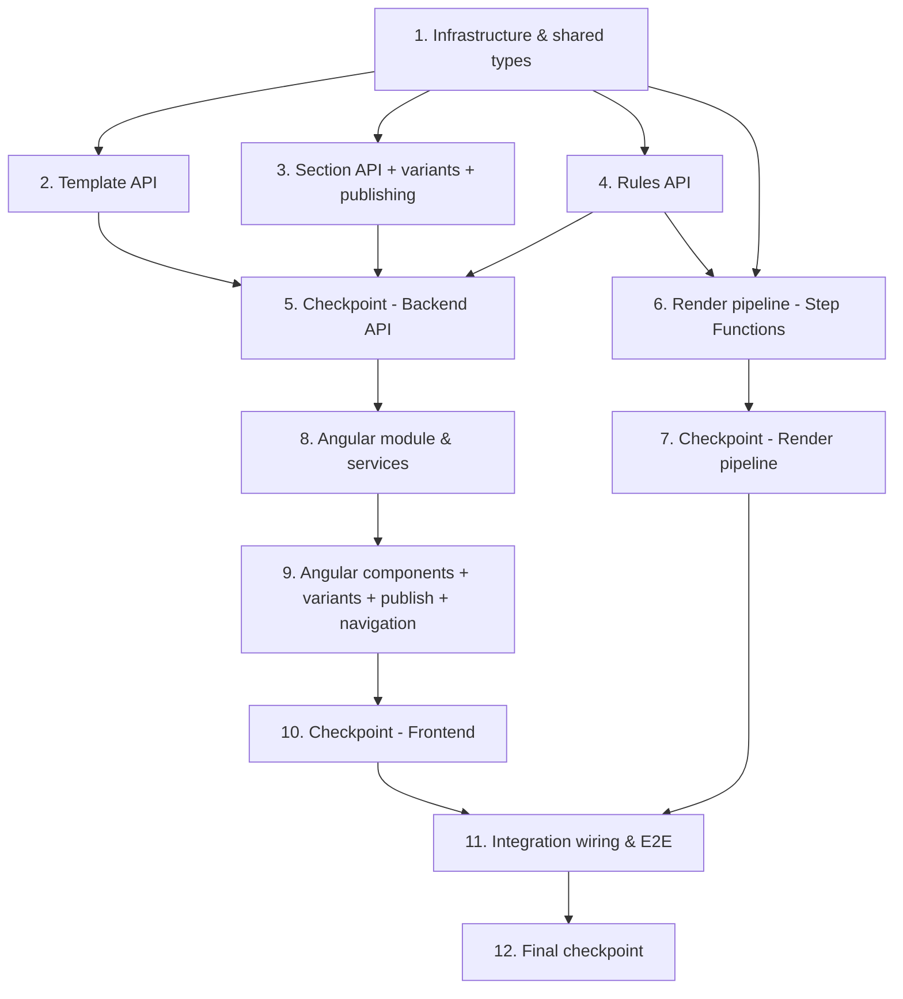

# Implementation Plan: Contract Note Template Management

## Overview

Implement a template management system within the BrytAdminPortal enabling business users to manage contract note PDF templates via a visual editor (pdf-me), a rules engine for automated template selection and per-section variant selection, controlled publishing of section versions to linked templates, and a Step Functions render pipeline. The implementation uses Angular (frontend), AWS Lambda + API Gateway (backend), AWS Step Functions (render orchestration), DynamoDB (metadata), S3 (schema JSON + PDFs), and CDK (infrastructure).

## Tasks

- [ ] 1. Infrastructure and shared types
  - [ ] 1.1 Define CDK infrastructure for DynamoDB table, S3 buckets, and API Gateway routes
    - Create DynamoDB table `ContractNoteTemplates` with PK/SK pattern and GSI `PriorityIndex` (GSI PK = `ALL_TEMPLATES`, GSI SK = `priority`)
    - Create S3 buckets for schema JSON storage and error output
    - Add API Gateway routes for template, section, and rules endpoints
    - _Requirements: 1.1, 5.2, 14.1_

  - [ ] 1.2 Create shared TypeScript interfaces and types
    - Define `SpecificationNode`, `AndOrNode`, `NotNode`, `ComparisonNode`, `InNode` types
    - Define `Template`, `Section`, `SharedSection`, `SectionVariant`, `SectionReference` interfaces
    - Define DynamoDB record types (Template, Section, SharedSection, SectionVariant, Rule, SharedSectionReference with pinnedVersionId, SectionVersion keyed by variant)
    - Place in a shared `types/` module accessible by both API lambdas and render pipeline
    - _Requirements: 10.2, 10.3, 10.4, 18.1, 19.1_

  - [ ] 1.5 Define CDK infrastructure for the Render_State_Machine (Step Functions)
    - Define the Step Functions state machine: ParseInput, SelectTemplate, RenderSections (Map state), Stitch, WriteOutput, and a HandleFailure catch state
    - Provision the per-state Lambdas and wire the S3 input event (via S3 notification / EventBridge) to start an execution
    - Configure per-section retry/catch on the Map state and least-privilege IAM for each state
    - _Requirements: 20.1, 20.2, 20.3, 20.4_

  - [ ] 1.3 Implement specification tree validation utility
    - Validate well-formedness: AND/OR must have leftOperand and rightOperand, NOT must have operand, comparisons must have field + value/values
    - Return validation errors with node paths for incomplete nodes
    - _Requirements: 10.5, 10.6_

  - [ ]* 1.4 Write property tests for specification tree validation
    - **Property 20: Specification tree serialization round-trip**
    - **Property 21: Specification validation rejects malformed trees**
    - **Validates: Requirements 10.2, 10.3, 10.4, 10.5**

- [ ] 2. Template API Lambda handlers
  - [ ] 2.1 Implement `list-templates` handler
    - Query DynamoDB GSI `PriorityIndex` to return all templates ordered by priority ascending
    - Return array of template records with name, description, sectionCount, priority
    - _Requirements: 1.1, 1.2_

  - [ ] 2.2 Implement `create-template` handler
    - Validate required fields (name, description); return 400 with field-level errors if missing
    - Check for duplicate name; return 409 if exists
    - Assign priority = count of existing templates + 1
    - Write template record to DynamoDB
    - _Requirements: 2.1, 2.2, 2.3, 2.4_

  - [ ] 2.3 Implement `get-template` handler
    - Fetch template metadata by PK `TEMPLATE#{id}` SK `METADATA`
    - Return 404 if not found
    - _Requirements: 3.1_

  - [ ] 2.4 Implement `update-template` handler
    - Validate input, update name and description
    - Return 404 if template not found
    - _Requirements: 3.2_

  - [ ] 2.5 Implement `delete-template` handler
    - Delete template record and all associated section records
    - Do NOT delete shared sections referenced by this template
    - Re-order remaining templates to maintain contiguous priority 1..N-1
    - _Requirements: 4.1, 4.2, 4.3_

  - [ ] 2.6 Implement `reorder-templates` handler
    - Accept array of template IDs in desired order
    - Batch-update priority values to contiguous integers starting from 1
    - _Requirements: 5.1, 5.2_

  - [ ]* 2.7 Write property tests for template API logic
    - **Property 1: Template listing returns priority-ordered results**
    - **Property 2: Template creation round-trip**
    - **Property 3: New templates get lowest priority**
    - **Property 4: Duplicate name rejection**
    - **Property 5: Required field validation**
    - **Property 6: Template update round-trip**
    - **Property 8: Template deletion maintains contiguous priority**
    - **Property 9: Shared sections survive template deletion**
    - **Property 10: Priority reorder produces contiguous ordering**
    - **Validates: Requirements 1.1, 1.2, 2.1, 2.2, 2.3, 2.4, 3.1, 3.2, 4.2, 4.3, 5.1, 5.2**

- [ ] 3. Section API Lambda handlers
  - [ ] 3.1 Implement `list-sections` handler
    - Query sections for template by PK `TEMPLATE#{id}` SK begins_with `SECTION#`
    - Return sections ordered by sortOrder ascending
    - _Requirements: 3.3, 6.1_

  - [ ] 3.2 Implement `add-section` handler
    - Create new section record appended to end (sortOrder = current max + 1)
    - Support adding a shared section by reference (set isShared=true, sharedSectionId, use shared section's schemaS3Key)
    - When adding a T&C section, enforce it is positioned after all non-T&C sections
    - Create SharedSectionReference record when adding a shared section
    - _Requirements: 6.1, 6.4, 6.5, 9.2_

  - [ ] 3.3 Implement `remove-section` handler
    - Remove section record from template
    - Re-order remaining sections to maintain contiguous sortOrder
    - Remove SharedSectionReference record if section was shared
    - _Requirements: 6.2_

  - [ ] 3.4 Implement `reorder-sections` handler
    - Accept ordered array of section IDs
    - Update sortOrder values to match new order
    - Enforce T&C sections remain at end
    - _Requirements: 6.3, 6.5_

  - [ ] 3.5 Implement `get-section-schema` and `save-section-schema` handlers
    - GET: Read schema JSON from S3 at the section's schemaS3Key, return as JSON
    - PUT: Validate schema JSON structure, write to S3, create a new Section Version Record in DynamoDB with timestamp and user
    - _Requirements: 7.1, 7.3, 16.1_

  - [ ] 3.6 Implement section version history handlers
    - `list-section-versions`: Query version records by PK `SECTION_VERSION#{sectionId}` ordered by timestamp descending
    - `get-section-version`: Fetch a specific version's schema JSON from S3 using the version's schemaS3Key
    - `revert-section-version`: Create a new version with the content of the specified historical version (non-destructive)
    - _Requirements: 16.2, 16.3, 16.4, 16.5_

  - [ ] 3.7 Implement shared section CRUD handlers
    - `list-shared-sections`: Return all shared sections with reference counts
    - `create-shared-section`: Create shared section record, support T&C designation
    - `update-shared-section`: Update metadata (name, isTermsAndConditions)
    - `delete-shared-section`: Check for references; block with 409 + reference list if referenced
    - `get-shared-section-refs`: Return list of templates referencing this shared section
    - _Requirements: 8.1, 8.2, 8.3, 8.4, 9.1, 9.4_

  - [ ] 3.8 Implement template change log
    - Write a change log record when sections are added, removed, reordered, or when template metadata/rules are updated
    - `list-template-changelog`: Query changelog records by PK `TEMPLATE#{id}` SK begins_with `CHANGELOG#` ordered by timestamp descending
    - _Requirements: 17.1, 17.2, 17.3_

  - [ ] 3.10 Implement section version publishing handlers
    - `get-linked-templates`: return templates linked to a section with each template's pinnedVersionId and an update-available flag (pinned older than latest)
    - `publish-section-version`: update the pinnedVersionId on all linked templates to a chosen version (defaulting to latest), and write a change log entry against each affected template
    - Ensure creating a new version does NOT change any pinnedVersionId (publish is explicit)
    - _Requirements: 18.1, 18.2, 18.3, 18.4, 18.5_

  - [ ] 3.11 Implement section variant CRUD handlers
    - `list-section-variants`, `add-section-variant`, `reorder-section-variants`, `update-section-variant` (name, isDefault), `delete-section-variant`
    - Enforce at most one default variant; treat a section with no variants as a single implicit variant
    - Key variant version history by `{sectionId}#{variantId}`
    - _Requirements: 19.1, 19.3, 19.8_

  - [ ] 3.12 Implement variant rule handlers
    - `get-variant-rule` and `save-variant-rule`, reusing the specification validation utility from task 1.3
    - _Requirements: 19.2, 19.7_

  - [ ]* 3.9 Write property tests for section API logic
    - **Property 7: Sections returned in sort order**
    - **Property 11: Section addition appends to end**
    - **Property 12: Section removal maintains contiguous order**
    - **Property 13: Shared section reference (no duplication)**
    - **Property 14: T&C sections positioned at end**
    - **Property 15: Schema JSON save/load round-trip**
    - **Property 16: Shared section visibility**
    - **Property 17: Shared section edit propagation**
    - **Property 18: Shared section reference tracking**
    - **Property 19: Referenced shared section deletion protection**
    - **Property 28: Section save creates a new version**
    - **Property 29: Section version revert creates new version (not destructive)**
    - **Property 30: Template change log records all modifications**
    - **Validates: Requirements 3.3, 6.1, 6.2, 6.4, 6.5, 7.1, 7.3, 8.1, 8.2, 8.3, 8.4, 9.1, 9.2, 9.4, 16.1, 16.4, 17.1**

  - [ ]* 3.13 Write property tests for version publishing and section variants
    - **Property 31: New section version does not change pinned versions**
    - **Property 32: Publish updates only selected templates**
    - **Property 33: Update-available flag correctness**
    - **Property 35: Variant first-match-wins with default fallback**
    - **Property 36: Section with no variants preserves single-variant behaviour**
    - **Validates: Requirements 8.2, 18.2, 18.3, 18.4, 18.5, 19.4, 19.5, 19.8**

- [ ] 4. Rules API Lambda handlers
  - [ ] 4.1 Implement `get-rule` handler
    - Fetch rule record by PK `TEMPLATE#{id}` SK `RULE`
    - Return specification JSON tree
    - _Requirements: 10.1_

  - [ ] 4.2 Implement `save-rule` handler
    - Validate specification tree using the validation utility from task 1.3
    - Return 400 with node-path errors if malformed
    - Persist validated specification to DynamoDB
    - _Requirements: 10.4, 10.5, 10.6_

- [ ] 5. Checkpoint - Backend API complete
  - Ensure all tests pass, ask the user if questions arise.

- [ ] 6. Render pipeline Lambda
  - [ ] 6.1 Implement specification evaluator
    - Recursive tree evaluator for specification nodes against contract data
    - EQUALS: field value === specified value
    - IN: field value in specified values set
    - LESS_THAN: numeric field value < threshold
    - MORE_THAN: numeric field value > threshold
    - AND: leftOperand && rightOperand
    - OR: leftOperand || rightOperand
    - NOT: !operand
    - _Requirements: 11.4, 11.5, 11.6_

  - [ ]* 6.2 Write property tests for specification evaluator
    - **Property 22: First-match-wins template selection**
    - **Property 23: Specification operator evaluation correctness**
    - **Validates: Requirements 5.3, 11.1, 11.2, 11.4, 11.5, 11.6**

  - [ ] 6.3 Implement template selection logic
    - Fetch all templates ordered by priority from DynamoDB GSI
    - Evaluate each template's specification against contract data in priority order
    - Return first matching template (first-match-wins)
    - Log error if no template matches
    - _Requirements: 11.1, 11.2, 11.3_

  - [ ] 6.4 Implement section renderer
    - For each section in the matched template, fetch schema JSON from S3
    - Render each section independently via @pdfme/generator with text, multiVariableText, table plugins
    - Supply configured fonts (NotoSans)
    - Halt and log on any section render failure
    - _Requirements: 12.1, 12.2, 12.3_

  - [ ]* 6.5 Write property test for section rendering
    - **Property 24: Independent section rendering produces valid PDF**
    - **Validates: Requirements 12.1**

  - [ ] 6.6 Implement PDF stitcher
    - Use pdf-lib to concatenate rendered section PDFs in section order
    - T&C section pages are appended last
    - Write final PDF to output S3 bucket
    - _Requirements: 13.1, 13.2, 13.3_

  - [ ] 6.10 Restructure the render pipeline as Step Functions state handlers
    - Split the flow into per-state Lambda handlers (parse, select-template, render-section, stitch, write-output, handle-failure) invoked by the state machine
    - Render-section runs inside the Map state as an independent, retryable unit; failure after retries routes to handle-failure with no partial output
    - _Requirements: 20.1, 20.2, 20.3, 20.5_

  - [ ] 6.11 Implement pinned-version resolution in section rendering
    - For each section reference, resolve the schema JSON for the template's pinnedVersionId rather than the latest version
    - _Requirements: 18.6_

  - [ ] 6.12 Implement section variant selection
    - For a section with variants, evaluate each Variant_Rule in variant order against contract data and select the first match; fall back to the default variant
    - If no variant matches and no default exists, log an error and halt (no output)
    - Reuse the specification evaluator from task 6.1
    - _Requirements: 19.4, 19.5, 19.6_

  - [ ]* 6.13 Write property tests for variant selection, pinned-version rendering, and failure isolation
    - **Property 34: Render resolves the pinned version**
    - **Property 37: No-match with no default halts**
    - **Property 38: Per-section failure isolation and no partial output**
    - **Validates: Requirements 18.6, 19.6, 20.2, 20.3**

  - [ ]* 6.7 Write property test for PDF stitching
    - **Property 25: PDF stitching preserves page count**
    - **Validates: Requirements 13.1, 13.2**

  - [ ] 6.8 Implement XML-to-JSON parser and S3 trigger handler
    - Parse incoming XML from S3 input bucket into JSON data structure
    - Orchestrate the full pipeline: parse → select template → render sections → stitch → write output
    - On failure at any stage: log error record to error S3 bucket, do NOT write partial output
    - _Requirements: 14.1, 14.2, 14.3, 14.4_

  - [ ]* 6.9 Write property tests for pipeline
    - **Property 26: XML-to-JSON parsing produces valid data structure**
    - **Property 27: Pipeline failure produces no output**
    - **Validates: Requirements 14.2, 14.4**

- [ ] 7. Checkpoint - Render pipeline complete
  - Ensure all tests pass, ask the user if questions arise.

- [ ] 8. Angular module setup and services
  - [ ] 8.1 Create ContractNoteModule with routing
    - Create Angular module at `portal/src/app/components/contract-notes/`
    - Configure routes: template list, template edit, shared sections, rules config
    - Add route guard for Cognito group membership check
    - _Requirements: 15.1, 15.2, 15.3_

  - [ ] 8.2 Implement TemplateService, SectionService, and RulesService
    - TemplateService: list, create, get, update, delete, reorder templates via HTTP
    - SectionService: list, add, remove, reorder sections; get/save schema; shared section CRUD + refs; list versions, get version, revert version
    - RulesService: get and save specification for a template
    - Wire to API Gateway endpoints
    - _Requirements: 1.1, 2.1, 3.1, 6.1, 7.1, 8.1, 10.1, 16.1, 16.2, 17.1_

- [ ] 9. Angular frontend components
  - [ ] 9.1 Implement TemplateListComponent
    - Display table of templates with name, description, section count, priority
    - Drag-and-drop or up/down buttons for reordering (calls reorder API)
    - Create, Edit, Delete, Configure Rules action buttons
    - Empty state message when no templates exist
    - Deletion confirmation dialog
    - _Requirements: 1.1, 1.2, 1.3, 4.1, 5.1_

  - [ ] 9.2 Implement TemplateEditComponent
    - Form for name and description with validation (required fields, duplicate name error display)
    - Section list showing ordered sections with add/remove/reorder
    - Version badge per section showing current version number (e.g., "v3")
    - Add section options: new section, existing shared section, T&C section
    - Section click opens SectionEditorComponent modal
    - Version history button per section (opens SectionVersionHistoryComponent)
    - Template change log panel (collapsible, shows chronological changes)
    - _Requirements: 2.1, 2.3, 2.4, 3.1, 3.2, 3.3, 6.1, 6.2, 6.3, 6.4, 6.5, 16.2, 17.2, 17.3_

  - [ ] 9.2a Implement SectionVersionHistoryComponent
    - Display current version at top (highlighted) with version number, timestamp, user, and [View in Designer] button
    - List previous versions ordered newest first with version number, timestamp, user
    - [Preview] button opens the historical version in the Section Editor as read-only
    - [Revert] button calls revert API (creates a new version from the selected historical version), then refreshes the list
    - Accessible via the "History" button on each section row in TemplateEditComponent
    - _Requirements: 16.2, 16.3, 16.4_

  - [ ] 9.3 Implement RulesConfigComponent
    - Visual tree editor for specification pattern (recursive node rendering)
    - Node type selection: AND, OR, NOT, EQUALS, LESS_THAN, MORE_THAN, IN
    - Leaf node configuration: field name input, value input(s)
    - Add/remove nodes
    - Validation before save with error highlighting on incomplete nodes
    - _Requirements: 10.1, 10.2, 10.3, 10.4, 10.5, 10.6_

  - [ ] 9.4 Implement SectionEditorComponent (Web Component wrapper for pdf-me Designer)
    - Create `<pdfme-designer>` Web Component wrapper that loads React + pdf-me Designer bundle
    - Mount/unmount React root on connectedCallback/disconnectedCallback
    - Accept schema JSON property, emit `schema-save` CustomEvent on save
    - Angular modal host component that loads schema from API and saves on event
    - Error state with retry if designer fails to load
    - _Requirements: 7.1, 7.2, 7.3, 7.4, 7.5_

  - [ ] 9.5 Implement SharedSectionsComponent and SharedSectionDetailComponent
    - SharedSectionsComponent: list all shared sections with name, type (standard/T&C), reference count
    - SharedSectionDetailComponent: view/edit shared section, show referencing templates
    - Create/delete shared sections with deletion warning when referenced
    - _Requirements: 8.1, 8.2, 8.3, 8.4, 9.1, 9.3, 9.4_

  - [ ] 9.7 Implement SectionVariantsComponent (Angular)
    - Inline variants list within the template edit page: name, rule summary, default badge, evaluation order
    - Add/reorder/set-default/delete variants; open the section editor per variant; open the rules editor per variant (reusing RulesConfigComponent)
    - _Requirements: 19.1, 19.2, 19.3, 19.7, 21.4_

  - [ ] 9.8 Implement SectionPublishComponent (Angular)
    - Launched from the section version history; lists linked templates with pinned version and update-available indicator
    - Publish a chosen version (defaulting to latest) to all linked templates, with confirmation
    - _Requirements: 18.3, 18.4, 18.5_

  - [ ] 9.9 Add Admin Portal navigation and landing pages (Angular)
    - Ensure Template List and Shared Sections Library are full landing pages (not modals) with navigation entry points gated by Cognito group
    - Present section editor and version history as modals launched from within a landing page
    - _Requirements: 21.1, 21.2, 21.3, 21.5_

  - [ ]* 9.6 Write unit tests for Angular components
    - Test TemplateListComponent rendering, empty state, action triggers
    - Test RulesConfigComponent tree manipulation and validation display
    - Test SectionEditorComponent lifecycle and event handling
    - Test SectionVariantsComponent ordering/default logic and SectionPublishComponent publish-to-all confirmation
    - _Requirements: 1.1, 1.3, 10.5, 7.5, 19.3, 18.3_

- [ ] 10. Checkpoint - Frontend complete
  - Ensure all tests pass, ask the user if questions arise.

- [ ] 11. Integration wiring and end-to-end validation
  - [ ] 11.1 Wire CDK deployment for all components
    - Ensure Lambda functions and the Render_State_Machine have correct IAM permissions for DynamoDB and S3
    - Ensure S3 event notification starts a Render_State_Machine execution
    - Ensure API Gateway routes are connected to correct Lambda handlers
    - Configure CORS for Admin Portal origin
    - _Requirements: 14.1, 15.1, 20.4_

  - [ ] 11.2 Add navigation entry in Admin Portal sidebar for Contract Note Templates
    - Add menu item linking to template list route
    - Ensure visibility is gated by Cognito group membership
    - _Requirements: 15.1, 15.3_

  - [ ]* 11.3 Write integration tests for full pipeline flow
    - Test: drop XML in input bucket → verify PDF appears in output bucket
    - Test: drop invalid XML → verify error record in error bucket, no output PDF
    - _Requirements: 14.1, 14.3, 14.4_

- [ ] 12. Final checkpoint
  - Ensure all tests pass, ask the user if questions arise.

## Task Dependency Graph



Execution waves (tasks in the same wave have no dependency on each other and may run in parallel):

```json
{
  "waves": [
    { "wave": 1, "tasks": ["1"] },
    { "wave": 2, "tasks": ["2", "3", "4"] },
    { "wave": 3, "tasks": ["5", "6"] },
    { "wave": 4, "tasks": ["7", "8"] },
    { "wave": 5, "tasks": ["9"] },
    { "wave": 6, "tasks": ["10", "11"] },
    { "wave": 7, "tasks": ["12"] }
  ]
}
```

Notes on ordering:
- Task 1.5 (Step Functions infra) underpins task 6 (render pipeline state handlers).
- Tasks 3.10-3.13 (publishing + variants) depend on the base section/version handlers (3.5, 3.6) and the rule validation utility (1.3).
- Tasks 6.11-6.12 (pinned-version resolution, variant selection) depend on the specification evaluator (6.1).
- Tasks 9.7-9.9 (variants, publish, navigation) depend on the base services (8.2) and the rules editor (9.3).

## Notes

- Tasks marked with `*` are optional and can be skipped for faster MVP
- Each task references specific requirements for traceability
- Checkpoints ensure incremental validation
- Property tests validate universal correctness properties from the design document
- Unit tests validate specific examples and edge cases
- The pdf-me Designer Web Component is built as a separate bundle loaded on-demand
- All API handlers follow existing Lambda patterns in the project
