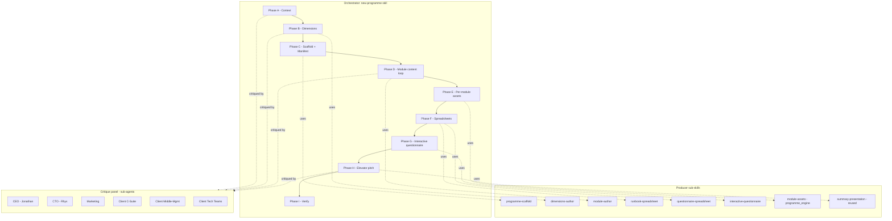
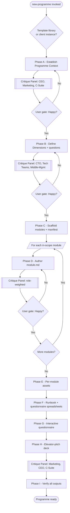
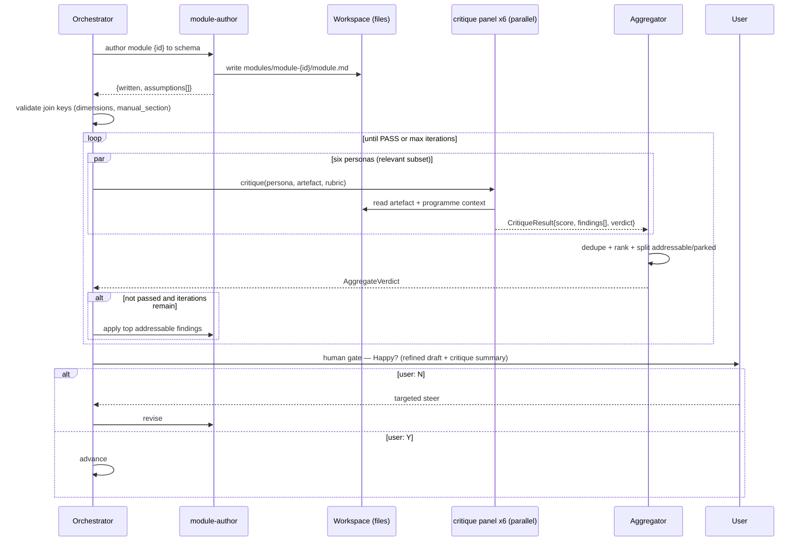
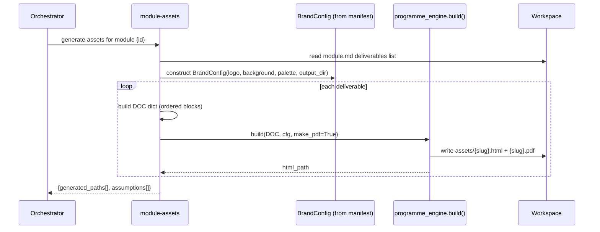
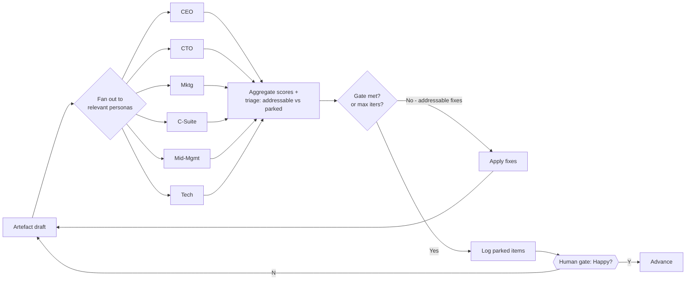

# Design — New Programme Skill (Service Catalog)

## Overview

The **New Programme** skill authors a complete, repeatable D55 service *programme* for the Service Catalog. Given a rough idea and (optionally) a client's assessment scores, it produces the full set of artefacts a programme needs:

- **Programme context & positioning** — background, ICP, phases, commercial model.
- **Assessment dimensions** — the radar axes, maturity rubrics (1–5), and questions.
- **A module library** — one folder per module, machine-parseable to `MODULE-SCHEMA.md`.
- **Per-module assets** — branded HTML + PDF plus starter templates.
- **An internal D55 runbook spreadsheet** — the Delivery Playbook: what happens at each stage.
- **An assessment questionnaire spreadsheet** — the questions to ask, scored per dimension.
- **An interactive questionnaire** — a self-contained HTML tool that scores current vs target, renders a radar chart, and recommends the applicable modules/next steps.
- **An elevator-pitch presentation** — the exec deck for the free assessment offer.

The defining feature of this skill is a **six-persona sub-agent critique loop** that refines each major artefact autonomously against internal (D55) and external (client) viewpoints before a human gate. This raises the quality bar without burning the user's attention on early drafts.

The **AI-DLC programme** (`analysis/D55/ai-dlc/`) is the reference implementation — the pattern was extracted from it. This skill generalises that pattern so any new programme (e.g. "Data Platform Modernisation", "FinOps", "Platform Engineering") can be produced to the same standard.

### Goals

- One orchestrator skill that takes a programme from idea → full asset set.
- Every artefact driven from a single machine-readable **programme manifest**, so tooling and the interactive questionnaire never drift from the docs.
- A structured, repeatable critique loop across six named perspectives, with score gates and a triage of *addressable-now* vs *parked* issues.
- **Self-sufficient, portable skill bundles** — the skill and its sub-skills carry everything they need (engine code, brand assets, templates, worked examples) inside their own directories, so a skill (or the whole set) can be zipped and dropped into another repo/project with no external-folder dependencies.
- Build on the *patterns* of existing skills (`deliverables-toolkit`, `summary-presentation`, `estimate-spreadsheet`, `data-model-pdf`, `openapi-html`) and the config-driven `programme_engine.py` — vendoring the reusable engine into the bundle rather than referencing it across the repo.

### Non-goals

- Building hosting, booking, or a live SaaS version of the questionnaire (outputs are self-contained HTML).
- Making pricing/commercial decisions (those are parked for Rhys/Jonathan; the skill captures them as working assumptions).
- Replacing the existing AI-DLC content — that stays as the reference; this skill copies *patterns*, not prose.

## Architecture

Three layers: an **orchestrator** (the `new-programme` skill), a set of **producer sub-skills** (each builds one artefact type, mostly reusing what exists), and a **critique panel** of sub-agents that refine artefacts between production and the human gate.



### The orchestration flow

The end-to-end flow (improved from the sketch) is captured in `diagram.md` and reproduced here:



### Directory layout for a programme

Generalised from the AI-DLC reference. A programme lives at `analysis/D55/<programme-slug>/`:

```
analysis/D55/<programme-slug>/
  programme.yaml                     # the manifest (single source of truth)
  context.md                         # background, positioning, commercial model, decision log
  dimensions.md                      # radar axes, rubrics, questions
  client-operating-manual-toc.md     # the kept-asset spine
  working-assumptions.md             # provisional decisions to confirm
  modules/
    MODULE-SCHEMA.md                 # frontmatter contract (copied/linked from reference)
    module-{id}-{slug}/
      module.md
      assets/                        # per-module HTML/PDF + starter templates
  spreadsheets/
    <Programme> Runbook.xlsx         # internal Delivery Playbook
    <Programme> Questionnaire.xlsx   # assessment questions per dimension
  outputs/
    workshop.html                    # interactive questionnaire (radar + recommendations)
    <programme>-overview.html/.pdf   # programme overview
    elevator-pitch.html              # exec deck
  assets/                            # brand assets (logos, backgrounds)
  critique/
    critique-prompt.md               # the six-persona prompt
    critique-<phase>-<iter>.md       # per-phase critique outputs
  programme_engine.py                # config-driven render engine (reused/generalised)
  build_*.py, generate_*.py          # thin content-driven callers
```

### Skill self-sufficiency & portability

A hard constraint: **the unit of portability is the skill (or skill-set) directory.** Any skill in this feature must be usable by zipping its directory and dropping it into another repo — with no reach-back into `analysis/`, no shared repo-root modules, and no hard-coded absolute paths. Portability wins over DRY: if two skills need the same engine, each carries its own vendored copy (or they ship together as one skill-set directory) rather than referencing a shared file elsewhere.

Consequently, a skill stops being a lone `.kiro/skills/<name>.md` file and becomes a **bundle directory**:

```
.kiro/skills/new-programme/
  SKILL.md                       # the skill instructions (frontmatter: inclusion: manual)
  MODULE-SCHEMA.md               # the module frontmatter contract (vendored, not referenced)
  engine/
    programme_engine.py          # vendored, self-contained render engine (BrandConfig + DOC -> HTML/PDF)
    spreadsheet_engine.py        # runbook + questionnaire xlsx generation
    questionnaire_template.html  # the interactive radar/recommendation tool template
  templates/
    programme.yaml.tmpl          # manifest skeleton
    module.md.tmpl               # module skeleton to the schema
    dimensions.md.tmpl
    client-operating-manual-toc.md.tmpl
  personas/
    d55_ceo.md  d55_cto.md  d55_marketing.md
    client_csuite.md  client_middle_mgmt.md  client_technical.md   # the six critique rubrics
  assets/brand/                  # default D55 logo + background (overridable per programme)
  examples/ai-dlc/               # a trimmed worked example (patterns, not full prose)
```

Rules that keep bundles portable:
- **Resolve paths relative to the bundle** (`Path(__file__).parent`), never relative to a repo root or `analysis/`.
- **Vendor, don't reference.** The engine, schema, persona rubrics, brand assets, and a worked example are copied into the bundle. Updating the reference implementation does not silently change a shipped skill.
- **Declare dependencies inside the bundle.** Python libs used (`openpyxl`, `playwright`, `pypdf`, `hypothesis`) are listed in a bundle-local `requirements.txt`; no assumption about the host repo's environment beyond a Python interpreter + Chromium.
- **Programme output location is a parameter**, defaulting to the bundle's own `output/` when run standalone, or a caller-supplied directory when embedded — so the skill never writes into fixed repo paths.
- **A portability check** (see Testing) copies a bundle to a temp dir outside the repo and runs it end-to-end on the example, asserting it produces outputs with no `analysis/`-relative or absolute-path failures.

This applies to the review/walkthrough tooling too: walkthrough generators live under a top-level `walkthroughs/<skill>/` folder (not inside the spec), and the New Programme skill's own outputs are self-contained. The one acknowledged exception is the current `build_spec_walkthrough.py` review artefact, which still imports the BRYT engine by path — that is a throwaway doc generator, not a shipped skill, and is the very cross-folder coupling the `programme_engine.py` vendoring is designed to remove.

### Sequence: module build + critique iteration (Phase D)



### Sequence: asset generation via the render engine (Phase E)



## Components and Interfaces

### 1. The programme manifest (`programme.yaml`)

The single source of truth that ties every artefact together. Generated in Phase C and updated as content is confirmed. Skills and the interactive questionnaire read from it so the docs and tooling never drift.

```yaml
programme:
  slug: ai-dlc
  name: "AI Development Lifecycle"
  external_name: null              # customer-facing name (may differ; often TBD)
  one_liner: "Assess -> Teach -> Prove -> Scale. We leave, you keep the capability."
  phases: [Assess, Teach, Prove, Scale]
  commercial:
    free_assessment: true
    tiers: [Assess, Assess+Teach, Full programme]
brand:
  primary: "#..."                  # feeds BrandConfig for programme_engine
  logo: assets/logo/...
  background: assets/backgrounds/...
dimensions:                        # the radar axes; join key = name
  - name: "Leadership & Mandate"
    short: "Leadership"
    rubric_ref: dimensions.md#1-leadership-and-mandate
  # ...one per axis
modules:                           # mirrors module.md frontmatter for fast consumption
  - id: 1
    slug: leadership-and-investment-case
    title: "Leadership & the Investment Case"
    dimensions_covered: ["Leadership & Mandate", "Metrics & ROI"]
    manual_section: "1. Mandate & Measurement"
    trigger: { recommend_when_current_at_or_below: 2, include_when_gap_at_or_above: 2, prioritise_when_gap_at_or_above: 2 }
```

**Validation rules (enforced by the scaffold sub-skill):**
- Every `modules[].dimensions_covered` entry must match a `dimensions[].name` exactly.
- Every `modules[].manual_section` must match a section title in `client-operating-manual-toc.md`.
- Trigger thresholds must be within the ranges defined in `MODULE-SCHEMA.md`.

### 2. Producer sub-skills

| Sub-skill | Status | Produces | Reuses |
|-----------|--------|----------|--------|
| `programme-scaffold` | new | Directory layout + `programme.yaml` + TOC skeleton; validates join keys | — |
| `dimensions-author` | new | `dimensions.md` — axes, 1–5 rubrics, calibration examples, must-ask/go-deeper questions | AI-DLC `dimensions.md` as the pattern |
| `module-author` | new | `module.md` to `MODULE-SCHEMA.md`; assessment-aware (applies trigger logic to recommend scope) | existing `new-programme` Steps 1–3 |
| `runbook-spreadsheet` | new | Internal Delivery Playbook `.xlsx` — stages, activities, owners, inputs/outputs, decision points | `estimate-spreadsheet` engine, `generate_spreadsheets.py` |
| `questionnaire-spreadsheet` | new | Assessment questions per dimension with scoring scale | `generate_spreadsheets.py` |
| `interactive-questionnaire` | new (generalise) | `workshop.html` — data-driven from manifest; radar + gap analysis + module recommendations | AI-DLC `workshop.html` |
| `module-assets` | new (thin) | Per-module branded HTML + PDF + starter templates | `programme_engine.build()`, `deliverables-toolkit` |
| `summary-presentation` | reuse | Elevator-pitch deck | as-is |

The interactive questionnaire is the most novel generalisation: today's `workshop.html` hardcodes AI-DLC's 8 dimensions and module map. The generalised version reads dimensions + module trigger logic from `programme.yaml` (embedded at build time) so the same tool renders for any programme, and its "recommended modules" output uses the exact `MODULE-SCHEMA.md` recommendation logic (included / high-priority / critical).

### 3. The critique panel (sub-agents)

Six personas, invoked as sub-agents (`general-task-execution`) in parallel where possible. Each returns a structured scorecard and a triaged issue list. This is the mechanism that "refines outputs from a few different perspectives".

| # | Persona | Lens | Cares most about |
|---|---------|------|------------------|
| 1 | **Jonathan — D55 CEO** | Internal / commercial | Strategic fit, brand, margin, is this a sellable *programme* not a list of workshops |
| 2 | **Rhys — D55 CTO** | Internal / delivery | Technical credibility, can a consultant actually run this, delivery risk |
| 3 | **Marketing** | Internal / GTM | Elevator pitch, funnel, the free-assessment hook, differentiation |
| 4 | **Client C-Suite** | External / buyer | ROI, risk, "why you / why now", board-defensibility |
| 5 | **Client Middle-Management** | External / feasibility | Disruption to my team, workload, "what does this mean for me on Monday" |
| 6 | **Client Technical Teams** | External / credibility | Is this real or vendor fluff, depth, respect for how engineers actually work |

**Persona → artefact relevance matrix** (which personas critique which phase, and who's weighted):

| Artefact (phase) | CEO | CTO | Mktg | C-Suite | Mid-Mgmt | Tech |
|------------------|:---:|:---:|:----:|:-------:|:--------:|:----:|
| A. Context/positioning | ●● | ● | ●● | ●● | ○ | ○ |
| B. Dimensions/questions | ○ | ●● | ○ | ● | ●● | ●● |
| D. Module content | ● | ●● | ● | ● | ●● | ●● |
| G. Interactive questionnaire | ● | ● | ●● | ●● | ● | ● |
| H. Elevator pitch | ●● | ○ | ●● | ●● | ○ | ○ |

●● = primary (score gates on these) · ● = contributing · ○ = light-touch/optional

### 4. Critique loop mechanics

Each critiqued phase runs an autonomous refine loop *before* the human gate. This is the expansion of the existing `iterate-prompt.md` process from 2 personas to 6, with explicit score gates.



**Loop rules:**
- **Max 3 iterations** per artefact (matches existing process), stop early on a clean pass.
- **Scoring:** each persona scores 1–5 on *addressable-in-document* quality only. External blockers (real case studies, live pilots, designer assets, pricing sign-off) are **parked**, never counted against the score.
- **Gate:** primary personas (●● for that artefact) must hit their threshold. Defaults: internal primary ≥ 4/5; external primary ≥ 3/5 (external audiences are harder and we're checking credibility, not perfection). Thresholds live in the manifest so they're tunable.
- **Triage:** each iteration splits issues into *addressable now* (fix in-file) vs *parked* (needs a person/decision) — parked items accumulate in `working-assumptions.md` / a parking-lot table.
- **Human gate:** after the autonomous loop passes (or maxes out), the user gets the refined artefact plus a short critique summary and confirms Happy? (Y/N). N re-enters the loop with the user's steer.

**Sub-agent invocation contract** — each persona sub-agent receives: the artefact file(s), the programme context, its persona brief, and the scoring rubric; it writes a structured result (`critique/critique-<phase>-<iter>.md`) with per-persona score, top-3 addressable fixes, and parked items.

### 5. Critique aggregation, convergence & termination

The aggregator merges the personas' results for an iteration into one ranked backlog and a pass/fail verdict, and decides whether to iterate, pass, or escalate. Three independent guards guarantee the loop always terminates.

```python
# Primary personas gate per artefact (from the relevance matrix). Weights bias ranking, not gating.
PERSONA_WEIGHTS: dict[Persona, float] = {
    "d55_cto": 1.3,          # technical credibility gates internal sign-off
    "client_csuite": 1.3,    # the buyer gates the sale
    "d55_ceo": 1.1, "d55_marketing": 1.0,
    "client_technical": 1.0, "client_middle_mgmt": 0.9,
}
SEVERITY_WEIGHT = {"blocker": 8, "major": 4, "minor": 2, "nit": 1}

MAX_ITERATIONS = 3           # per artefact; matches the established iterate-prompt.md process. Tunable in manifest.
CONVERGENCE_DELTA = 1        # if the addressable backlog shrinks by < this vs last iter -> stop (stall)

def aggregate(results: list[CritiqueResult], phase: str, iteration: int) -> AggregateVerdict:
    addressable = _dedupe([f for r in results for f in r.findings if f.disposition == "addressable"])
    parked      = _dedupe([f for r in results for f in r.findings if f.disposition == "parked"])
    for f in addressable:                       # rank by severity x persona weight x cross-persona frequency
        f.rank = SEVERITY_WEIGHT[f.severity] * PERSONA_WEIGHTS[f.persona] * _cross_persona_freq(f, results)
    backlog = sorted(addressable, key=lambda f: f.rank, reverse=True)
    scores  = {r.persona: r.score for r in results}
    return AggregateVerdict(phase, iteration, scores, backlog, parked,
                            passed=_gates_met(phase, scores, backlog))

def _gates_met(phase: str, scores: dict[Persona, int], backlog: list[Finding]) -> bool:
    if any(f.severity == "blocker" for f in backlog):
        return False
    # thresholds: internal primary >= 4, external primary >= 3 (credibility, not perfection)
    return all(scores.get(p, 5) >= threshold for p, threshold in primary_thresholds(phase).items())

def should_continue(history: list[AggregateVerdict]) -> Literal["PASS", "ITERATE", "ESCALATE"]:
    latest = history[-1]
    if latest.passed:                              return "PASS"          # -> human gate
    if len(history) >= MAX_ITERATIONS:             return "ESCALATE"      # cap hit -> human gate w/ open items
    if len(history) >= 2 and (len(history[-2].backlog) - len(latest.backlog)) < CONVERGENCE_DELTA:
        return "ESCALATE"                          # stalled/oscillating -> stop, escalate
    return "ITERATE"                               # apply top-K addressable findings, re-run
```

- **PASS** — primary-persona thresholds met and zero open blockers → hand the refined artefact to the human gate.
- **ITERATE** — apply the top-K (bounded) addressable findings via the relevant producer sub-skill, then re-critique. Only affected artefacts are rebuilt.
- **ESCALATE** — cap hit or backlog stalled → stop automated iteration, surface the open backlog + per-persona scores at the human gate with an explicit "did not converge" note. Every iteration is appended to `critique/critique-<phase>-<iter>.md` so the refinement is auditable.

## Data Models

Code sections use **Python** (the language of the existing `programme_engine.py`) and **YAML** (the manifest/frontmatter language), matching established conventions.

### Assessment scores (radar input)

Input to client-instance mode and the interactive questionnaire. Mirrors the 1–5 current/target model in `dimensions.md`.

```python
@dataclass
class DimensionScore:
    dimension: str        # exact dimension name — JOIN KEY to dimensions[].name and dimensions_covered
    current: int          # 1..5
    target: int           # 1..5
    notes: str = ""

    @property
    def gap(self) -> int:
        return max(0, self.target - self.current)

@dataclass
class Assessment:
    client_name: str | None          # None in template mode
    scores: list[DimensionScore]     # exactly one per dimension in the manifest
    captured_at: str
```

### Module recommendation (output of trigger logic)

Per `MODULE-SCHEMA.md`. Drives both the interactive questionnaire and client-instance scoping — both must produce identical results.

```python
Status = Literal["critical", "high", "standard", "excluded"]

@dataclass
class Recommendation:
    module_id: int
    status: Status
    reason: str            # human-readable rationale ("weak on governance -> Shipping Safely critical")
```

### Critique data models

Reconciles the addressable/parked triage (from `iterate-prompt.md`) with severity + backlog convergence.

```python
Severity = Literal["blocker", "major", "minor", "nit"]
Persona = Literal["d55_ceo", "d55_cto", "d55_marketing",
                  "client_csuite", "client_middle_mgmt", "client_technical"]
Disposition = Literal["addressable", "parked"]   # parked = needs a person/decision, never counts against score

@dataclass
class Finding:
    persona: Persona
    severity: Severity
    disposition: Disposition
    target: str            # artefact path / logical id the finding is about
    issue: str             # what's wrong (specific)
    suggestion: str        # what to change
    owner: str | None = None   # for parked items (e.g. "Rhys", "Marketing/Design")
    dedupe_key: str = ""   # normalised issue signature for cross-persona merge

@dataclass
class CritiqueResult:
    phase: str             # "A" | "B" | "D" | "G" | "H"
    persona: Persona
    score: int             # 1..5 readiness from this persona's view (addressable items only)
    findings: list[Finding]
    verdict: Literal["PASS", "ITERATE"]
    summary: str

@dataclass
class AggregateVerdict:
    phase: str
    iteration: int
    per_persona_scores: dict[Persona, int]
    backlog: list[Finding]          # deduped, ranked, addressable only
    parked: list[Finding]           # accumulates into working-assumptions.md
    passed: bool                    # primary-persona thresholds met AND no open blockers
```

### Contract violation

```python
@dataclass
class ContractViolation:
    kind: Literal["unknown_dimension", "unknown_manual_section",
                  "critical_not_covered", "unscored_dimension", "duplicate_score"]
    where: str        # module id / file
    value: str        # the offending string
```

## Recommendation logic (assessment → modules)

Reproduces the `MODULE-SCHEMA.md` trigger logic as an explicit algorithm, since both the interactive questionnaire (client-side) and client-instance scoping (build-time) depend on producing identical results.

```
ALGORITHM recommend_modules(assessment, modules) -> list[Recommendation]
BEGIN
  results <- []
  FOR each module m IN modules DO
    included <- false; critical <- false; high <- false
    FOR each dimension d IN m.dimensions_covered DO
      s <- assessment.score_for(d)                                  // current, target
      IF s.current <= m.trigger.recommend_when_current_at_or_below THEN included <- true
      IF (s.target - s.current) >= m.trigger.include_when_gap_at_or_above THEN included <- true   // ambition-driven
      IF m.trigger.critical_when_current_at_or_below IS NOT NULL
         AND d IN m.trigger.critical_dimensions
         AND s.current <= m.trigger.critical_when_current_at_or_below THEN
        included <- true; critical <- true                          // hard gate
    END FOR
    IF included THEN
      FOR each dimension d IN m.dimensions_covered DO
        IF (assessment.score_for(d).target - assessment.score_for(d).current)
           >= m.trigger.prioritise_when_gap_at_or_above THEN high <- true
      END FOR
      status <- critical ? "critical" : (high ? "high" : "standard")   // critical > high > standard
      results.append(Recommendation(m.id, status, rationale))
    END IF
  END FOR
  RETURN results
END
```

**Preconditions:** `assessment` covers every dimension in the manifest exactly once; each module's frontmatter is schema-valid.
**Postconditions:** a module appears at most once; every returned module is included; `status` is the highest triggered (critical > high > standard); an excluded module is never returned with a priority.

## Join-key contracts & validator

The programme is only tooling-consumable if three joins hold. The scaffold sub-skill validates them after scaffolding and again before any generation step trusts them.

| Join | Authority | Must match | Rule |
|------|-----------|------------|------|
| Dimension coverage | `dimensions[].name` (manifest / `dimensions.md`) | `dimensions_covered[]` in each `module.md` | subset, exact string |
| Manual mapping | section titles in `client-operating-manual-toc.md` | `manual_section` in each `module.md` | member, exact string |
| Scoring | `dimensions[].name` | `DimensionScore.dimension` | bijection: every dimension scored once |
| Criticality | a module's `dimensions_covered` | `trigger.critical_dimensions[]` | subset |

```python
def validate_join_keys(programme_dir: Path) -> list[ContractViolation]:
    dims = load_dimension_names(programme_dir / "programme.yaml")
    toc  = load_toc_titles(programme_dir / "client-operating-manual-toc.md")
    violations: list[ContractViolation] = []
    for mod in glob(programme_dir / "modules/*/module.md"):
        fm = parse_frontmatter(mod)
        for d in fm["dimensions_covered"]:
            if d not in dims: violations.append(ContractViolation("unknown_dimension", mod, d))
        if fm["manual_section"] not in toc:
            violations.append(ContractViolation("unknown_manual_section", mod, fm["manual_section"]))
        for cd in fm["trigger"].get("critical_dimensions", []):
            if cd not in fm["dimensions_covered"]:
                violations.append(ContractViolation("critical_not_covered", mod, cd))
    return violations
```

A non-empty result is a **hard stop** — the orchestrator routes violations back to the `module-author` sub-skill to fix rather than emitting drifted docs.

## Correctness properties

The invariants the implementation must uphold; these drive the tests below.

1. **Manifest integrity** — after a successful build, `validate_join_keys` returns empty (dimensions ↔ modules ↔ manual TOC all resolve). A broken join is a hard stop, not a drifted doc.
2. **Scoring bijection** — every dimension in the manifest is scored exactly once; each score ∈ [1,5] for both current and target.
3. **Recommendation monotonicity** — lowering a covered dimension's current, or raising its target, never *removes* a module from the recommended set (it can only add or raise priority).
4. **Priority implies inclusion** — no module is ever returned high/critical while excluded; status is the highest triggered (critical > high > standard).
5. **Critical gate honoured** — if a module names `critical_dimensions` with a threshold and a listed dimension's current ≤ threshold, the module is always included and flagged critical.
6. **Trigger-logic parity** — the interactive questionnaire's client-side recommendations exactly match build-time `recommend_modules()` for the same scores.
7. **Loop termination** — every critique loop halts within `MAX_ITERATIONS`, or earlier on PASS/stall. No input causes unbounded iteration.
8. **Convergence detection** — if consecutive iterations don't shrink the addressable backlog by ≥ `CONVERGENCE_DELTA`, the loop escalates rather than continuing.
9. **Gate integrity** — `AggregateVerdict.passed` is true iff every primary persona meets its threshold and there are zero open blockers; parked items never affect the score.
10. **Aggregator idempotence** — identical findings from multiple personas collapse to one backlog item (by `dedupe_key`), ranked by cross-persona frequency; aggregating the same results twice yields the same order.
11. **Mode isolation** — a client-instance build never mutates the template library.
12. **Self-containment** — every HTML output embeds its assets/runtime as base64 (portable, offline) — no CDN links, per `deliverables-toolkit`.
13. **Bundle portability** — a skill bundle copied to a location outside the repo runs end-to-end on its bundled example with no path resolving into `analysis/`, the repo root, or any absolute path. All resources it needs are inside the bundle.

## Testing Strategy

### Unit tests
- `recommend_modules()` against `MODULE-SCHEMA.md` worked examples and the AI-DLC modules — assert included set and status (weak-governance → Shipping Safely critical; high-ambition-from-strong-base → included; etc.).
- `validate_join_keys()` with deliberately broken fixtures (unknown dimension, unknown manual section, critical-not-covered).
- `aggregate()` — dedupe, weighting, ranking, and `_gates_met` on hand-built `CritiqueResult` sets.
- `should_continue()` — PASS, cap-hit ESCALATE, stall ESCALATE, and ITERATE branches.

### Property-based tests (`hypothesis`)
- **Property 3 (monotonicity):** generate random assessments; assert lowering current / raising target never drops a module.
- **Property 2 (bijection):** generate assessments; assert scoring coverage + range.
- **Property 7 (termination):** generate random critique streams (including adversarial oscillating backlogs); assert every loop halts within `MAX_ITERATIONS`.
- **Property 9 (gate integrity):** generate random per-persona scores + findings; assert `passed` ⇔ (primary thresholds met ∧ no blockers).
- **Property 10 (aggregator idempotence):** assert `aggregate(x)` order == `aggregate(x)` order and cross-persona duplicates collapse.

### Integration & rendered-output verification
Following `deliverables-toolkit` (the agent cannot view images — measure the DOM):
- **Interactive questionnaire:** serve locally, drive with Playwright, assert the radar renders (canvas/SVG present), score inputs validate, recommended modules match build-time `recommend_modules()` for a fixture score set (Property 6), no horizontal overflow.
- **Per-module & overview docs:** measure DOM (images loaded `naturalWidth>0`, expected block counts, cover background applied); read PDFs back with `pypdf` for page count/size (A4 595×842pt) and orphaned-heading detection.
- **Spreadsheets:** open with `openpyxl`, assert expected sheets/rows; restore from git after read-only checks (openpyxl rewrites binaries).
- **Mode isolation (Property 11):** client-instance build leaves the template library byte-identical (git clean).
- **Bundle portability (Property 13):** copy the skill bundle to a temp dir *outside* the repo, run it on the bundled example, and assert it produces outputs and that no file/asset load resolves into `analysis/`, the repo root, or an absolute path. This is the guard that the "zip and drop into another project" promise actually holds.
- Clean up temporary servers, screenshots, and check scripts afterwards.

## Error Handling

| Condition | Response | Recovery |
|-----------|----------|----------|
| Broken join keys after scaffold/authoring | Hard stop before generation; route violations back to `module-author` with the offending strings | Re-validate; proceed only when empty |
| Critique loop won't converge (cap hit / stall) | `ESCALATE` — surface open backlog + per-persona scores at the human gate with a "did not converge" note | Human accepts-with-caveats, gives targeted steer, or changes scope |
| Render/PDF failure (Chromium missing, missing image) | `build()` degrades: writes HTML, skips PDF with an install hint; missing brand asset → clear error naming the path | `python -m playwright install chromium` or fix asset path; re-run only the failed generator |
| openpyxl binary churn | After read-only test opens, restore xlsx from git | Regenerate only when source content changed |
| Persona sub-agent returns malformed result | Treat as failed unit; retry once with stricter instruction; if it fails again, record a `blocker` finding "critic {persona} unavailable" rather than silently dropping a perspective | Surface at the human gate |

## Key Design Decisions

1. **Manifest-first, not doc-first.** A machine-readable `programme.yaml` is the spine; docs and tools render from it. This is the generalisation that lets one skill serve any programme and keeps the interactive tool in sync. *Alternative rejected:* parsing markdown frontmatter at build time only — brittle and scatters the source of truth.
2. **Autonomous critique loop before the human gate, not instead of it.** Six sub-agents refine to a quality bar so the human reviews a strong draft, not a first pass. *Alternative rejected:* single-perspective critique (today's CTO+Marketing only) — misses the external client viewpoints the offering is sold into.
3. **External-persona thresholds lower than internal.** External audiences stress credibility; holding them to 5/5 would loop forever on things only a real pilot can fix. Parked-vs-addressable triage keeps the loop honest.
4. **Reuse over rebuild.** `programme_engine.py`, `deliverables-toolkit`, and `summary-presentation` do the heavy rendering; new sub-skills are thin content producers. Cheapest path to a working skill.
5. **Template vs client-instance modes.** Maintain a canonical template library per programme; clone per client and scope by scores rather than editing the template in place.
6. **Portability over DRY — skills are self-sufficient bundles.** Each skill directory vendors its engine, schema, persona rubrics, brand assets, and a worked example so it can be zipped and reused elsewhere with zero external-folder dependencies. *Alternative rejected:* referencing a shared repo-root engine and the `analysis/D55/ai-dlc/` reference by path — smaller footprint, but the skill breaks the moment it leaves this repo, which defeats the point of packaging it as a shareable skill.

## Open Questions (for requirements/confirmation)

1. **Scope of the first build** — do we generalise the whole engine now, or ship the critique-loop upgrade + manifest against AI-DLC first and generalise second?
2. **Critique cost/latency** — six sub-agents × up to 3 iterations × 4 critiqued phases is a lot of calls. Do we cap (e.g. run external personas only on the final iteration), or make panel membership per-phase configurable?
3. **Runbook spreadsheet shape** — confirm the columns for the internal Delivery Playbook (stages, activities, owners, RACI?, inputs/outputs, decision points).
4. **Interactive questionnaire hosting** — self-contained HTML only for now, or is a hosted/booking version in scope later?
5. **External naming** — does the skill prompt for/defer the customer-facing programme name (AI-DLC's is still TBD)?
