# New Programme Skill — Orchestration Diagrams

The end-to-end flow is decomposed into a **high-level overview** (four stages and how they connect) plus a **per-stage detail** diagram for each. This keeps every diagram page-friendly and readable, instead of one very tall chart.

Rendered PNGs (mermaid.js + Playwright) sit alongside this file. Regenerate by serving `_render-diagrams.html` and screenshotting each SVG (see session notes).

Key structure over the original sketch:

- **Named stages (1–4)** grouping the nine phases (A–I).
- **A six-persona critique panel** runs before each human gate within stages 1–3.
- **Human "Happy?" gates** kept distinct from the autonomous critique loop.
- **A manifest** (`programme.yaml`) introduced at scaffold time as the single source of truth.

## Overview — how the stages interact

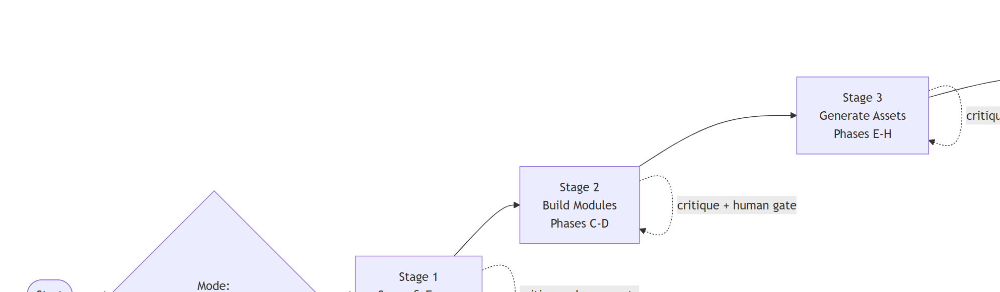

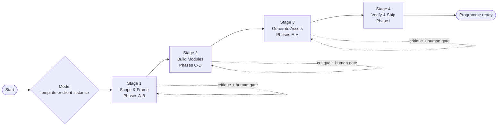

## Stage 1 — Scope & Frame (Phases A–B)

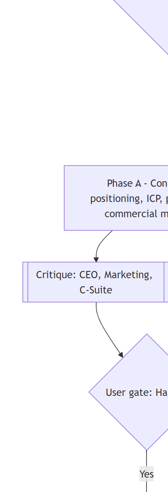

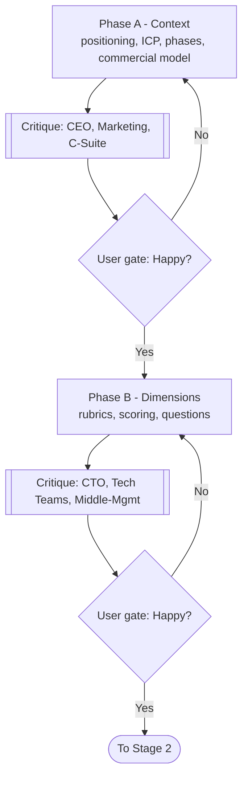

## Stage 2 — Build Modules (Phases C–D)

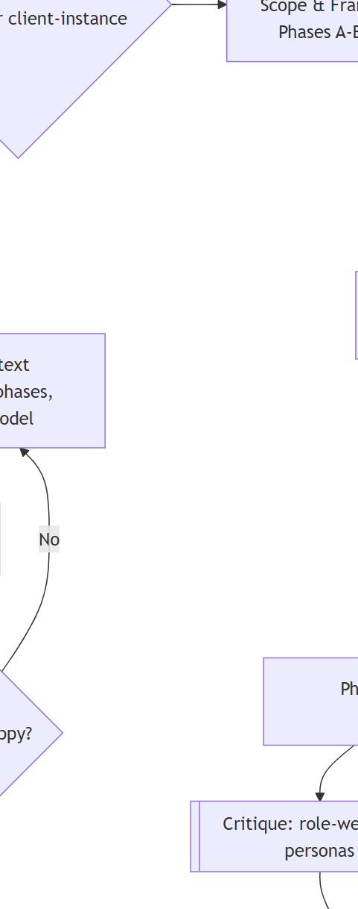

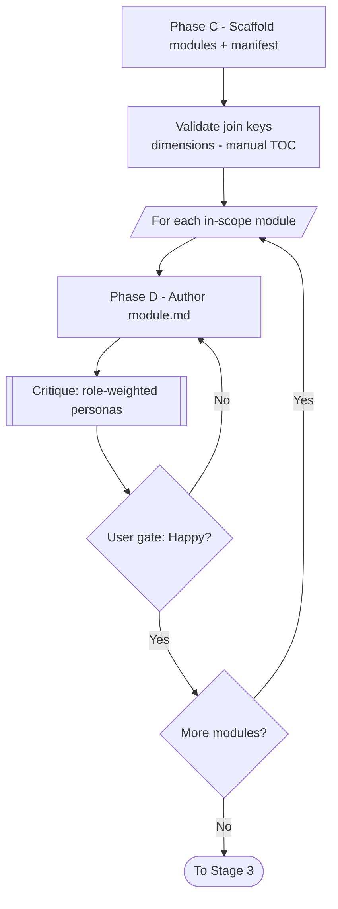

## Stage 3 — Generate Assets (Phases E–H)

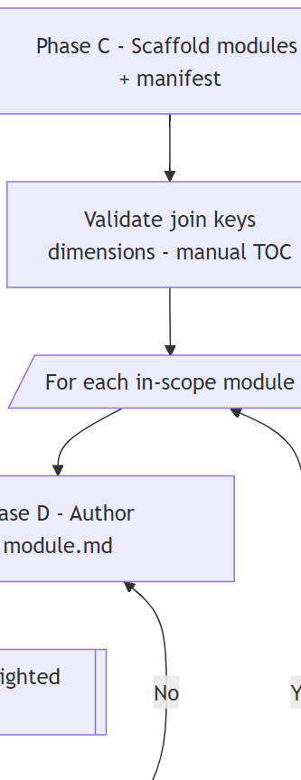

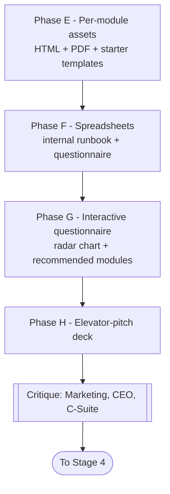

## Stage 4 — Verify & Ship (Phase I)

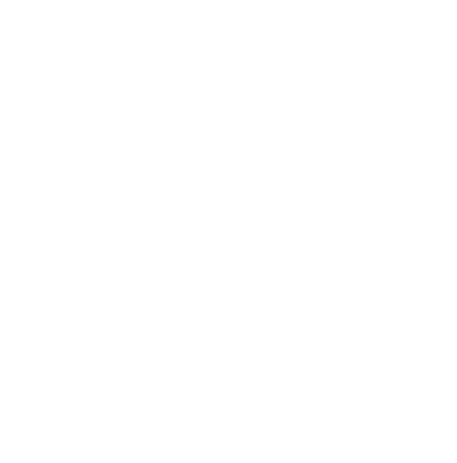

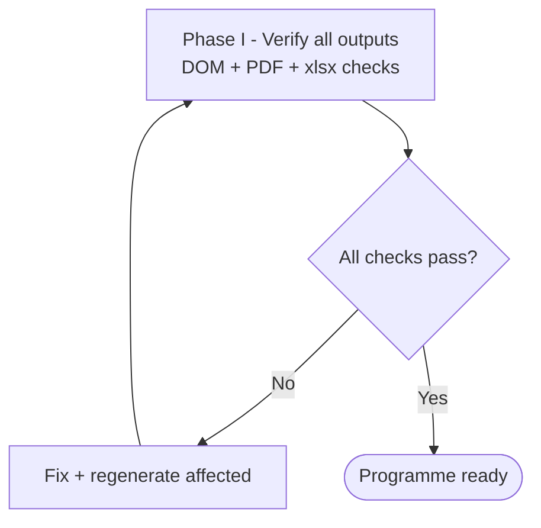

## The critique loop (detail)

Runs inside stages 1–3 before each human gate.

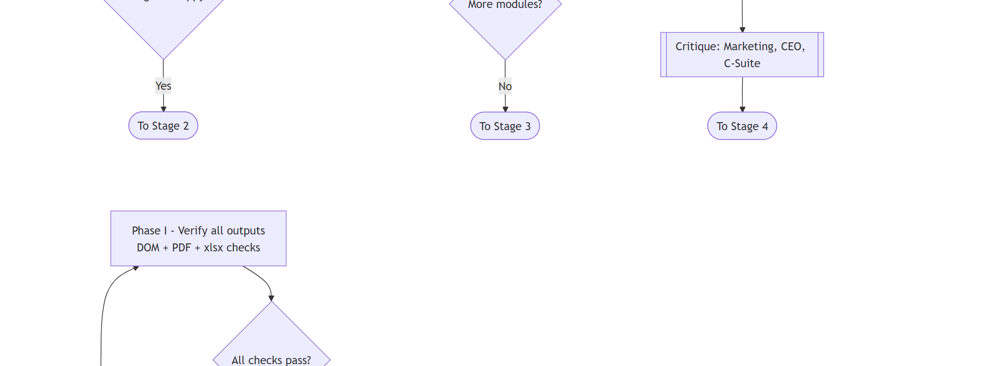

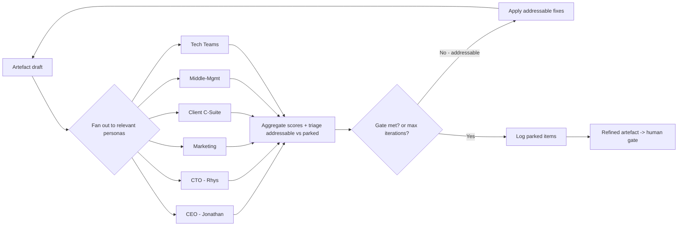
