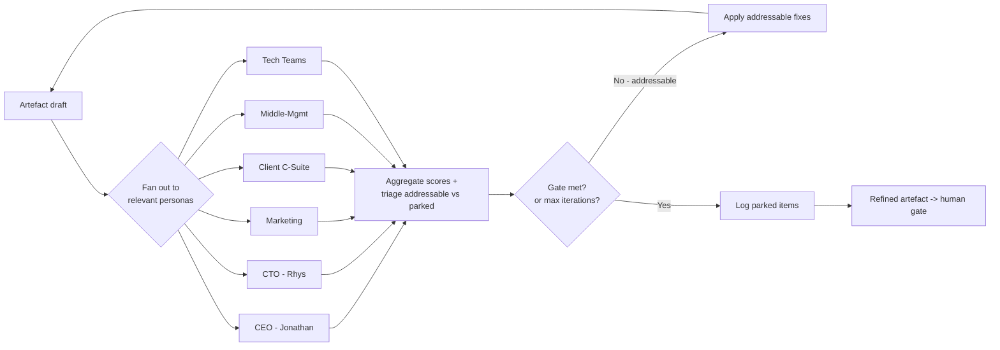

# New Programme Skill — Orchestration Diagram

Improved from the original hand-drawn sketch. The key additions over the sketch:

- **Named phases (A–I)** rather than loose boxes.
- **A six-persona critique panel** inserted before each human gate (not just at the end).
- **Human "Happy?" gates** kept distinct from the autonomous critique loop.
- **A manifest** (`programme.yaml`) introduced at scaffold time as the single source of truth.
- **Explicit spreadsheet + interactive questionnaire phases** (F, G) that the sketch only implied.

## End-to-end flow

```mermaid
flowchart TD
    Start([new-programme invoked]) --> Mode{Template library<br/>or client instance?}
    Mode --> Ctx[Phase A - Establish Programme Context<br/>positioning, ICP, phases, commercial model]
    Ctx --> CritA[[Critique Panel: CEO, Marketing, C-Suite]]
    CritA --> GateA{User gate: Happy?}
    GateA -->|No| Ctx
    GateA -->|Yes| Dim[Phase B - Define Dimensions<br/>rubrics, scoring, questions]
    Dim --> CritB[[Critique Panel: CTO, Tech Teams, Middle-Mgmt]]
    CritB --> GateB{User gate: Happy?}
    GateB -->|No| Dim
    GateB -->|Yes| Scaf[Phase C - Scaffold modules + manifest<br/>trigger logic from scores]
    Scaf --> Loop[/For each in-scope module/]
    Loop --> Auth[Phase D - Author module.md]
    Auth --> CritD[[Critique Panel: role-weighted personas]]
    CritD --> GateD{User gate: Happy?}
    GateD -->|No| Auth
    GateD -->|Yes| More{More modules?}
    More -->|Yes| Loop
    More -->|No| Assets[Phase E - Per-module assets<br/>HTML + PDF + starter templates]
    Assets --> Sheets[Phase F - Spreadsheets<br/>internal runbook + questionnaire]
    Sheets --> Interactive[Phase G - Interactive questionnaire<br/>radar chart + recommended modules]
    Interactive --> Pitch[Phase H - Elevator-pitch deck]
    Pitch --> CritH[[Critique Panel: Marketing, CEO, C-Suite]]
    CritH --> Verify[Phase I - Verify all outputs<br/>DOM + PDF measurement]
    Verify --> Done([Programme ready])
```

## The critique loop (detail)

