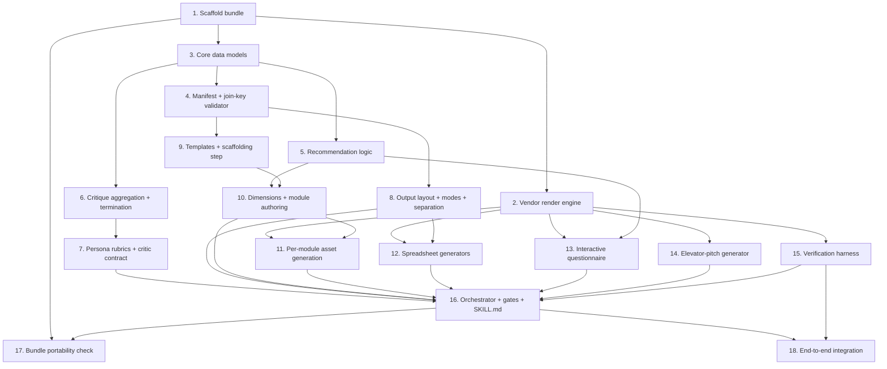

# Implementation Plan

## Overview

Build order follows the design's "AI-DLC first, then generalise" decision: vendor and generalise the reference engine into a self-contained skill bundle, build the core library (manifest, contracts, recommendation, critique) test-first, then the producer generators, then the orchestrator and end-to-end verification. All code is Python + YAML per the design; property tests use `hypothesis`.

The bundle lives at `.kiro/skills/new-programme/`. Paths resolve relative to the bundle (Requirement 14).

## Tasks

- [x] 1. Scaffold the self-sufficient skill bundle
  - Create `.kiro/skills/new-programme/` with `SKILL.md` (frontmatter `inclusion: manual`, placeholder), `engine/`, `templates/`, `personas/`, `assets/brand/`, `examples/`, and a bundle-local `requirements.txt` (openpyxl, playwright, pypdf, hypothesis, pyyaml).
  - Add a `paths.py` helper that resolves all resource paths relative to `Path(__file__).parent` (no repo-root or absolute paths).
  - _Requirements: 14.1, 14.2_

- [x] 2. Vendor and generalise the render engine
  - Copy `analysis/D55/ai-dlc/programme_engine.py` into `engine/programme_engine.py` and remove any repo-relative/absolute path assumptions; make brand assets load from `assets/brand/` via the bundle path helper.
  - Confirm `BrandConfig` + `build(doc, cfg, make_pdf)` renders branded, self-contained HTML (base64-embedded assets) and A4 PDF.
  - _Requirements: 8.2, 8.3, 14.1, 14.2_

- [x] 3. Define core data models
  - In `engine/models.py` implement dataclasses: `DimensionScore` (with `gap`), `Assessment`, `Recommendation`/`Status`, `BrandConfig` (reuse), and the critique models `Finding`, `CritiqueResult`, `AggregateVerdict`, plus `ContractViolation`.
  - _Requirements: 2.1, 4.3, 7.1_

- [x] 4. Manifest loading and the join-key validator
  - [x] 4.1 Implement `engine/manifest.py` to read/write `programme.yaml` and parse module frontmatter and manual-TOC section titles.
    - _Requirements: 2.1_
  - [x] 4.2 Implement `validate_join_keys(programme_dir)` returning `ContractViolation[]` for unknown dimension, unknown manual section, critical-not-covered, and scoring bijection issues; make it a hard stop for callers.
    - _Requirements: 2.2, 2.3, 2.4, 2.5_
  - [x] 4.3 Unit-test the validator with deliberately broken fixtures (unknown dimension, unknown manual section, critical-not-covered) and a valid fixture returning empty (Property 1).
    - _Requirements: 2.5_

- [x] 5. Recommendation logic (single shared implementation)
  - [x] 5.1 Implement `engine/recommend.py::recommend_modules(assessment, modules)` exactly per MODULE-SCHEMA trigger logic (include/high/critical, highest-level-wins), plus `validate_assessment` enforcing the scoring bijection and 1–5 range.
    - _Requirements: 7.1, 7.2, 7.3, 7.4, 7.6_
  - [x] 5.2 Unit-test against MODULE-SCHEMA worked examples and the AI-DLC modules (weak-governance→critical, high-ambition-from-strong-base→included).
    - _Requirements: 7.1, 7.2, 7.3, 7.4_
  - [x] 5.3 Property tests (`hypothesis`): monotonicity (Property 3), priority-implies-inclusion (Property 4), critical gate (Property 5), scoring bijection (Property 2).
    - _Requirements: 7.2, 7.3, 7.4, 7.5, 7.6_

- [x] 6. Critique aggregation and termination
  - [x] 6.1 Implement `engine/critique.py`: `aggregate(results, phase, iteration)` (dedupe, rank by severity × persona weight × cross-persona frequency, addressable/parked split, `passed` gate) and `should_continue(history)` returning PASS/ITERATE/ESCALATE with the max-iteration cap and stall detection.
    - _Requirements: 4.3, 4.4, 4.5, 4.6, 4.7_
  - [x] 6.2 Implement the critique-log writer that appends per-persona scores, backlog delta, and decision each round.
    - _Requirements: 4.8_
  - [x] 6.3 Unit-test `aggregate` (dedupe/weighting/gate) and `should_continue` (PASS, cap ESCALATE, stall ESCALATE, ITERATE).
    - _Requirements: 4.5, 4.6_
  - [x] 6.4 Property tests: loop termination within cap for adversarial/oscillating streams (Properties 7, 8), gate integrity (Property 9), aggregator idempotence/dedupe (Property 10).
    - _Requirements: 4.4, 4.6, 4.7_

- [x] 7. Persona rubrics and critic invocation contract
  - Author the six persona rubric files in `personas/` (d55_ceo, d55_cto, d55_marketing, client_csuite, client_middle_mgmt, client_technical), each with a scored rubric and the addressable-vs-parked instruction.
  - Define the persona→artefact relevance matrix and primary-persona thresholds (internal ≥4, external ≥3) in `engine/critique.py` config, and the sub-agent invocation input/output contract used by the orchestrator.
  - _Requirements: 4.1, 4.2_

- [x] 8. Output layout, modes, and internal/client separation
  - [x] 8.1 Implement `engine/layout.py`: given a configurable output root (default `programmes/<slug>/`), create the template-mode layout (`programme.yaml`, docs, `modules/`, `internal/`, `client/`, `assets/brand/`) and the client-instance layout under `clients/<client-slug>/`.
    - _Requirements: 12.1, 12.2, 12.5, 12.7_
  - [x] 8.2 Enforce that internal-only assets are written under `internal/` and never under `client/` or module `assets/`, and provide a `client_bundle()` helper that excludes `internal/`.
    - _Requirements: 12.3, 12.4, 9.2_
  - [x] 8.3 Implement client-instance cloning that never mutates the template library; unit-test template stays byte-identical (Property 11).
    - _Requirements: 12.6_

- [x] 9. Templates and scaffolding step
  - Add `templates/` skeletons (`programme.yaml.tmpl`, `module.md.tmpl`, `dimensions.md.tmpl`, `client-operating-manual-toc.md.tmpl`) and implement the scaffold routine that instantiates them and runs `validate_join_keys` after scaffolding.
  - _Requirements: 2.1, 6.1, 6.3_

- [x] 10. Dimensions and module authoring steps
  - [x] 10.1 Implement the dimensions authoring step producing `dimensions.md` (1–5 rubrics, calibration, must-ask/go-deeper questions) with names usable as join keys.
    - _Requirements: 5.1, 5.2, 5.3_
  - [x] 10.2 Implement the module authoring step producing schema-conformant `module.md` per in-scope module, validating join keys, and (client-instance) only populating recommended modules.
    - _Requirements: 6.1, 6.2, 6.3, 6.4_

- [x] 11. Per-module asset generation
  - Implement `engine/module_assets.py` that reads a module's deliverables and renders branded HTML + matching PDF + starter templates into that module's `assets/` via `programme_engine.build()`.
  - Verify self-containment (base64-embedded, no CDN) in output (Property 12).
  - _Requirements: 8.1, 8.2, 8.3_

- [x] 12. Spreadsheet generators
  - [x] 12.1 Implement the internal Delivery Playbook generator (`openpyxl`): stages, activities, owners, inputs/outputs, decision points; written under `internal/`.
    - _Requirements: 9.1, 9.2_
  - [x] 12.2 Implement the assessment questionnaire spreadsheet generator: questions per dimension + 1–5 scale, dimension names matching the manifest; written under `client/`.
    - _Requirements: 10.1, 10.2_

- [x] 13. Interactive questionnaire generator
  - Generalise the AI-DLC `workshop.html` into `engine/questionnaire.py` + `templates/questionnaire_template.html`, reading dimensions and module trigger logic from the manifest (embedded at build time), rendering the radar chart and recommendations.
  - Reuse the exact `recommend_modules` logic client-side; add a parity test asserting client-side output matches build-time for fixture scores (Property 6). Output self-contained HTML under `client/` (Property 12).
  - _Requirements: 11.1, 11.2, 11.3, 11.4_

- [x] 14. Elevator-pitch generator
  - Implement the pitch deck generator (reusing the `summary-presentation` pattern): 2-minute narrative, stage path, value, next step; tailored to gaps in client-instance mode; written under `client/`.
  - _Requirements: 13.1, 13.2, 13.3_

- [x] 15. Output verification harness
  - Implement `engine/verify.py`: serve locally + drive Playwright to measure the DOM (images loaded, expected counts, no overflow); read PDFs with `pypdf` (page count/size, orphaned-heading detection); open xlsx with `openpyxl` (expected sheets/rows). On failure, signal the affected asset for regeneration; clean up temp servers/scripts.
  - _Requirements: 15.1, 15.2, 15.3, 15.4, 15.5_

- [x] 16. Orchestrator: state machine, phases, and human gates
  - [x] 16.1 Implement `engine/orchestrator.py` driving the four stages (Scope & Frame, Build Modules, Generate Assets, Verify & Ship), the per-artefact critique loop before each human gate, and the module loop with per-module gate.
    - _Requirements: 1.1, 1.3, 3.1, 3.2, 3.3, 3.4, 3.5_
  - [x] 16.2 Wire mode handling (template vs client-instance), required-input prompting, and the working-assumptions register for provisional decisions.
    - _Requirements: 1.1, 1.2, 1.4, 1.5_
  - [x] 16.3 Author `SKILL.md` orchestrator instructions tying the steps, sub-skills, and critic invocation together (manual inclusion).
    - _Requirements: 1.1, 4.1, 4.2_

- [x] 17. Bundle portability check
  - Implement a test that copies the bundle to a temp dir outside the repo and runs it end-to-end on the bundled `examples/` programme, asserting outputs are produced and no path resolves into `analysis/`, the repo root, or an absolute path (Property 13).
  - _Requirements: 14.1, 14.2, 14.3, 14.4_

- [x] 18. End-to-end integration
  - [x] 18.1 Add a tiny 2-dimension / 2-module fixture programme and run template mode end-to-end; assert deliverable completeness and self-containment.
    - _Requirements: 1.4, 8.3, 11.4, 15.1_
  - [x] 18.2 Run client-instance mode on the fixture with sample scores; assert only in-scope modules get assets and the template is untouched.
    - _Requirements: 1.2, 6.4, 12.6_
  - [x] 18.3 Regenerate the AI-DLC programme through the skill as the reference validation and diff against the existing hand-built assets for parity of structure.
    - _Requirements: 1.3, 1.4_

## Task Dependency Graph



Execution waves (tasks in the same wave have no dependency on each other and may run in parallel):

```json
{
  "waves": [
    { "wave": 1, "tasks": ["1"] },
    { "wave": 2, "tasks": ["2", "3"] },
    { "wave": 3, "tasks": ["4", "5", "6", "14", "15"] },
    { "wave": 4, "tasks": ["7", "8", "9", "13"] },
    { "wave": 5, "tasks": ["10", "12"] },
    { "wave": 6, "tasks": ["11"] },
    { "wave": 7, "tasks": ["16"] },
    { "wave": 8, "tasks": ["17", "18"] }
  ]
}
```

## Notes

- **Test-first for the core library.** Tasks 4–6 (validator, recommendation, critique) carry the correctness properties and should be built with their tests before the generators depend on them.
- **Single recommendation implementation.** Task 5 produces the one `recommend_modules` used by both build-time scoping and the interactive questionnaire (Task 13) to guarantee parity (Property 6). Do not fork the logic.
- **Internal vs client separation is structural.** Task 8 owns the `internal/` vs `client/` split; Tasks 12–14 must write to the correct side. The internal Delivery Playbook must never land under `client/`.
- **Portability is a hard gate.** Task 17 must pass from outside the repo; if any generator reaches into `analysis/` or the repo root, fix the generator, not the test.
- **Reuse over rebuild.** Tasks 2, 13, 14 generalise existing assets (`programme_engine.py`, `workshop.html`, `summary-presentation`) rather than writing renderers from scratch.
- **Working assumptions to confirm with Rhys/Jonathan** (do not block on these): default output root `programmes/<slug>/`, the `internal/`/`client/` split, first-build scope (AI-DLC first), and commercial/pricing/naming — all captured in requirements' open-questions section.
