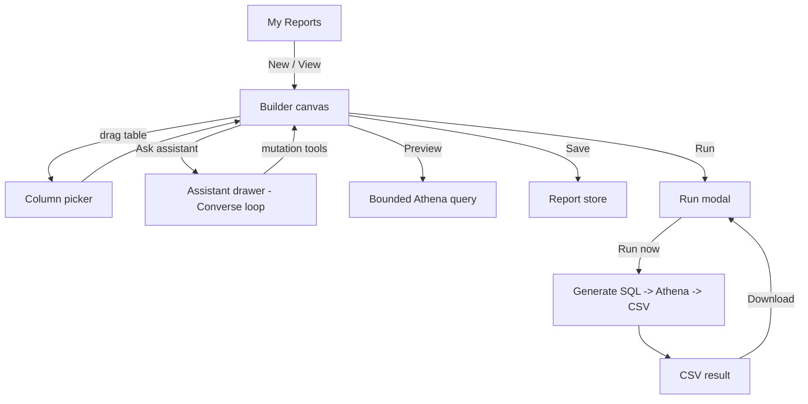
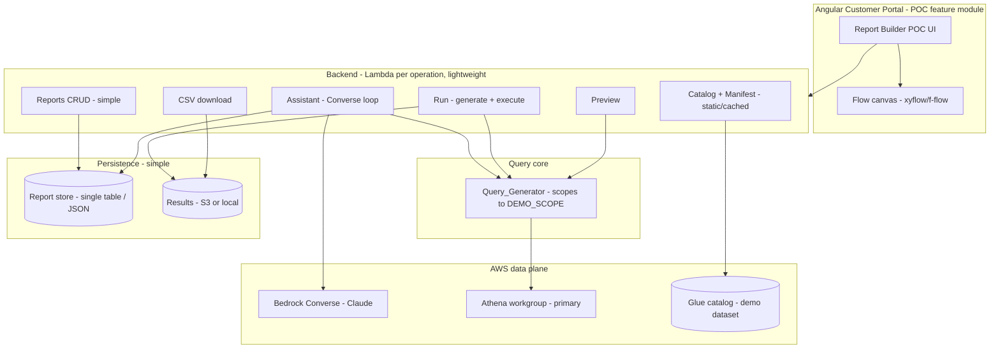

# Design Document: Report Builder (Proof of Concept)

## Overview

This is the **POC design** — a stripped-down clone of
[`../report-builder/design.md`](../report-builder/design.md). Its goal is a
demo-able slice that shows the core experience: drag allow-listed tables onto a
flow canvas, pick columns, connect joins, refine the design in plain language
with an AWS Bedrock assistant, preview, run, and download a CSV.

The full design is built as a **security spine** with three independent layers of
data-isolation, verification, and prompt-injection defence, plus production AWS
infrastructure (DynamoDB single-table, versioned S3, Step Functions, per-env
IAM + Lake Formation). **None of that spine or infrastructure is built for the
POC.** The POC substitutes a **single configured Demo_Scope** for the entire
identity/isolation/verification stack, and the **simplest components that demo
well** for the production infrastructure.

> **Why this is safe to strip for a POC.** The POC runs as one Demo_User against
> one configured customer scope, ideally on the dev twin or a fixture dataset. It
> is not exposed to multiple tenants, so the isolation/verification machinery that
> dominates the full design is not needed to demonstrate the *experience*. When
> the client approves, we build the full `report-builder` spec — which carries the
> spine — not a hardened version of this.

Grounded in the shared Phase 0 analysis (reused, not re-derived):

- **Schema & audit** — `analysis/BRYT/report-builder/schema/schema.md`, `bryt-number-audit.md`
- **Join_Manifest** — `analysis/BRYT/report-builder/schema/join-manifest.json` (v0.2.0)
- **Bedrock approach** — `analysis/BRYT/report-builder/bedrock-approach.md` (Converse tool-use)
- **Mockups** — `analysis/BRYT/report-builder/screen-mockups.md`
- **POC scoping** — `analysis/BRYT/report-builder-poc/overview.md`, `plan.md`

## What changed from the full design (the strip)

| Full design element | POC design |
|---|---|
| Layer 1 — identity + Authorised_Bryt_Numbers resolution (JWT, User_Customer_Mapping, admin override) | **Removed.** A single `DEMO_SCOPE` constant (one bryt number / filter) from config. |
| Layer 3 — independent `Query_Verifier` (pre-exec + result-set) | **Removed.** No independent verification layer. |
| Prompt-injection defence + audit logging | **Removed.** |
| Configurable query bounds (rows + scanned bytes, range-validated) | **Reduced** to a single fixed `LIMIT`. |
| Step Functions async run pipeline (generate→verify→execute→write→finalise + catch) | **Reduced** to a direct "generate → execute Athena → write CSV" call, optionally polled. |
| DynamoDB single-table + GSIs, versioned/encrypted S3 snapshot bucket | **Reduced** to a single simple store (one table, or local JSON) + a results location. |
| Per-env IAM + Lake Formation execution role | **Reduced** to a single demo role with read access to the demo dataset. |
| JWT authorizer | **Removed** (or a trivial stub). |
| Full 14-route API surface (cancel, presigned download, conversation store) | **Trimmed** to the core routes below. |
| `Query_Generator` — pins from Trusted_Context, via-mpan window CTE, projects pin cols for the verifier | **Kept but simpler** — scopes to `DEMO_SCOPE`, still builds joins from the manifest; no verifier-driven pin projection. |

`Query_Generator` is **kept** because it is what turns the visual design into a
real query — without it there is no result to show. It is simplified: it scopes to
the demo bryt number and applies a fixed `LIMIT`, but it does **not** carry the
verifier-driven pin projection or the configurable-bounds machinery.

## Architecture

### High-level user flow (unchanged experience)



### System architecture (stripped)



No `Query_Verifier` box, no Step Functions box, no identity-resolution box — the
three that make the full diagram a "spine" are intentionally absent.

### Repository / project structure (lightweight)

The POC does **not** need to mirror the strict three-directory
`BrytReportBuilder` production layout. A single small service plus the Angular
feature module is enough:

```
report-builder-poc/
  api/          # a handful of TS Lambda (or Express) handlers, one per operation
    reports/    # create, read, update, delete, list  (simple store)
    catalog/    # get-catalog, get-manifest  (static allow-list + manifest)
    assistant/  # chat (Converse loop)
    run/        # run (generate SQL -> Athena -> CSV), get-run, download-csv
    preview/    # preview
    core/       # Query_Generator, Report_Design types, Join_Manifest
  web/          # Angular Customer Portal feature module (canvas, picker, drawer, modals)
```

Production patterns (SFN, DDB single-table, LF role, JWT authorizer) are
introduced in the full spec, not here.

## Domain model — `Report_Design` (kept)

The shared model is **kept unchanged** from the full design — it is the thing the
canvas and the assistant both edit, and it is small. Keeping it identical means
the model built for the POC carries straight into the full spec with no rework.

```typescript
interface ReportDesign {
  reportId: string;              // ULID
  name: string;
  description?: string;
  tables: SelectedTable[];
  joins: DesignJoin[];
  filters: DesignFilter[];
  sort: SortRule[];
  schemaVersion: number;
}

interface SelectedTable { table: string; columns: string[]; }
interface DesignJoin   { joinId: string; left: string; right: string; }
interface DesignFilter {
  table: string; column: string;
  op: 'eq'|'ne'|'lt'|'lte'|'gt'|'gte'|'contains'|'startsWith'|'in'|'between'|'isNull'|'notNull';
  value?: unknown; values?: unknown[];   // still bound as PARAMETERS, never concatenated
}
interface SortRule { table: string; column: string; direction: 'asc'|'desc'; }
```

The `BrytScope` narrowing type from the full model is dropped — the POC always
uses the single `DEMO_SCOPE`.

### Graph mapping, round-trip, validation

- **Graph mapping (R8.4):** 1:1 node↔table, edge↔join, same as the full design.
- **Round-trip (R8.3):** canonicalise (sorted keys; tables/columns/joins/filters
  as sets; `sort` ordered); `deserialise(serialise(d)) == d`.
- **Validation (R8.5):** `validateDesign(design, catalog, manifest)` rejects
  tables/columns off the allow-list and joins not in the manifest, naming the
  offender. This is kept because it protects the *demo* from generating broken
  SQL — but it is a correctness check, not the security spine.

## Query generation (kept, simplified)

`Query_Generator` is pure: `(ReportDesign, Catalog, JoinManifest) -> GeneratedQuery`.

```typescript
interface GeneratedQuery {
  sql: string;                 // Athena SQL with bound parameters
  parameters: Record<string, unknown>;
  referencedTables: string[];
  joinIds: string[];
  rowLimit: number;            // a single fixed POC constant
}
```

Rules:

1. References only allow-listed tables/columns; a stray reference aborts naming it.
2. Joins use only Join_Manifest predicates; a required join with no predicate aborts naming it.
3. Scopes every query to the **`DEMO_SCOPE`** filter (a single configured bryt
   number) — e.g. `WHERE <table>.bryt_number = :demo_scope`. This keeps the demo
   showing one customer's data. It is **not** derived per request and is **not**
   verified downstream.
4. Applies a fixed `LIMIT` (e.g. 100 for preview, 100000 for run) — plain
   constants, no configurable-bounds / scanned-bytes machinery.
5. Filter values remain **bound parameters** (basic SQL hygiene, cheap to keep).

The `supply_mpan` UNNEST CTE from the manifest is kept **only if** the demo uses a
`via-mpan` table; otherwise the demo can stick to `direct`-pinned tables to keep
the POC query surface minimal.

## Components and interfaces

### Catalog + Join_Manifest service (simplified)

- Serves a **static / cached allow-list** of demo tables + columns and the
  Join_Manifest. Reading live from Glue is optional; a static catalog is more
  reliable for a live demo.
- **No fail-closed governance** requirement — if the catalog is a static asset it
  cannot be "unavailable" mid-demo. If it does read Glue, a simple error is fine.
- Tags join/primary keys (`isKey`) so the Column_Picker can pre-select them.

### Assistant — Converse tool-use loop (kept — the star)

The assistant is the centrepiece of the demo, so it is **kept**, following
`bedrock-approach.md` (Converse API tool-use, Claude on Bedrock). `toolConfig`
exposes the **Report_Design mutation tools** — `add_table`, `remove_table`,
`add_column`, `remove_column`, `add_join` (manifest predicates only), `set_filter`,
`set_sort` — each mutating the shared design through `validateDesign` and reporting
rejections back to the model so it can explain limitations (R4.6).

Stripped from the full assistant:

- **No prompt-injection defence / audit logging** (R12) — deferred.
- **No Trusted_Context injection of Authorised_Bryt_Numbers** — the assistant
  works on the design only; scoping is applied later by `Query_Generator` via the
  constant `DEMO_SCOPE`.
- **`validate_query` (dry-run `EXPLAIN`) is optional** — nice for polish, not a
  gate. If included it is best-effort, not `toolChoice`-forced.
- **Conversation persistence is optional** — the demo can keep history in memory
  for the session; no dedicated Conversation_Store.

### Run (simplified — no Step Functions)

`run` generates the SQL, calls Athena `StartQueryExecution` on the demo
workgroup, waits/polls for completion, and points at the CSV Athena wrote to S3.
Statuses: `Queued → Running → Complete | Failed`. No `Cancelled`, no catch-state
machine, no independent verify step. A Run record stores run number, status,
started time, row count, and result location.

### Preview (simplified)

Synchronous bounded query (`LIMIT 100`) scoped to `DEMO_SCOPE`, returning the
selected columns in design order plus a filter/sort summary. No independent
verification, no hard-timeout governance guarantee — a reasonable client-side
timeout is enough for a demo.

### CSV download (simplified)

Returns the CSV object for a `Complete` run. A direct download or a short-lived
link is fine; owner-scoping and presigned-URL rigor are deferred (single Demo_User).

### API surface (trimmed to the core)

| Method | Route | Handler |
|--------|-------|---------|
| GET | `/reports` | `reports/list` |
| POST | `/reports` | `reports/create` |
| GET | `/reports/{reportId}` | `reports/read` |
| PUT | `/reports/{reportId}` | `reports/update` |
| DELETE | `/reports/{reportId}` | `reports/delete` |
| GET | `/catalog` | `catalog/get-catalog` |
| GET | `/catalog/manifest` | `catalog/get-manifest` |
| POST | `/reports/{reportId}/assistant` | `assistant/chat` |
| POST | `/reports/{reportId}/preview` | `preview/preview` |
| POST | `/reports/{reportId}/runs` | `run/run` |
| GET | `/reports/{reportId}/runs/{runId}` | `run/get-run` |
| GET | `/reports/{reportId}/runs/{runId}/result` | `run/download-csv` |

Dropped vs the full spec: `list-runs` depth, `cancel-run`, JWT-scoped identity on
every handler.

## Data Models

_Simplified for the POC._

- **Report store:** a single simple store (one DynamoDB table with `PK=reportId`,
  or even local JSON for a local demo) holding the serialised `Report_Design` +
  metadata (name, description, table list, timestamps). No GSIs, no per-user PK,
  no S3 snapshot.
- **Run record:** `{ reportId, runNo, status, startedAt, rowCount?, resultLocation? }`.
- **Results:** the CSV Athena writes to an S3 results prefix (or local dir for a
  local demo). No versioning/lifecycle requirements.

```typescript
type RunStatus = 'Queued' | 'Running' | 'Complete' | 'Failed';   // no 'Cancelled'
```

## Deployment (simplified)

A single small stack (or `sam`/`cdk` app) is enough: the handful of Lambdas (or a
single Express service), the Athena workgroup + demo dataset access, a Bedrock
model grant, and the simple store. No Step Functions, no LF grant choreography, no
multi-account role pattern, no JWT authorizer.

## Correctness Properties

The POC has **no security spine**, so the full spec's data-isolation and
verification properties (its P1–P4, P8–P10) are intentionally **not** in scope
here. Only the model-integrity properties that keep the demo working are kept:

### Property 1: Allow-list integrity
Every generated query references only allow-listed tables/columns and
manifest-defined joins.
**Validates: Requirements 8.5, 9.2, 9.3**
**Upheld by:** `validateDesign` + `Query_Generator` (Tasks 4, 5).

### Property 2: Demo scoping
Every generated query is scoped to `DEMO_SCOPE` and carries the fixed `LIMIT`.
**Validates: Requirements 9.4**
**Upheld by:** `Query_Generator` (Task 5) — a demo convenience, **not** a security
guarantee.

### Property 3: Round-trip identity
`deserialise(serialise(design))` reproduces the same tables, columns, joins,
filters, and ordered sort.
**Validates: Requirements 8.3**
**Upheld by:** the round-trip serialise (Task 6).

### Property 4: Shared-model consistency
A canvas edit and an equivalent assistant edit produce the same `Report_Design`.
**Validates: Requirements 8.2, 8.4**
**Upheld by:** the shared model + pure graph mapping (Tasks 9, 15).

> The full spec's properties P1–P13 (pin correctness, verifier independence,
> cross-tenancy window safety, injection resistance) are deferred with the spine.

## Error Handling

POC error handling is intentionally lightweight — enough for a smooth demo, not
production-grade resilience:

- **Validation errors** (disallowed table/column/join): surfaced to the caller
  naming the offender; the design is left unchanged (R8.5, R9.5).
- **Assistant declines** a request it cannot satisfy within the catalog/manifest:
  returns a plain-language explanation, design unchanged (R4.6).
- **Preview failure:** shows an error in the dialog, design unchanged, no Run
  queued (R5.7).
- **Run failure:** the Run is marked `Failed` with the error message shown in the
  run modal (R7.5). No catch-state machine, no partial-output discard guarantees —
  deferred to the full spec.
- **Everything else** (store/Athena/Bedrock errors): a simple error response and a
  toast in the UI. No retry/backoff choreography for the POC.

## Testing Strategy

Right-sized for a throwaway demo:

- **Unit:** `Query_Generator` (correct SQL for a few representative designs incl.
  a join), `validateDesign` (rejects off-allow-list refs), and the serialise
  round-trip (C3).
- **Manual demo run-through (Task 18):** the primary confidence check — walk the
  full flow (New → drag → pick columns → ask assistant → preview → run → download)
  against the demo dataset and confirm it is smooth and repeatable.
- **Explicitly out of scope:** the full spec's property-based security tests
  (cross-tenant isolation, injection, bounds, verifier independence) and the CI/CD
  suite — those arrive with the spine on green-light.

## What we deliberately did NOT build (and where it comes back)

Everything in this list is built in the full `report-builder` spec on green-light:

- **Security spine:** identity/bryt resolution (R10, R19), independent
  `Query_Verifier` (R11), prompt-injection defence + audit (R12), configurable
  query bounds (R13).
- **Production infra:** DynamoDB single-table + GSIs (R17.3), versioned/encrypted
  S3 with lifecycle (R17.4), Step Functions pipeline (R17.6, R17.7), per-env
  IAM + Lake Formation role, JWT authorizer (R17.10).
- **Run lifecycle depth:** cancel + terminal-state protection (R15.5–R15.7),
  50-run history, presigned owner-scoped downloads.
- **Fail-closed catalog** on Glue unavailability (R18.6).

Because the POC keeps the **Report_Design model, the Query_Generator, the Catalog/
Join_Manifest shapes, and the Converse assistant** intact, the demo code is a
genuine seed for the production build rather than a throwaway mock — the spine and
infra wrap around these kept pieces later.
