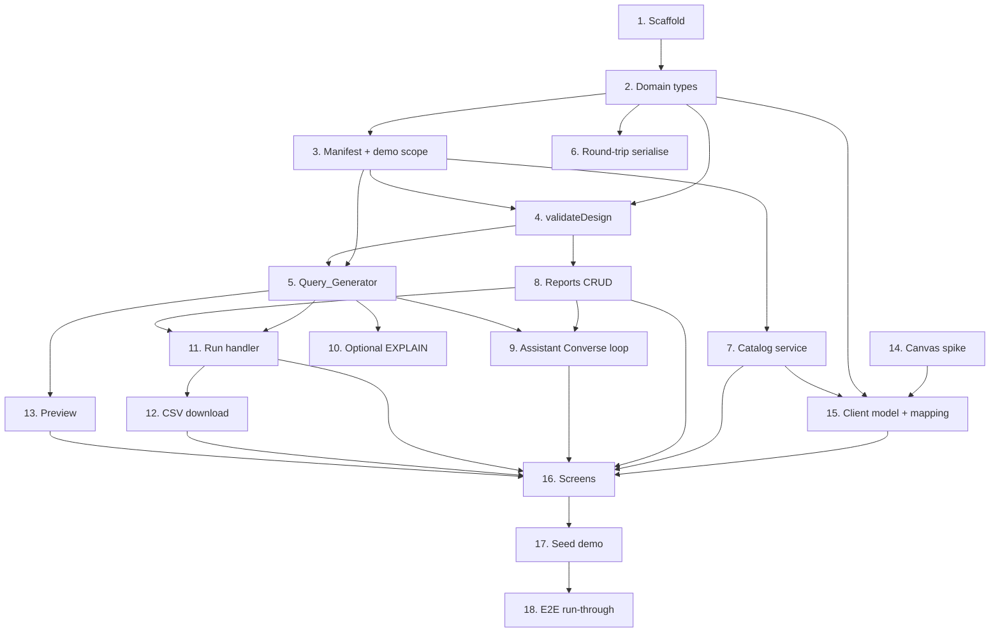

# Implementation Plan: Report Builder (Proof of Concept)

> Derived from [`design.md`](design.md) and [`requirements.md`](requirements.md).
> This is the **POC** checklist — a stripped clone of
> [`../report-builder/tasks.md`](../report-builder/tasks.md). The higher-level POC
> working plan lives in
> [`analysis/BRYT/report-builder-poc/plan.md`](../../../analysis/BRYT/report-builder-poc/plan.md);
> keep [`session.md`](../../../analysis/BRYT/report-builder-poc/session.md) in step.

## Overview

Builds a **demo-able slice** of the Report Builder: a lightweight backend plus the
Angular feature module for the visual builder + AI assistant, running as a single
Demo_User against a single configured Demo_Scope. There is **no security spine**
(no identity resolution, no independent verifier, no injection defence, no
configurable bounds) and **no production infrastructure** (no Step Functions, no
DynamoDB single-table, no Lake Formation role, no JWT authorizer). Those land in
the full `report-builder` spec on green-light.

The full spec deliberately ordered its security spine (its Tasks 5–10) **before**
any execution path. The POC has **no spine**, so tasks are ordered simply for the
fastest path to a working demo.

**Legend:** `[ ]` todo · `[~]` in progress · `[x]` done · `[!]` blocked ·
`*` optional / polish.

## Tasks

### Phase 1 — Foundations

- [ ] 1. Scaffold the POC project
  - `api/` (handful of TS handlers or one small service) + `web/` (Angular feature module)
  - Domain folders: `reports/`, `catalog/`, `assistant/`, `run/`, `preview/`, `core/`
  - _Requirements: (design "Repository / project structure")_

- [ ] 2. Define `core` domain types
  - `ReportDesign`, `SelectedTable`, `DesignJoin`, `DesignFilter`, `SortRule` (same shapes as the full spec, so they carry forward)
  - `Catalog`, `CatalogTable`, `CatalogColumn`; `GeneratedQuery`; `Run`, `RunStatus` (no `Cancelled`)
  - _Requirements: R8.1, R8.4_

- [ ] 3. Bring in the Join_Manifest + demo allow-list
  - Import `schema/join-manifest.json` (v0.2.0) as a typed read-only model; pick the minimal demo table set (prefer `direct`-pinned tables to keep the query surface small)
  - Define the `DEMO_SCOPE` constant (single bryt number) + the fixed row `LIMIT`s (preview 100 / run 100000)
  - _Requirements: R9.4, R10.4_

### Phase 2 — Query generation + validation

- [ ] 4. Implement `validateDesign(design, catalog, manifest)`
  - Reject tables/columns off the allow-list and joins not in the manifest, naming the offender (correctness check, not a security gate)
  - _Requirements: R8.5_

- [ ] 5. Implement `Query_Generator` (design + catalog + manifest → SQL)
  - Reference only allow-listed tables/columns; joins only from manifest predicates
  - Scope every query to `DEMO_SCOPE`; apply the fixed `LIMIT`; filter values as bound parameters
  - Emit the `supply_mpan` CTE only if a `via-mpan` demo table is used
  - _Requirements: R9.1, R9.2, R9.3, R9.4, R9.5_

- [ ] 6. Implement `Report_Design` serialise/deserialise round-trip
  - Canonicalise (sorted keys; sets for tables/columns/joins/filters; ordered `sort`); `deserialise(serialise(d)) == d`
  - _Requirements: R8.3_

### Phase 3 — Backend services

- [ ] 7. Catalog service (static / cached)
  - `GET /catalog`: serve the demo allow-list with `isKey` tags; `GET /catalog/manifest`: serve the manifest
  - Static asset is fine — no fail-closed governance required
  - _Requirements: R10.1, R10.2, R10.3, R10.4_

- [ ] 8. Reports CRUD (simple store)
  - `create`/`read`/`update`/`delete`/`list` against a single simple store; `update` overwrites in place; validate the design (Task 4) on write
  - _Requirements: R1, R6, R8.5_

- [ ] 9. Assistant chat handler — Converse tool-use loop (the star)
  - `POST /reports/{reportId}/assistant`; Converse loop (Claude) with Report_Design mutation tools; return updated design + per-change + applied-change summary; supply the Join_Manifest as context
  - Keep conversation history in memory for the session (no dedicated store)
  - _Requirements: R4.1, R4.2, R4.3, R4.4, R4.5, R4.6, R4.7_

- [ ]* 10. Optional `validate_query` dry-run (`EXPLAIN`) polish
  - Best-effort Athena `EXPLAIN` surfaced to the assistant; **not** `toolChoice`-forced, **not** a gate
  - _Requirements: R9 (polish)_

### Phase 4 — Run + preview + download

- [ ] 11. Run handler (generate → Athena → CSV, no Step Functions)
  - `POST /reports/{reportId}/runs`: generate SQL, `StartQueryExecution`, poll to completion, record CSV location; statuses `Queued → Running → Complete | Failed`
  - `GET .../runs/{runId}` for status; store run number, status, started time, row count, result location
  - _Requirements: R7.1, R7.2, R7.5, R7.6, R9.1_

- [ ] 12. CSV download handler
  - `GET .../runs/{runId}/result`: return the CSV for a `Complete` run (direct download or short-lived link)
  - _Requirements: R7.3, R7.4_

- [ ] 13. Preview handler
  - `POST /reports/{reportId}/preview`: synchronous bounded query (`LIMIT 100`) scoped to `DEMO_SCOPE`; return selected columns in design order + filter/sort summary; no Run queued; error → dialog error, design unchanged
  - _Requirements: R5.1, R5.2, R5.3, R5.4, R5.7_

### Phase 5 — Frontend (Angular Customer Portal feature module)

- [ ]* 14. Flow-canvas library spike
  - Choose `ngx-xyflow` vs `f-flow`; spike the design→graph mapping
  - _Requirements: R2, R8.4_

- [ ] 15. Client `Report_Design` model + graph mapping
  - Same logical model as backend; pure bidirectional node↔table / edge↔join mapping so canvas + assistant edits stay in sync
  - _Requirements: R8.2, R8.4_

- [ ] 16. Screens
  - My Reports (list + New + View/Delete, R1), Builder canvas (palette, nodes, joins, name, R2), Column picker (R3), Assistant drawer (R4), Run modal + download (R7), Preview dialog (R5), Save modal (R6)
  - _Requirements: R1, R2, R3, R4, R5, R6, R7_

### Phase 6 — Demo readiness

- [ ] 17. Seed a demo report + demo data
  - A couple of pre-built saved reports and a scripted "ask the assistant" moment that reliably lands well in front of the client
  - _Requirements: (demo readiness)_

- [ ] 18. End-to-end demo run-through
  - Walk the full flow (New → drag tables → pick columns → ask assistant → preview → run → download) against the demo dataset; confirm it is smooth and repeatable
  - _Requirements: R2, R3, R4, R5, R7_

## Notes

- Tasks marked `*` are optional polish.
- **No security spine and no production infra by design** — see the "What we
  deliberately did NOT build" section of `design.md`. On client green-light, the
  full `report-builder` spec (with the spine + infra) is what gets built; the
  kept pieces here (Report_Design model, Query_Generator, Catalog/Join_Manifest,
  Converse assistant) seed that build.

## Task Dependency Graph



Execution waves (tasks in the same wave have no dependency on each other):

```json
{
  "waves": [
    { "wave": 1, "tasks": ["1", "14"] },
    { "wave": 2, "tasks": ["2"] },
    { "wave": 3, "tasks": ["3", "6"] },
    { "wave": 4, "tasks": ["4", "7"] },
    { "wave": 5, "tasks": ["5", "8"] },
    { "wave": 6, "tasks": ["9", "10", "11", "13", "15"] },
    { "wave": 7, "tasks": ["12", "16"] },
    { "wave": 8, "tasks": ["17"] },
    { "wave": 9, "tasks": ["18"] }
  ]
}
```
