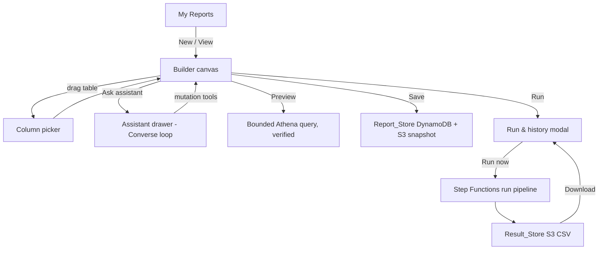
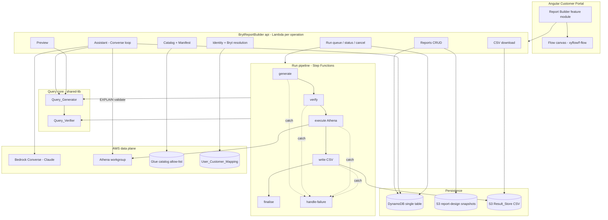
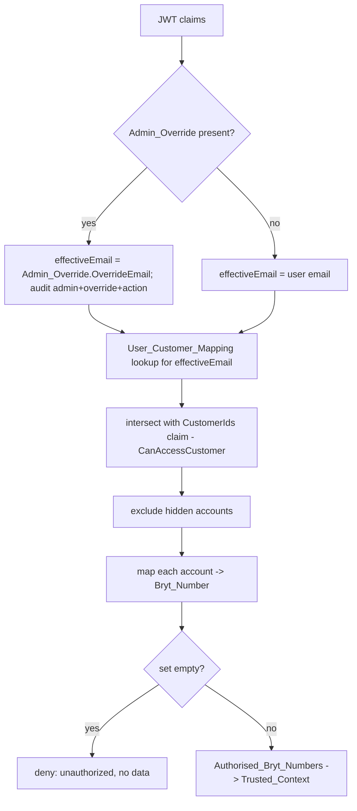

# Design Document: Report Builder

## Overview

The Report Builder is a self-service report/query builder delivered as an extension to the Angular Customer Portal. A non-technical, signed-in customer assembles a report visually — drags allow-listed tables onto a flow canvas, picks columns, connects joins — and iterates in plain language with an AWS Bedrock assistant. Saved reports run asynchronously against Amazon Athena and produce downloadable CSVs.

The backend is a new repository, `BrytReportBuilder`, mirroring the established `BrytBusinessServices` (contract-note) patterns: per-operation TypeScript Lambda handlers grouped by domain folder, a single DynamoDB table, versioned/encrypted S3 buckets, an API Gateway REST resource tree, Step Functions for the async run pipeline, and a `shared-lib` for shared types.

Security is the spine of this design, not a layer on top. Every generated query is pinned to the set of bryt numbers the user is authorised for (the `Authorised_Bryt_Numbers`), resolved server-side from JWT claims and supplied as `Trusted_Context` that the model and user prompt cannot influence. An independent `Query_Verifier` re-checks the pin and bounds before execution and re-checks every row before a result is downloadable.

This design is grounded in the approved requirements (`requirements.md`, 19 requirements, EARS) and the Phase 0 decision artifacts:

- **Schema & bryt-number audit** — `analysis/BRYT/report-builder/schema/schema.md`, `bryt-number-audit.md`
- **Join_Manifest** — `analysis/BRYT/report-builder/schema/join-manifest.json` (canonical, v0.2.0) + `join-manifest.md`
- **Bedrock approach** — `analysis/BRYT/report-builder/bedrock-approach.md` (roll-our-own Converse tool-use)
- **Phase 0.5 decisions** — `analysis/BRYT/report-builder/phase-0.5-decisions.md`

> **Scope guardrails carried from Phase 0.** The **MVP allow-list is the 9 dev-verified tables** (6 `direct`-pinned + `supply_activity`'s `supply_mpan` mapping + the 3 windowed `via-mpan` consumption/reading tables). `ecoes_activity`, both Jira tables, and `consumption_activity_view_test` are excluded (fail-closed). Preview is a server-side bounded Athena query, CSVs are retained indefinitely (lifecycle hook reserved but disabled), run completion is surfaced by in-portal polling only.

## Requirement traceability

| Area | Requirements |
|------|--------------|
| Domain model (`Report_Design`) | R8 |
| My Reports / CRUD / Save | R1, R6, R16.1 |
| Builder canvas & columns | R2, R3, R18.2, R18.3 |
| Assistant (Converse loop) | R4, R9.4, R12, R16.5 |
| Agent→SQL + dry-run validate | R9 |
| Data isolation (pin) | R10, R19 |
| Output verification | R11 |
| Prompt-injection defence | R12 |
| Query bounds | R13 |
| Persistence | R14, R17.3, R17.4 |
| Run lifecycle | R7, R15 |
| Backend APIs | R16 |
| Repo structure & patterns | R17 |
| Catalog & Join_Manifest | R18 |
| Preview | R5 |

## Architecture

### High-level user flow



### System architecture



### Repository structure (`BrytReportBuilder`, R17.1)

Exactly three top-level directories, mirroring BrytBusinessServices:

```
BrytReportBuilder/
  api/            # one TS Lambda handler per operation, grouped by domain folder (R17.2)
    src/
      reports/          # create, read, update, delete, list
      catalog/          # get-catalog, get-manifest
      assistant/        # chat (Converse loop)
      runs/             # queue-run, get-run, list-runs, cancel-run, download-csv
      preview/          # preview
      pipeline/         # generate, verify, execute, write-csv, finalise, handle-failure (SFN tasks)
      shared/           # http + identity helpers, bryt resolution
  cdk/            # single DynamoDB table, S3 buckets, REST API, Step Functions, roles
    lib/
  shared-lib/     # Report_Design, Run, Catalog, Join_Manifest types; Query_Generator; Query_Verifier (R17.8)
```

`Query_Generator` and `Query_Verifier` live in `shared-lib` because they are invoked from three contexts (assistant validate, preview, run pipeline) and their logic is the security spine — one implementation, one place to test.

### Key architecture decisions

| Decision | Choice | Rationale |
|----------|--------|-----------|
| Bedrock integration | Roll-our-own **Converse API tool-use** loop in a Lambda | We own the loop, Trusted_Context injection, audit logging, and forced `validate_query`; the verifier stays outside the model. See `bedrock-approach.md` (Task 0.4). |
| Dry-run validation | Athena **`EXPLAIN`** | Validates SQL + resolves catalog metadata with no data scan, not charged. |
| Report_Design persistence | **Primary in DynamoDB**, versioned JSON **snapshot in S3** on save | Small JSON, fast owner-scoped list/CRUD/update-in-place; S3 snapshot satisfies R17.4 + gives history, off the read path. (Phase 0.5 Q6) |
| Async run | **Step Functions** generate→verify→execute→write→finalise, catch on every state | Matches R17.6/R17.7; returns a run id before completion. |
| Bryt pin | `bryt_number IN (:authorised_bryt_numbers)` from Trusted_Context | Supports multi-account users; single-account narrowing passes a one-element subset (Phase 0.5 Q8, R10.6). |
| via-mpan pinning | Join to `supply_mpan` mapping **with effective-date window** | `mpan → bryt` is many-over-time; window prevents cross-tenant leakage. Verifier rejects unjoined/window-less reads. |
| Catalog source | Curated **allow-list** intersected with Glue, **fail-closed** | Role-visible metadata ≠ queryable; IAM and Lake Formation are separate, per-environment grants. (Decision log) |
| Preview | Server-side bounded Athena query (`LIMIT 100`), same generate→verify path | R5.5 mandates a bounded, pinned, verified query; a client sample would be a security regression. (Phase 0.5 Q1) |
| Query bounds | Run 100k rows / 50 GiB; preview 100 rows / 1 GiB; configurable | Inside R13.3/R13.4 ceilings; byte bound is the real cost control. (Phase 0.5 Q5) |
| Execution role | One CDK role **pattern deployed per environment** | dev/prod are separate accounts with separate LF grants and DB names; not one cross-account role. (Decision log) |

## Domain model — `Report_Design` (R8)

`Report_Design` is the single shared model edited by both the Flow_Canvas and the Assistant (R8.1, R8.2). It is deliberately a **logical** description of intent — selected tables, columns, joins, filters, sort — never SQL. SQL is derived from it by the `Query_Generator` at run/preview time. This keeps the model portable between the frontend graph and the backend, and keeps the security-sensitive translation in one audited place.

```typescript
// shared-lib/types/report-design.ts

interface ReportDesign {
  reportId: string;              // ULID; stable across saves
  name: string;                  // 1..200 in builder (R2.8), 1..100 on save (R6.1)
  description?: string;          // 0..500 (R6.1)
  tables: SelectedTable[];
  joins: DesignJoin[];
  filters: DesignFilter[];
  sort: SortRule[];              // ordered; left-to-right precedence
  scope?: BrytScope;             // optional single-account narrowing (Phase 0.5 Q8)
  schemaVersion: number;         // for forward migration of the serialised form
}

interface SelectedTable {
  table: string;                 // must be an allow-listed Catalog table (R8.5)
  columns: string[];             // must be allow-listed columns of `table` (R8.5)
}

interface DesignJoin {
  joinId: string;                // must match a Join_Manifest join `id` (R8.6)
  left: string;                  // table name
  right: string;                 // table name
}

interface DesignFilter {
  table: string;
  column: string;                // allow-listed column
  op: 'eq'|'ne'|'lt'|'lte'|'gt'|'gte'|'contains'|'startsWith'|'in'|'between'|'isNull'|'notNull';
  value?: unknown;               // treated as a bound PARAMETER, never string-concatenated
  values?: unknown[];            // for `in` / `between`
}

interface SortRule {
  table: string;
  column: string;
  direction: 'asc'|'desc';
}

interface BrytScope {
  // A single Bryt_Number the user narrowed to. The server ALWAYS re-checks it is a
  // member of Authorised_Bryt_Numbers (R10.6); never a security relaxation.
  brytNumber: string;
}
```

### Graph mapping (R8.4)

The frontend maps `Report_Design` to the flow graph 1:1: each `SelectedTable` is exactly one node, each `DesignJoin` is exactly one edge. Node bodies show selected columns with the "X of N selected" summary (R2.3); edges show the join-condition badge from the manifest predicate (R2.5). The mapping is pure and bidirectional so a canvas edit and an assistant edit produce the same model with no conversion (R8.2).

### Serialisation round-trip (R8.3)

The persistable form is the JSON above. Round-trip identity is guaranteed by treating `tables`, `columns` per table, `joins`, and `filters` as **sets** (order-insensitive, deduplicated on write) and `sort` as an **ordered list**. Serialise = `JSON.stringify` of a canonicalised object (sorted keys, sorted set members); deserialise validates against the Catalog + Manifest and rehydrates. A property test asserts `deserialise(serialise(d))` equals `d` on those five facets (see Correctness Properties).

### Validation (R8.5, R8.6, R18.7)

Every mutation and every load runs `validateDesign(design, catalog, manifest)`:

1. Each `table` ∈ catalog allow-list, else reject naming the table (R8.5).
2. Each `column` ∈ that table's allow-listed columns, else reject naming the column (R8.5).
3. Each `join.joinId` ∈ manifest `joins`, and its `left`/`right` match the manifest entry, else reject naming the join (R8.6).
4. If ≥2 tables are selected but not connected by a manifest-defined join path, reject indicating no join is defined (R18.7).
5. Filter/sort columns must be allow-listed columns of a selected table.

Validation failures **leave any previously persisted design unchanged** (R8.5, R8.6) — the API never partially writes.

## Security & verification design (the spine)

This is the core of the feature. Three independent layers enforce data isolation, and no single layer is trusted alone.

### Layer 1 — Identity & Authorised_Bryt_Numbers resolution (R10, R19)

Every request resolves identity and scope server-side, before any data work:



Rules baked into the `shared/identity` helper:

- Identity and bryt numbers come **only** from JWT claims + the mapping store — never from headers, query params, or body (R10.1).
- The set is **re-resolved per request** (R19.5) so an Admin_Override change takes effect immediately; nothing is cached across identity changes.
- Empty set → `401`/`403`, no data (R10.3). Missing/expired/invalid JWT → auth-failure, no data (R10.10, R17.10).
- `User_Customer_Mapping` lookup failure → deny with an error, **never** fall back to an unscoped query (R19.7).
- Admin_Override active → audit entry (admin identity, override email, action) (R19.6).

The resolved `Authorised_Bryt_Numbers` becomes `Trusted_Context` handed to the generator and assistant (R10.4). Report/Run/Conversation store access is scoped to `effectiveId` (the effective email/identity) on every read and write (R10.8); a reference to an entity owned by another identity returns not-accessible without disclosing existence (R10.9).

### Layer 2 — Query_Generator (R9, R10.5, R13)

`Query_Generator` (in `shared-lib`) is pure: `(ReportDesign, Catalog, JoinManifest, Bounds, TrustedContext) -> GeneratedQuery`. It never sees the model output or the raw user prompt.

```typescript
interface GeneratedQuery {
  sql: string;                       // Athena SQL with bound parameters
  parameters: QueryParameters;       // includes :authorised_bryt_numbers (the trusted set)
  referencedTables: string[];
  referencedColumns: ColumnRef[];
  joinIds: string[];
  pins: AppliedPin[];                // one per referenced table, for the verifier to check
  rowLimit: number;                  // <= configured max (R13.3)
  maxScannedBytes: number;           // <= configured max (R13.4)
}
```

Generation rules:

1. References **only** allow-listed tables/columns (R9.2, R13.1); a stray reference aborts generation naming it (R9.7, R13.2).
2. Joins use **only** Join_Manifest predicates (R9.3); a required join with no manifest predicate aborts naming it (R9.8).
3. **Pins every table** from the manifest `pins` (R10.5):
   - `direct` → `WHERE <table>.<col> IN (:authorised_bryt_numbers)`.
   - `via-mpan` → inner-join the `supply_mpan` mapping with the **effective-date window** and pin `supply_mpan.bryt_number IN (:authorised_bryt_numbers)`. A `via-mpan` table is never emitted without this join.
4. The `:authorised_bryt_numbers` value is bound from `Trusted_Context` only (R10.7). If `scope.brytNumber` is set, the generator first asserts it is a member of the set, then narrows the bind to that one element (R10.6); otherwise the full set.
5. Applies `LIMIT <rowLimit>` and sets the workgroup/query scanned-bytes cutoff to `maxScannedBytes` (R13.3, R13.4). Bounds are read from configuration per request (R13.6); absent/out-of-range config rejects the request (R13.7).
6. Filter values are always **bound parameters**, never concatenated — closing SQL-injection independent of prompt-injection.

The `supply_mpan` mapping is emitted as a CTE:

```sql
WITH supply_mpan AS (
  SELECT s.bryt_number, sup.mpan, sup.supply_start_date, sup.supply_end_date
  FROM supply_activity s
  CROSS JOIN UNNEST(s.supplies) AS t(sup)
)
```

### Layer 3 — Query_Verifier (R11, R12.5, R12.6, R13.5)

`Query_Verifier` is an **independent** backend step — not a model tool, not part of generation — that runs before execution and again after completion. It re-derives its expectations from `Trusted_Context` + the manifest, so it cannot be satisfied by anything the model emitted.

**Pre-execution (static) checks:**

1. **Pin present & correct** — every referenced table has its expected pin: a `direct` table's `bryt_number` column is filtered to a **subset** of `Authorised_Bryt_Numbers` (R11.1); a `via-mpan` table is joined to a pinned `supply_mpan` **with the effective-date window** (rejects mpan-only joins that drop the window). Missing/incorrect → block + record verification failure (R11.2, R12.6).
2. **Allow-list** — no table/column outside the catalog (R12.6).
3. **Bounds** — `rowLimit` and `maxScannedBytes` are present and within configured range; a query whose declared/estimated scan exceeds the byte bound is blocked before rows return (R13.5). The Athena workgroup also enforces a hard `BytesScannedCutoffPerQuery` as defence-in-depth.

A blocked query marks the Run **Failed**, makes no result available, and surfaces "could not be verified" (R11.3). Because the verifier enforces pin/allow-list/bounds independently of the assistant (R12.5), an assistant that omitted the pin or exceeded bounds is caught here (R12.6).

**Post-completion (result) checks:**

4. On run completion, before the CSV is downloadable, the verifier reads back the result's bryt-number column(s) and confirms **every** record's `Bryt_Number` ∈ `Authorised_Bryt_Numbers` (R11.4). This is why the generator always projects the pinning bryt column(s) internally, even if the user did not select them (they are stripped from the delivered CSV if unselected).
   - For `via-mpan` results with no direct bryt column, verification is over the `supply_mpan.bryt_number` carried through the pin join.
5. Any record failing → mark Run **Failed**, **discard** the result set, no download (R11.5, R11.6).

### Prompt-injection defence (R12)

- The assistant's system prompt classifies **all** user prompt content and any data pulled into context as **untrusted**; operational instructions within it are never executed (R12.1).
- `Authorised_Bryt_Numbers` scoping is injected as Trusted_Context and preserved for every request regardless of prompt content (R12.2, R10.7).
- If untrusted input tries to remove/alter/disable/bypass the pin, allow-list, or bounds, the assistant ignores it, preserves the constraints, completes with Trusted_Context scoping (R12.3), and records an **audit entry** that the attempt was ignored (R12.4).
- Crucially, even a fully-compromised assistant cannot leak data: the generator only ever binds the pin from Trusted_Context, and the independent verifier blocks any query/result that violates the pin or bounds (R12.5, R12.6). The model is untrusted-by-design; the verifier is the enforcement boundary.

## Components and interfaces

### Catalog + Join_Manifest service (R18)

The Catalog is a **curated allow-list**, not a reflection of what the role can see. At request time the catalog handler intersects the static allow-list (the 9 MVP tables + their allow-listed columns) with live Glue `GetTables`/`GetTable` metadata:

- Exposes only allow-listed tables/columns (R18.1, R18.2, R18.3); anything outside the allow-list, or present in Glue but not allow-listed, is never surfaced.
- **Fails closed:** if the Glue database is unavailable, returns a data-source-unavailable error and exposes **no** tables rather than partial/stale content (R18.6).
- Serves the Join_Manifest to clients and to the assistant as Trusted_Context (R18.4, R18.5).

The manifest is promoted from `analysis/BRYT/report-builder/schema/join-manifest.json` into `shared-lib` as a typed model and served read-only. The Phase-0 copy remains the reviewed source.

```typescript
interface Catalog {
  tables: CatalogTable[];
}
interface CatalogTable {
  name: string;
  columnCount: number;
  columns: CatalogColumn[];
}
interface CatalogColumn {
  name: string;
  dataType: string;        // Glue/Athena type
  isKey: boolean;          // join key or primary key -> `key` tag + pre-select (R3.1, R3.2)
}
```

### Assistant — Converse tool-use loop (R4, R9.4, R12, R16.5)

The assistant handler runs a Bedrock **Converse** loop (Claude) in a single Lambda (per `bedrock-approach.md`). The loop is entirely ours: we assemble the system prompt, inject Trusted_Context, run tools, and persist history to the Conversation_Store.

`toolConfig` exposes:

1. **Report_Design mutation tools** — `add_table`, `remove_table`, `add_column`, `remove_column`, `add_join` (Join_Manifest predicates only), `set_filter`, `set_sort`. Each mutates the shared `Report_Design` through the same `validateDesign` used by the canvas (R4.5, R8.2). A mutation that would reference a non-allow-listed table/column or an undefined join is rejected by the tool and reported back to the model, which surfaces the limitation to the user (R4.6).
2. **`validate_query`** — generates SQL from the current design and runs Athena `EXPLAIN`; forced via `toolChoice` before the assistant finalises an applied change (R9.4), under a 30s timeout (R9.9). An `EXPLAIN` error blocks finalisation and surfaces the validation error, leaving the design unchanged (R9.5).

Loop contract:

- Message validation happens at the API edge: 1..2000 chars from the drawer (R4.8), API hard limit 4000 (R16.5, R16.10); empty/whitespace/oversize rejected without calling Bedrock.
- Trusted_Context (`Authorised_Bryt_Numbers`, selected `Bryt_Number`, Join_Manifest) is placed in the system prompt / tool inputs by the Lambda, never taken from model output (R10.4, R10.7).
- Response returns the updated `Report_Design` + a per-change description and an applied-change summary (R4.3, R4.4).
- History persists to Conversation_Store per report + owner (R14.2); reopening a report restores it (R14.3, R16.5). Converse is stateless — we pass history from our store each turn, matching the Bryt-scoped store.
- Injection attempts detected in untrusted input are audit-logged and ignored (R12.3, R12.4).

### Run pipeline — Step Functions (R7, R15, R17.6, R17.7)

`queue-run` writes a Run record (`Queued`), starts the state machine, and returns the run id + `Queued` status within 3s (R7.1, R16.2, R15.1). The state machine:

```
generate -> verify -> execute (Athena) -> write-csv -> finalise
   \___________\___________\____________\____ (catch on every state) -> handle-failure
```

- **generate** — `Query_Generator` produces the bounded, pinned SQL from the saved design + Trusted_Context; sets status `Running` (R15.2).
- **verify** — `Query_Verifier` pre-execution checks; failure → `handle-failure` marks `Failed`, no result (R11.2, R11.3).
- **execute** — `StartQueryExecution` on the Athena workgroup (with the scanned-bytes cutoff); polls to completion.
- **write-csv** — Athena's result lands in the Result_Store S3 bucket; the pipeline records its location.
- **finalise** — `Query_Verifier` result-set check (R11.4); on pass, set `Complete`, record result location + row count (0..999,999,999) (R15.3, R14.8); on any failing row, discard result, set `Failed` (R11.5).
- **handle-failure** (catch) — sets `Failed`, records an error message ≤1000 chars, discards partial output so no result location is recorded (R15.4, R17.7).

**Cancellation** (R15.5–R15.7, R16.6): `cancel-run` is valid only for `Queued`/`Running`; it stops the execution (SFN stop + Athena `StopQueryExecution`) within 10s and sets `Cancelled`. Terminal states (`Complete`/`Failed`/`Cancelled`) reject cancellation and never transition (R15.6, R15.7, R16.9). Run statuses are read via `get-run`/`list-runs` (up to 50, most-recent-first, R7.2, R16.3).

### Preview (R5)

`preview` is synchronous and does **not** queue a Run (R5.4). It runs the same generate→verify path with the **preview bounds** (100 rows / 1 GiB), pinned to `Authorised_Bryt_Numbers` (R5.5), under a 10s budget with `EXPLAIN` in front to fail fast (R5.8). It returns ≤100 rows projecting only the selected columns in design order (R5.1, R5.3), plus the filter/sort summary (R5.2). Zero rows → empty-result indication with columns + summary still shown (R5.10). Failure/timeout → error in dialog, design unchanged, no Run queued (R5.8, R5.9).

### CSV download (R7.3, R7.4, R16.4, R16.8)

`download-csv` is valid only for `Complete` runs (R16.8) and only after result verification passed. It returns the CSV object from Result_Store scoped to the owner. If the object is missing, returns a retrieval error (R7.10). Delivery is a short-lived pre-signed URL to the owner-scoped key (no public access).

### API surface (R16, contracts modelled on the contract-note pattern R16.7)

| Method | Route | Handler | Requirements |
|--------|-------|---------|--------------|
| GET | `/reports` | `reports/list` | R1, R16.1 |
| POST | `/reports` | `reports/create` | R6, R16.1 |
| GET | `/reports/{reportId}` | `reports/read` | R1.4, R14.3, R16.1 |
| PUT | `/reports/{reportId}` | `reports/update` | R6.7, R16.1 |
| DELETE | `/reports/{reportId}` | `reports/delete` | R1.5, R16.1 |
| GET | `/catalog` | `catalog/get-catalog` | R18.1–R18.3, R18.6 |
| GET | `/catalog/manifest` | `catalog/get-manifest` | R18.4, R18.5 |
| POST | `/reports/{reportId}/assistant` | `assistant/chat` | R4, R16.5 |
| POST | `/reports/{reportId}/preview` | `preview/preview` | R5 |
| POST | `/reports/{reportId}/runs` | `runs/queue-run` | R7.1, R16.2 |
| GET | `/reports/{reportId}/runs` | `runs/list-runs` | R7.2, R16.3 |
| GET | `/reports/{reportId}/runs/{runId}` | `runs/get-run` | R7.8, R16.3 |
| POST | `/reports/{reportId}/runs/{runId}/cancel` | `runs/cancel-run` | R7.7, R16.6 |
| GET | `/reports/{reportId}/runs/{runId}/result` | `runs/download-csv` | R7.4, R16.4 |

Every handler resolves identity + Authorised_Bryt_Numbers first (R10.1) and scopes all store access to the effective identity (R10.8, R10.9).

## Data models

### DynamoDB single table (R17.3, Phase 0.5 Q6)

One table, `PK`/`SK`, PAY_PER_REQUEST, with GSIs. `<effectiveId>` is the effective Portal_User identity (Admin_Override email when present) and scopes every item (R10.8).

| Entity | PK | SK | GSI | Notes |
|--------|----|----|-----|-------|
| Report | `USER#<effectiveId>` | `REPORT#<reportId>` | `GSI1PK=USER#<effectiveId>`, `GSI1SK=NAME#<lowername>` | Name GSI drives A–Z/Z–A sort + case-insensitive search (R1.6, R1.7) |
| Conversation msg | `USER#<effectiveId>` | `REPORT#<reportId>#MSG#<ts>` | — | Per-report history (R14.2), time-ordered |
| Run | `USER#<effectiveId>` | `REPORT#<reportId>#RUN#<runNo>` | `GSI2PK=REPORT#<reportId>`, `GSI2SK=STARTED#<ts>` | Recency list, up to 50 most-recent (R7.2) |

The Report item stores the serialised `Report_Design` inline (small JSON, well under the 400 KB item limit) plus metadata (name, description, table list for the My Reports badges, timestamps). Run items store run number, trigger, `Run_Status`, row count, error message (≤1000 chars), and Result_Store location (R14.6, R14.7).

`update` on an existing `reportId` overwrites in place — no duplicate entry (R6.7). Owner-scoped queries mean a cross-user reference simply returns nothing (R10.9).

### S3 buckets (R17.4 — public access blocked, versioned, SSE)

- **Report-design snapshot bucket** — on each save, a versioned JSON snapshot `snapshots/<effectiveId>/<reportId>.json`. Off the read path; provides design history/restore (R14.3, R14.5) and export. Satisfies R17.4's "report design objects in versioned/encrypted S3".
- **Result_Store bucket** — run CSVs at `results/<effectiveId>/<reportId>/<runNo>.csv` (R14.8, R7.4). A **disabled** S3 lifecycle rule is defined in CDK so expiry can be switched on later without a data-model change (Phase 0.5 Q3); nothing about expiry is surfaced in the UI now.

### Serialised `Report_Design`

The persistable form is the canonicalised `ReportDesign` JSON (see Domain model). It is validated against the Catalog + Manifest on every write and read; a design referencing a disallowed table/column/join is rejected without touching the persisted copy (R8.5, R8.6).

### Run / status types

```typescript
type RunStatus = 'Queued' | 'Running' | 'Complete' | 'Failed' | 'Cancelled';

interface Run {
  reportId: string;
  runNo: number;
  trigger: 'manual';            // scheduled is out of scope
  status: RunStatus;
  startedAt: string;            // ISO 8601
  rowCount?: number;            // 0..999,999,999 on Complete (R15.3)
  errorMessage?: string;        // <= 1000 chars on Failed (R15.4)
  resultLocation?: string;      // Result_Store key, only when Complete + verified
}
```

## CDK topology (R17)

One CDK app defining, per environment (dev/prod are separate accounts with separate LF grants and DB names — Decision log):

- **DynamoDB table** — PK/SK, GSI1 (name), GSI2 (run recency), PAY_PER_REQUEST (R17.3).
- **S3 buckets** — snapshot + Result_Store, both `blockPublicAccess=ALL`, `versioned=true`, SSE (R17.4); Result_Store has the disabled lifecycle rule.
- **API Gateway REST API** — resource tree routing each route to its Lambda integration (R17.5); JWT authorizer rejecting missing/expired/invalid tokens (R17.10).
- **Lambdas** — one per operation (R17.2), plus the pipeline task Lambdas.
- **Step Functions** state machine — generate→verify→execute→write→finalise with a catch to handle-failure on every state (R17.6, R17.7).
- **Execution role** — one role pattern granted, in that account, IAM for the API actions (`glue:GetTables/GetTable`, `athena:StartQueryExecution/GetQueryExecution/GetQueryResults/StopQueryExecution`, `s3:GetObject/PutObject` on the result prefix, `bedrock:InvokeModel`) **and** Lake Formation `SELECT` on exactly the 9 allow-listed tables. IAM ≠ LF; both are required and granted per environment.
- **Athena workgroup** — with `BytesScannedCutoffPerQuery` set as a hard backstop to the configured byte bound, and result output to the Result_Store bucket.
- **Config** — row/byte bounds (run + preview), model id, database name, and workgroup as environment/SSM config, read per request (R13.6) and range-validated (R13.7).

## Frontend architecture (Angular Customer Portal extension)

A new feature module in the existing portal. Screens map to the mockups (`screen-mockups.md`).

- **Flow canvas library** — `ngx-xyflow` vs `f-flow`, chosen and spiked in Phase 6.1. The canvas renders the `Report_Design`→graph mapping (R8.4).
- **Shared `Report_Design` client model** — the same logical model as the backend, edited by both the canvas and the assistant drawer so visual and conversational edits stay in sync (R8.2). Graph mapping is a pure function over it (R8.4).
- **Screens:** My Reports (01, R1), Builder canvas (02, R2), Column picker (03, R3), Assistant drawer (04, R4), Run & history (05, R7), Preview (06, R5), Save (07, R6).
- **State & scoping** — all data comes from the Report_API scoped server-side; the client never sends identity or bryt numbers (R10.1). "View" opens the builder (R1.4, Phase 0.5 Q2). The Run & history modal polls while open and on Refresh (R7.8, Phase 0.5 Q4) — no email/push for MVP.
- **Validation mirrored client-side for UX** (name lengths R2.8/R2.13/R6.1, ≥1 column R3.8, message length R4.8) but the server re-validates authoritatively.

## Correctness properties

These are the invariants the implementation and tests must uphold, each mapped to requirements.

### Property 1: Every generated query is pinned to Authorised_Bryt_Numbers
*For any* `Report_Design` and *any* `Authorised_Bryt_Numbers`, the `Query_Generator` output pins every referenced table — `direct` by a `bryt_number IN (:authorised_bryt_numbers)` filter, `via-mpan` by a windowed join to a pinned `supply_mpan` — and binds the value only from Trusted_Context.
**Validates: R10.4, R10.5, R10.7**

### Property 2: The verifier blocks any unpinned or out-of-bounds query
*For any* query submitted for execution, if it lacks a bryt-number filter restricting results to a subset of Authorised_Bryt_Numbers, or reads a `via-mpan` table without the windowed pin join, or exceeds the row/byte bounds, or references a non-allow-listed table/column, the `Query_Verifier` blocks execution and records a verification/bounds failure — independently of assistant output.
**Validates: R11.1, R11.2, R12.5, R12.6, R13.5**

### Property 3: No result reaches the user with a foreign bryt number
*For any* completed Run, if any result record's `Bryt_Number` is not a member of Authorised_Bryt_Numbers, the result set is discarded, the Run is Failed, and no download is offered.
**Validates: R11.4, R11.5, R11.6**

### Property 4: The effective-date window prevents cross-tenancy leakage
*For any* `via-mpan` table and *any* mpan whose tenancy changed over time, the generated pin join returns a row to a bryt only for the period that bryt held the supply (`event_date` within `[supply_start_date, supply_end_date]`, open-ended when end is null).
**Validates: R10.5, R11.1 (via manifest window rule)**

### Property 5: Report_Design round-trip identity
*For any* valid `Report_Design`, deserialising its serialised form yields identical sets of tables, columns-per-table, joins, and filters, and an identical ordered sort.
**Validates: R8.3**

### Property 6: Canvas and assistant edit one model
*For any* change applied by the canvas or the assistant, the other observes it without conversion; each node maps to exactly one table and each edge to exactly one join.
**Validates: R8.2, R8.4**

### Property 7: Only allow-listed tables/joins are accepted
*For any* `Report_Design` referencing a table/column absent from the Catalog or a join absent from the Join_Manifest, validation rejects it naming the offending element and leaves the persisted design unchanged.
**Validates: R8.5, R8.6, R9.7, R9.8, R18.7**

### Property 8: Identity is server-resolved and re-resolved per request
*For any* request, identity and Authorised_Bryt_Numbers derive only from JWT claims + User_Customer_Mapping (never headers/params/body) and are re-resolved each request so Admin_Override changes apply immediately; an empty set or failed mapping lookup denies access with no unscoped fallback.
**Validates: R10.1, R10.3, R19.5, R19.7**

### Property 9: Store access is owner-scoped
*For any* report, run, or conversation not owned by the effective identity, the API returns not-accessible without disclosing existence for another user.
**Validates: R10.8, R10.9**

### Property 10: Prompt injection cannot weaken scoping
*For any* user prompt or context data instructing removal/alteration/bypass of the pin, allow-list, or bounds, the assistant ignores it, preserves Trusted_Context scoping, audit-logs the attempt, and the independent verifier still enforces the constraints.
**Validates: R12.1, R12.2, R12.3, R12.4**

### Property 11: Preview never queues a Run and stays bounded
*For any* Preview request, no async Run is queued, the query is bounded to ≤100 rows and the preview byte bound, pinned, and verified on the same path as a run.
**Validates: R5.4, R5.5**

### Property 12: Run status transitions are one-way to terminal
*For any* Run, once Complete/Failed/Cancelled it never transitions again; cancellation is accepted only from Queued/Running.
**Validates: R15.5, R15.6, R15.7, R16.9**

### Property 13: Catalog fails closed
*For any* Catalog request where the Glue database is unavailable, the Catalog returns an unavailable error and exposes no tables rather than partial/stale content.
**Validates: R18.6**

## Error handling

### API errors

| Scenario | Handling | HTTP |
|----------|----------|------|
| Missing/expired/invalid JWT | Reject, no operation | 401 |
| Empty Authorised_Bryt_Numbers | Deny, no data | 403 |
| User_Customer_Mapping lookup failure | Deny, no unscoped fallback | 502/503 |
| Entity owned by another identity | Not-accessible, no existence disclosure | 404 |
| Design references disallowed table/column/join | Reject naming it, persisted design unchanged | 400 |
| Assistant message > 4000 chars | Reject, design unmodified | 400 |
| CSV requested for non-Complete run | Reject, no object | 409 |
| Cancel on terminal run | Reject, status unchanged | 409 |
| Glue catalog unavailable | Unavailable error, no tables | 503 |

### Pipeline errors (catch → handle-failure)

| Scenario | Handling |
|----------|----------|
| Generation error (disallowed ref, missing join, bad bounds config) | Fail before execute; Run Failed with reason |
| Pre-execution verification failure (no/incorrect pin, bounds, allow-list) | Block; Run Failed "could not be verified"; no result |
| Athena execution error / scanned-bytes cutoff hit | Run Failed; error ≤1000 chars; no partial output |
| Result-set verification failure (foreign bryt) | Discard result; Run Failed "result could not be verified" |
| Dry-run `EXPLAIN` error or >30s timeout (assistant) | Block finalisation; surface validation error; design unchanged |

## Testing strategy

### Unit
- `Query_Generator` — pin emission (direct + via-mpan window CTE), allow-list enforcement, manifest-only joins, bound parameters, LIMIT/byte bounds, single-account narrowing membership check.
- `Query_Verifier` — pin/window detection (positive and adversarial: mpan-only join, missing filter, superset filter), bounds, allow-list, result-set row scan.
- Identity/bryt resolution — Admin_Override precedence, CustomerIds ∩ CanAccessCustomer, hidden-account exclusion, empty-set denial, re-resolution per request.
- `Report_Design` — validation and serialise/deserialise round-trip.
- Catalog — allow-list intersection, fail-closed on Glue outage.

### Property-based
Generators: random valid/invalid `Report_Design`s; random `Authorised_Bryt_Numbers` sets; random via-mpan rows with overlapping tenancy windows; random Athena result sets including foreign-bryt and null rows; random adversarial prompt strings. Assert Properties 1–13 above.

### Integration
- End-to-end run: design → queue → generate → verify → execute (dev twin `bryt-dev`) → write CSV → finalise → download.
- Cross-tenant isolation: a design over `consumption_activity` for user A never returns user B's rows across a change-of-tenancy mpan (Property 4) — value-checked in the dev twin.
- Verifier as backstop: feed a deliberately unpinned query into the pipeline and confirm it is blocked and the Run is Failed.
- Assistant loop: forced `validate_query` before finalisation; injection attempt is ignored, audit-logged, and scoping preserved.
- Cancellation within 10s from Queued and Running; terminal-state protection.

### Security tests (Phase 7.1)
Cross-tenant isolation, prompt injection, bounds enforcement, verifier independence — mapped to R10–R13. Prod value-level confirmation of the mpan mapping remains deferred pending a scoped Lake Formation grant (Decision log).

## Deferred / carried forward

- **Prod value verification** of the mpan mapping completeness and medium-confidence content joins — needs a scoped prod Lake Formation grant; dev twin used for MVP verification.
- **`ecoes_activity`** re-admission — when a prod LF grant allows value checks and an as-of anchor is agreed.
- **CSV expiry** — lifecycle hook reserved but disabled.
- **Run notifications** (email/push) — in-portal polling only for MVP.
