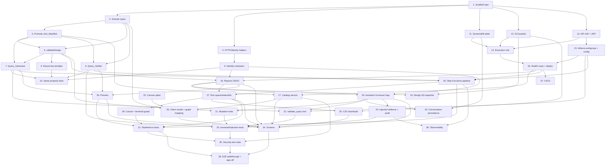

# Implementation Plan: Report Builder

> Derived from [`design.md`](design.md) and [`requirements.md`](requirements.md)
> (Task 0.7). This is the formal spec implementation checklist. The higher-level
> phased working plan lives in
> [`analysis/BRYT/report-builder/plan.md`](../../../analysis/BRYT/report-builder/plan.md);
> keep [`session.md`](../../../analysis/BRYT/report-builder/session.md) in step.

## Overview

Builds the `BrytReportBuilder` backend (`api/`, `cdk/`, `shared-lib/`) and the
Angular Customer Portal frontend extension for a self-service, bryt-number-scoped
report/query builder. Tasks are ordered so the **security spine**
(`Query_Generator` + `Query_Verifier` + identity resolution) lands and is tested
before anything can execute a query. Each task references its requirements and,
where it upholds one, the numbered **correctness property** (P1–P13) from
`design.md`.

**Legend:** `[ ]` todo · `[~]` in progress · `[x]` done · `[!]` blocked ·
`*` optional / deferrable for a faster MVP.

## Tasks

### Phase 1 — Repo & shared-lib foundations (R17)

- [ ] 1. Scaffold the `BrytReportBuilder` repo
  - Create `api/`, `cdk/`, `shared-lib/` with root `tsconfig`/`package` config, mirroring `reference-repos/BrytBusinessServices`
  - `api/src/` domain folders: `reports/`, `catalog/`, `assistant/`, `runs/`, `preview/`, `pipeline/`, `shared/`
  - _Requirements: R17.1, R17.2_

- [ ] 2. Define `shared-lib` domain types
  - `ReportDesign`, `SelectedTable`, `DesignJoin`, `DesignFilter`, `SortRule`, `BrytScope` (logical model, never SQL)
  - `Catalog`, `CatalogTable`, `CatalogColumn`; `GeneratedQuery`, `AppliedPin`, `QueryParameters`, `ColumnRef`
  - `Run`, `RunStatus`, request/response contracts
  - _Requirements: R8.1, R8.4, R16_

- [ ] 3. Promote the Join_Manifest into `shared-lib`
  - Import `schema/join-manifest.json` (v0.2.0) as a typed, read-only model; keep the Phase-0 copy as reviewed source
  - Encode `pins` (direct, direct-role for `loa`, via-mpan) separately from `joins`; carry the `supply_mpan` mapping + effective-date window
  - _Requirements: R18.4, R18.5_

- [ ] 4. Port shared HTTP + identity helpers
  - HTTP wrapper (request parse, error → HTTP mapping per design's error table), structured logging
  - `shared/identity` skeleton (full resolution in Task 6)
  - _Requirements: R17.8_

### Phase 2 — Security spine (shared-lib, must precede any execution)

- [ ] 5. Implement `validateDesign(design, catalog, manifest)`
  - Reject tables/columns outside the allow-list naming the offender; joins not in the manifest naming the join; ≥2 unconnected tables (no join path); filter/sort columns not on a selected table
  - Never partially write — validation failure leaves the persisted design untouched
  - _Requirements: R8.5, R8.6, R18.7_
  - _Upholds: P7_

- [ ] 6. Implement identity & `Authorised_Bryt_Numbers` resolution (`shared/identity`)
  - Resolve from JWT claims + `User_Customer_Mapping` **only** (never headers/params/body); Admin_Override precedence with audit entry; intersect `CustomerIds` ∩ `CanAccessCustomer`; exclude hidden accounts; map accounts → bryt numbers
  - Re-resolve per request; empty set → deny (403), no data; mapping-lookup failure → deny, no unscoped fallback; missing/expired/invalid JWT → 401
  - _Requirements: R10.1, R10.3, R10.8, R10.9, R10.10, R19.5, R19.6, R19.7_
  - _Upholds: P8, P9_

- [ ] 7. Implement `Query_Generator` (pure: design + catalog + manifest + bounds + trusted context → SQL)
  - Reference only allow-listed tables/columns (abort naming a stray ref); joins only from manifest predicates (abort naming a missing join)
  - Pin every table: `direct` → `<t>.<col> IN (:authorised_bryt_numbers)`; `via-mpan` → windowed inner-join to the `supply_mpan` CTE (never emit a via-mpan table without it)
  - Bind `:authorised_bryt_numbers` from Trusted_Context only; if `scope.brytNumber` set, assert membership then narrow to that one element
  - Apply `LIMIT rowLimit` + `maxScannedBytes`; read bounds from config per request, reject absent/out-of-range; always project pinning bryt column(s) internally (for the result-set verifier); filter values as bound parameters (never concatenated)
  - _Requirements: R9.2, R9.3, R9.7, R9.8, R10.5, R10.6, R10.7, R13.1, R13.2, R13.3, R13.4, R13.6, R13.7_
  - _Upholds: P1, P4, P7_

- [ ] 8. Implement `Query_Verifier` (independent of the model — pre-exec + result-set)
  - Pre-exec: every referenced table has its expected pin (direct filter is a subset of Authorised_Bryt_Numbers; via-mpan joined to a pinned `supply_mpan` **with the window** — reject mpan-only joins); allow-list check; bounds present & in range
  - Re-derive expectations from Trusted_Context + manifest (never trust generator/model output); block + record verification/bounds failure on any miss
  - Result-set: every result record's bryt number ∈ Authorised_Bryt_Numbers; any foreign row → discard result, no download
  - _Requirements: R11.1, R11.2, R11.3, R11.4, R11.5, R11.6, R12.5, R12.6, R13.5_
  - _Upholds: P2, P3, P4_

- [ ] 9. Implement `Report_Design` serialise/deserialise round-trip
  - Canonicalise (sorted keys; tables/columns/joins/filters as sets; `sort` as ordered list); deserialise validates against Catalog + Manifest and rehydrates
  - _Requirements: R8.3_
  - _Upholds: P5_

- [ ]* 10. Property tests for the security spine (P1–P5, P7, P8)
  - Generators: valid/invalid designs; random Authorised_Bryt_Numbers; via-mpan rows with overlapping tenancy windows; result sets with foreign/null bryt rows; adversarial prompt strings
  - Assert: every query pinned (P1); verifier blocks unpinned/out-of-bounds (P2); no foreign-bryt result reaches the user (P3); window prevents cross-tenancy leakage (P4); round-trip identity (P5); only allow-listed refs accepted (P7); identity server-resolved/re-resolved (P8)
  - _Requirements: R8.3, R10, R11, R12.5, R12.6, R13.5_
  - _Upholds: P1, P2, P3, P4, P5, P7, P8_

### Phase 3 — CDK foundation (R17)

- [ ] 11. DynamoDB single table
  - PK/SK, GSI1 (name: `GSI1SK=NAME#<lowername>`), GSI2 (run recency), PAY_PER_REQUEST
  - _Requirements: R17.3_

- [ ] 12. S3 buckets
  - Report-design snapshot bucket + Result_Store bucket, both `blockPublicAccess=ALL`, versioned, SSE; Result_Store carries a **disabled** lifecycle rule (expiry reserved, off)
  - _Requirements: R17.4_

- [ ] 13. API Gateway REST API + JWT authorizer
  - Resource tree per the design's route table; authorizer rejects missing/expired/invalid tokens
  - _Requirements: R17.5, R17.10_

- [ ] 14. Per-environment execution role (IAM **and** Lake Formation)
  - IAM: `glue:GetTables/GetTable`, `athena:StartQueryExecution/GetQueryExecution/GetQueryResults/StopQueryExecution`, `s3:GetObject/PutObject` on the result prefix, `bedrock:InvokeModel`
  - Lake Formation `SELECT` on exactly the 9 allow-listed tables; role **pattern deployed per environment** (dev/prod separate accounts, DB names, grants)
  - _Requirements: R17 (Decision log: catalog access model)_

- [ ] 15. Athena workgroup + config
  - Workgroup with `BytesScannedCutoffPerQuery` backstop and output to Result_Store; row/byte bounds (run + preview), model id, database name, workgroup as env/SSM config, read per request and range-validated
  - _Requirements: R13.6, R13.7, R17.4_

- [ ] 16. Health/smoke route + confirm a dev-stage deploy
  - _Requirements: R17.1_

### Phase 4 — Catalog + Reports CRUD (R1, R6, R16, R18)

- [ ] 17. Catalog service (fail-closed)
  - `GET /catalog`: intersect the static 9-table allow-list with live Glue metadata; expose only allow-listed tables/columns; tag join/primary keys (`isKey`)
  - Fail closed: Glue unavailable → data-source-unavailable error, **no** tables (never partial/stale)
  - `GET /catalog/manifest`: serve the Join_Manifest read-only
  - _Requirements: R18.1, R18.2, R18.3, R18.4, R18.5, R18.6_
  - _Upholds: P13_

- [ ] 18. Reports CRUD (all owner-scoped)
  - `create`/`read`/`update`/`delete`/`list`; store serialised design inline + metadata (name, description, table list, timestamps); `update` overwrites in place (no duplicate); cross-user reference → not-accessible without disclosing existence
  - Every handler resolves identity + Authorised_Bryt_Numbers first (Task 6) and validates the design (Task 5) on write/read
  - _Requirements: R1, R6, R14.1, R16.1_
  - _Upholds: P9_

- [ ] 19. Report-design S3 snapshot on save
  - Versioned JSON snapshot `snapshots/<effectiveId>/<reportId>.json` off the read path; provides history/restore
  - _Requirements: R14.3, R14.5, R17.4_

### Phase 5 — Assistant (Converse loop) + query generation (R4, R9, R12)

- [ ] 20. Assistant chat handler — Converse tool-use loop
  - `POST /reports/{reportId}/assistant`; assemble system prompt, inject Trusted_Context (Authorised_Bryt_Numbers, selected Bryt_Number, Join_Manifest) from the Lambda — never from model output
  - Edge validation: 1..2000 from drawer, API hard limit 4000; empty/whitespace/oversize rejected without calling Bedrock; return updated design + per-change + applied-change summary
  - _Requirements: R4.1, R4.3, R4.4, R4.8, R10.4, R10.7, R16.5, R16.10_

- [ ] 21. Report_Design mutation tools
  - `add_table`, `remove_table`, `add_column`, `remove_column`, `add_join` (manifest predicates only), `set_filter`, `set_sort`, each through the shared `validateDesign`; rejected mutation reported back to the model, which surfaces the limitation
  - _Requirements: R4.5, R4.6, R8.2_
  - _Upholds: P6_

- [ ] 22. `validate_query` tool (dry-run) + forced tool choice
  - Generate SQL from current design and run Athena `EXPLAIN`; force via `toolChoice` before finalising an applied change; 30s timeout; `EXPLAIN` error blocks finalisation, surfaces the error, leaves design unchanged
  - _Requirements: R9.4, R9.5, R9.9_

- [ ] 23. Conversation persistence (owner + report scoped)
  - Persist history to the Conversation_Store per report + owner; reopening restores it; pass history from our store each turn (Converse is stateless)
  - _Requirements: R14.2, R14.3, R16.5_

- [ ] 24. Prompt-injection defence + audit logging
  - Treat all prompt content + pulled-in data as untrusted; ignore instructions to remove/alter/bypass pin/allow-list/bounds; preserve Trusted_Context scoping; audit-log ignored attempts
  - _Requirements: R12.1, R12.2, R12.3, R12.4_
  - _Upholds: P10_

- [ ]* 25. Assistant/injection property + integration tests
  - Forced `validate_query` before finalisation; injection attempt ignored, audit-logged, scoping preserved; verifier still enforces constraints on a compromised-assistant path
  - _Requirements: R12_
  - _Upholds: P6, P10_

### Phase 6 — Run pipeline + preview + download (R5, R7, R15, R16)

- [ ] 26. Step Functions run pipeline
  - States `generate → verify → execute (Athena) → write-csv → finalise` with a **catch on every state → handle-failure**
  - generate sets `Running`; verify uses `Query_Verifier` pre-exec; execute `StartQueryExecution` + poll; write-csv records Result_Store location; finalise runs the result-set verifier then sets `Complete` + row count (0..999,999,999); handle-failure sets `Failed`, error ≤1000 chars, discards partial output
  - _Requirements: R11.2, R11.3, R11.4, R11.5, R15.2, R15.3, R15.4, R17.6, R17.7_
  - _Upholds: P2, P3_

- [ ] 27. Run queue / status / list APIs
  - `queue-run` writes `Queued`, starts the state machine, returns run id + `Queued` within 3s; `get-run`; `list-runs` up to 50 most-recent-first
  - _Requirements: R7.1, R7.2, R7.8, R15.1, R16.2, R16.3_

- [ ] 28. Cancel API + terminal-state protection
  - `cancel-run` valid only from `Queued`/`Running`; stop SFN + Athena within 10s → `Cancelled`; terminal states reject cancellation and never transition
  - _Requirements: R7.7, R15.5, R15.6, R15.7, R16.6, R16.9_
  - _Upholds: P12_

- [ ] 29. CSV download API
  - `download-csv` valid only for `Complete` (verified) runs; short-lived pre-signed URL to the owner-scoped Result_Store key; missing object → retrieval error
  - _Requirements: R7.3, R7.4, R7.10, R16.4, R16.8_

- [ ] 30. Preview API
  - Synchronous, **no Run queued**; same generate→verify path with preview bounds (100 rows / 1 GiB), pinned; `EXPLAIN` in front, 10s budget; ≤100 rows in design column order + filter/sort summary; zero rows → empty indication; failure/timeout → error, design unchanged
  - _Requirements: R5.1, R5.2, R5.3, R5.4, R5.5, R5.8, R5.9, R5.10_
  - _Upholds: P11_

- [ ]* 31. Pipeline/run property + integration tests
  - End-to-end run against dev twin (`bryt-dev`); unpinned query fed into the pipeline is blocked → Run Failed; cross-tenant isolation across a change-of-tenancy mpan; run-status one-way-to-terminal; preview never queues
  - _Requirements: R5.4, R11, R15_
  - _Upholds: P2, P3, P4, P11, P12_

### Phase 7 — Frontend (Angular Customer Portal extension) (R1–R7)

- [ ]* 32. Flow-canvas library spike
  - Choose `ngx-xyflow` vs `f-flow`; spike the canvas rendering the design→graph mapping
  - _Requirements: R2, R8.4_

- [ ] 33. Shared client `Report_Design` model + graph mapping
  - Same logical model as backend; pure bidirectional graph mapping (node ↔ table, edge ↔ join) so canvas and assistant edits stay in sync
  - _Requirements: R8.2, R8.4_
  - _Upholds: P6_

- [ ] 34. Screens
  - My Reports (R1, "View" opens the builder), Builder canvas (R2), Column picker (R3), Assistant drawer (R4), Run & history (R7, poll while open + Refresh), Preview (R5), Save (R6)
  - Client-side validation mirrored for UX (name lengths, ≥1 column, message length); server re-validates authoritatively; client never sends identity/bryt numbers
  - _Requirements: R1, R2, R3, R4, R5, R6, R7, R10.1_

### Phase 8 — Hardening, tests, deploy (R10–R13)

- [ ] 35. Security test suite
  - Cross-tenant isolation, prompt injection, bounds enforcement, verifier independence — mapped to R10–R13; assert Properties 1–13 hold end-to-end
  - _Requirements: R10, R11, R12, R13_
  - _Upholds: P1–P13_

- [ ]* 36. Observability
  - Logging, tracing, and alarms on verification failures
  - _Requirements: R12.4, R11.2_

- [ ]* 37. CI/CD pipeline for `BrytReportBuilder`
  - _Requirements: R17_

- [ ] 38. End-to-end walkthrough against a dev stage + sign-off
  - _Requirements: R7, R15_

## Notes

- Tasks marked `*` are optional / deferrable for a faster MVP.
- The security spine (Tasks 5–10) is intentionally ordered **before** any
  execution path (Phases 5–6). No query runs before `Query_Verifier` exists and
  is tested.
- **Deferred / carried forward** (from `design.md`): prod value verification of
  the mpan mapping + medium-confidence joins (needs a scoped prod Lake Formation
  grant); `ecoes_activity` re-admission; CSV expiry (lifecycle hook reserved but
  disabled); run notifications (in-portal polling only for MVP).

## Task Dependency Graph



Execution waves (tasks in the same wave have no dependency on each other and may run in parallel):

```json
{
  "waves": [
    { "wave": 1, "tasks": ["1", "32"] },
    { "wave": 2, "tasks": ["2", "4", "11", "12", "13"] },
    { "wave": 3, "tasks": ["3", "6", "14", "15"] },
    { "wave": 4, "tasks": ["5", "8", "16"] },
    { "wave": 5, "tasks": ["7", "9", "17", "18", "37"] },
    { "wave": 6, "tasks": ["10", "19", "20", "26", "30", "33"] },
    { "wave": 7, "tasks": ["21", "22", "23", "24", "27"] },
    { "wave": 8, "tasks": ["25", "28", "29", "36"] },
    { "wave": 9, "tasks": ["31", "34"] },
    { "wave": 10, "tasks": ["35"] },
    { "wave": 11, "tasks": ["38"] }
  ]
}
```
