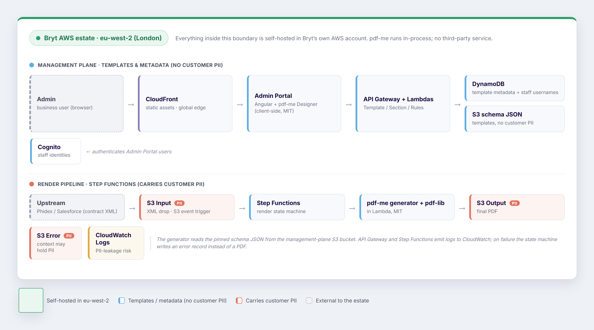

## Overview

This assessment covers the Bryt Energy Contract Note Rework: the template
management system and serverless render pipeline built with **pdf-me**. It sets out the main
service interactions and evaluates whether the design raises any data-sovereignty or GDPR
concerns, given that pdf-me is open source and deployed entirely within Bryt's own AWS estate
in the **eu-west-2 (London)** region.

The headline: the entire solution is **self hosted, safe and defensible**. The residual risk is not pdf-me or
the region; it is the operational plumbing around the two buckets that carry customer PII,
tracked as caveats at the end of this document.

## Service interaction

The diagram below shows the main pieces of the solution and, critically, **where customer
personal data actually flows**. Nodes tinted red carry customer PII; blue nodes carry
templates and metadata only; everything inside the green boundary is self-hosted in Bryt's
own AWS account in eu-west-2.

The two flows are deliberately separated. The **management plane** (top) is where business
users author templates; it handles layout and metadata, not customer data. The **render
pipeline** (bottom) is where contract data flows: an XML drop triggers the Step Functions
state machine, which renders sections with the pdf-me generator and stitches the final PDF.
Only the input, output and error buckets in that lower lane hold customer PII.

## Key facts

> {{check}} **pdf-me is a library, not a service.** It is MIT-licensed and open source. The Designer runs client-side in the admin's browser; the generator runs in-process inside a Lambda. No contract data is sent to pdfme.com or any external endpoint.

> {{check}} **No new processor or sub-processor.** Because pdf-me executes inside Bryt's own compute, it introduces no third party to the data flow; nothing to add to a GDPR processor register or a data-processing agreement.

> {{check}} **Everything runs in eu-west-2.** S3 (input, output, error), DynamoDB, the Lambdas and Step Functions are all in the London region, so customer PII is stored and processed in the UK.

> {{check}} **The lawful basis for location holds.** Under UK GDPR this is domestic processing. For EU data subjects, the UK holds an EU adequacy decision, so transfers are lawful with no additional safeguards required.

> {{check}} **The PII footprint is narrow.** Customer PII lives only in the XML input, the PDF output and (potentially) the error bucket. The template, schema and metadata stores carry layout, not customer data.

## Overall position

The self-hosted, MIT-licensed, eu-west-2 argument is sound. pdf-me does not weaken data
sovereignty because it never receives data outside the estate, and the region choice keeps all
processing in the UK under an adequate legal basis. What remains is a short list of
operational controls that an auditor or DPO would expect to see evidenced; none are blockers,
but they are where a "self-hosted so we're fine" assumption typically springs a leak.

## Caveats to close out

Each item below carries a risk rating and a note on the evidence that closes it. Four have been
reviewed and verified; three remain in progress, as flagged in the Verification column.

| # | Caveat | Risk | Status | Evidence that closes it | Verification |
|---|--------|------|--------|--------------------------|--------------|
| 1 | CloudWatch log leakage | High | Investigating | Confirm Lambdas do not log parsed contract data; review the error bucket's open-ended `context` field for PII; set explicit log-retention periods. | {{amber:Investigating}} |
| 2 | Font loading stays in-estate | Medium | Closed | Verify pdf-me fonts (e.g. NotoSans) are bundled into the Lambda / front-end bundle, not fetched from a Google Fonts CDN at render time. | {{green:Checked OK}} |
| 3 | CloudFront edge caching | Low | Closed | Confirm no API / PII responses are cached at the global edge; only static, non-personal assets are distributed. | {{green:Checked OK}} |
| 4 | Region pinning of all stores | Medium | Closed | Verify no DynamoDB global tables, no cross-region S3 replication, and that any backup / DR target is in-region (or another adequate jurisdiction). | {{green:Checked OK}} |
| 5 | Encryption at rest and in transit | Low | Investigating | Confirm S3 and DynamoDB encryption at rest (KMS) and TLS on API Gateway; record for the audit trail. | {{green:S3 OK}} {{amber:Dynamo Investigating}} |
| 6 | Retention & right to erasure | High | Needs discussion | Define lifecycle / retention policies on the output bucket and a deletion path, to satisfy storage-limitation and right-to-erasure obligations. | {{blue:Needs Discussion}} |
| 7 | Preview with real customer data | Medium | Closed | Ensure the Designer previews templates with sample / synthetic data only, so live PII never lands in an admin's browser. | {{green:Checked OK}} |

## Notes

- **pdf-me licensing:** MIT, per the project repository (github.com/pdfme/pdfme).
- **Region:** all stateful services in eu-west-2 (London); adequacy decision applies for EU data subjects.
