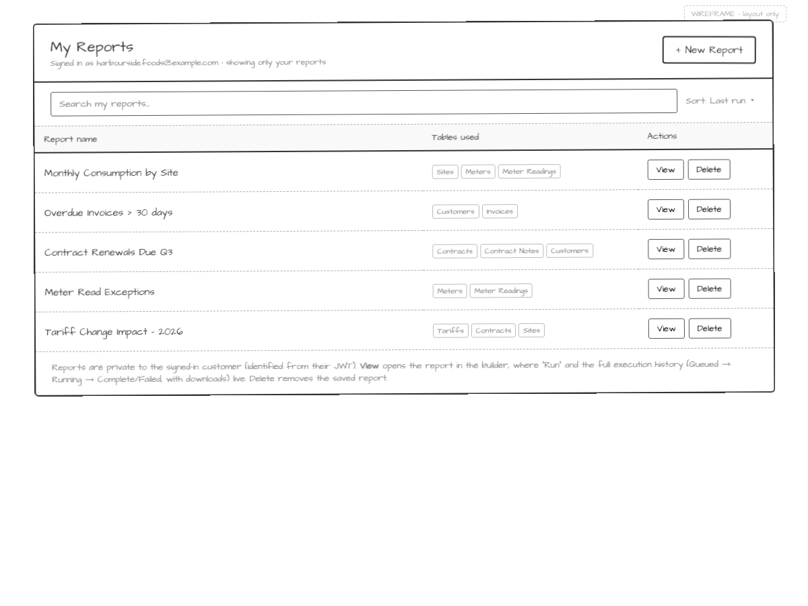
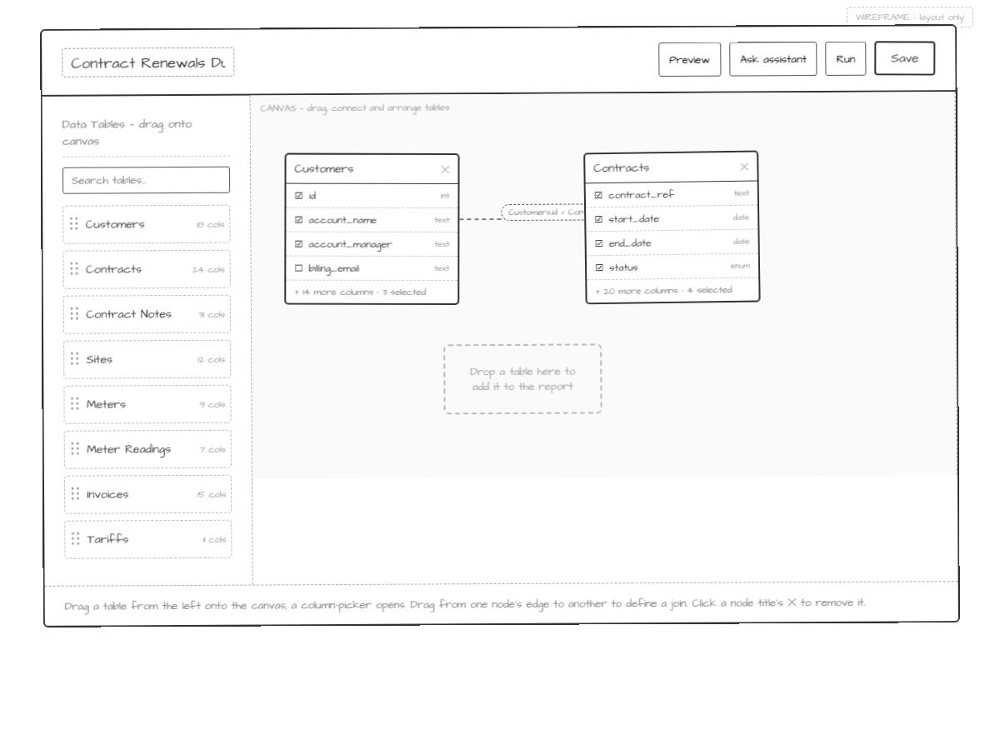
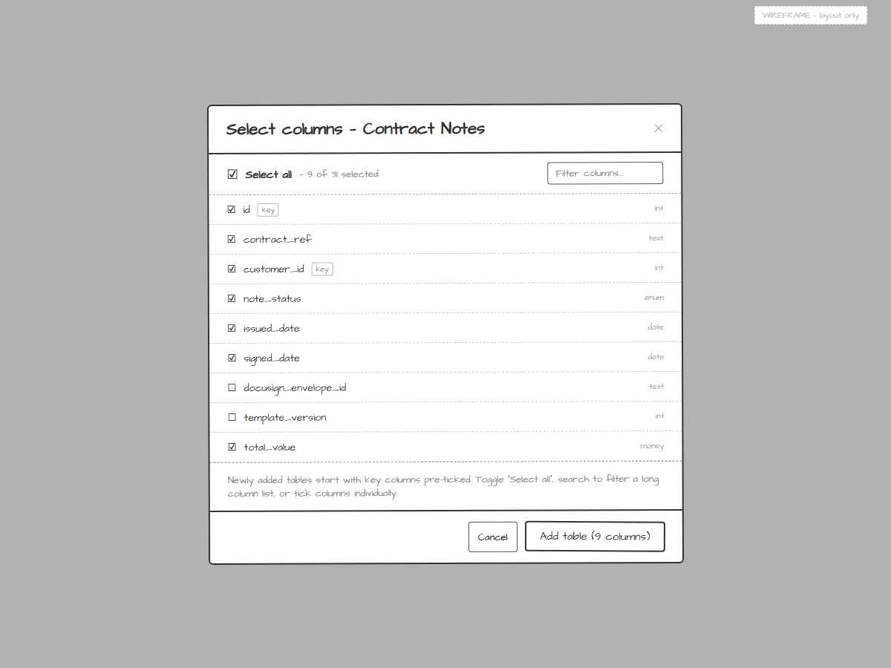
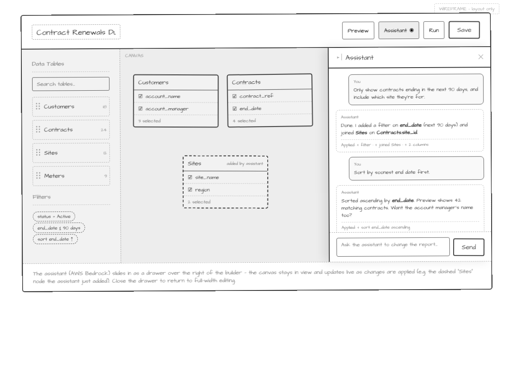
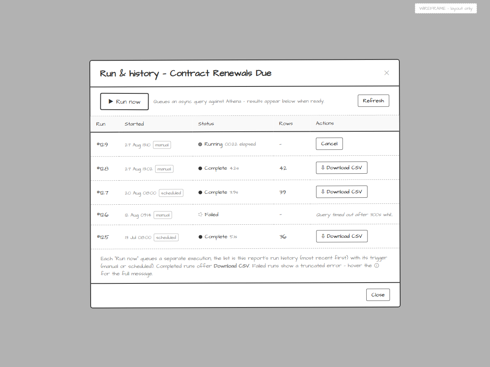
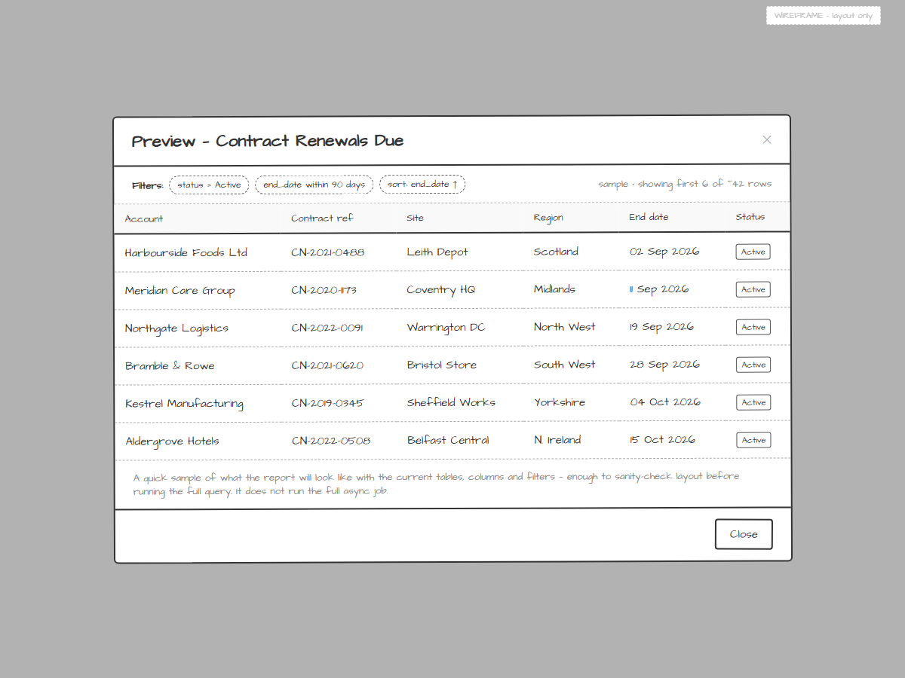
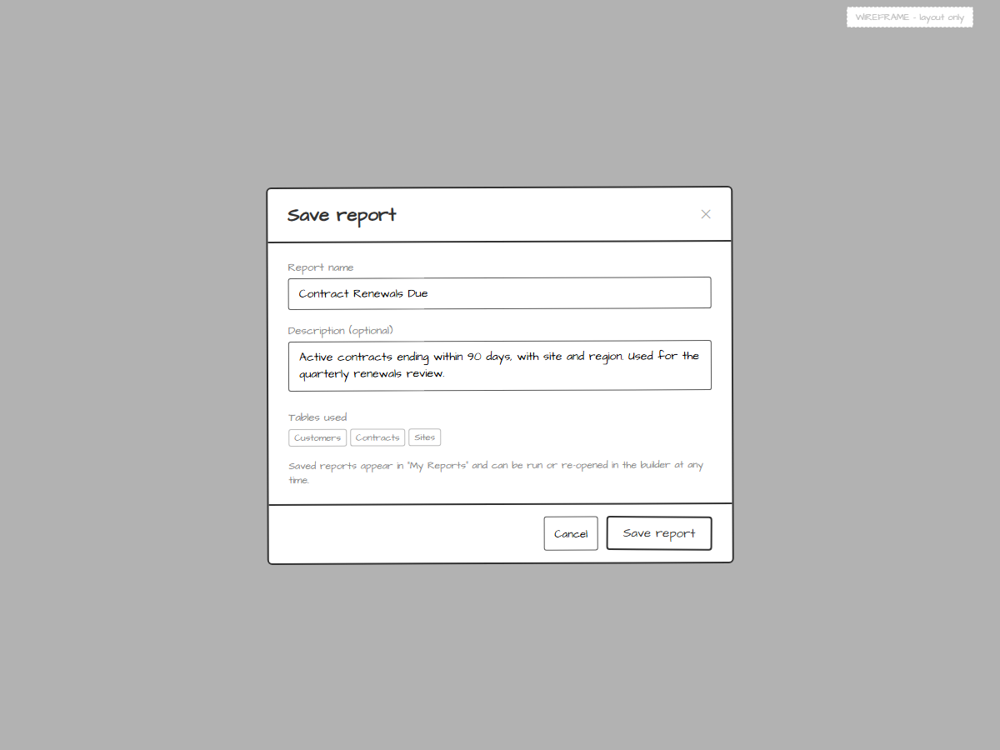

# Report Builder — Screen Mockups

Low-fidelity, hand-drawn wireframes for a **simplified report / query builder**
proposed as an extension to the (Angular) Customer Portal. The goal is a
drag-and-drop experience for **non-technical users**: drop tables onto a flow
canvas, pick the columns you want per table, iterate on the design with an AI
assistant (AWS Bedrock + Core), then persist the report for reuse.

These are throwaway artefacts for validating **layout and flow** — not brand,
colour, or pixels. The sketchy font + tilt + "WIREFRAME" label are intentional.

Candidate flow libraries referenced in the brief: a ReactFlow-style graph via
[`ngx-xyflow`](https://github.com/knackstedt/ngx-xyflow) or
[`f-flow`](https://github.com/Foblex/f-flow).

## Screens

| # | Screen | Preview |
|---|--------|---------|
| 01 | My Reports |  |
| 02 | Builder canvas |  |
| 03 | Select columns (modal) |  |
| 04 | Assistant / iterate |  |
| 05 | Run & history (modal) |  |
| 06 | Report preview |  |
| 07 | Save report (modal) |  |

---

### 01 — My Reports
**Layout:** Header with "+ New Report" and a note that the list is scoped to the
signed-in customer (identified from their JWT). A single search + sort toolbar.
A table of the user's saved reports: name, the tables each uses (as badges), and
per-row actions.

**Key interactions:**
- Reports are private to the signed-in customer — no sharing or owner concept.
- "+ New Report" opens the drag-and-drop builder (screen 02).
- Row actions are just **View** and **Delete**. View opens the report in the
  builder, where running the query and the full execution history live (05).

### 02 — Builder canvas
**Layout:** Editable report name in the header + Preview / Ask assistant /
**Run** / Save. Left panel is the **Data Tables palette** (searchable,
each row a draggable handle showing its column count). Right side is the **flow
canvas**: table "nodes" showing their selected columns, a dashed join line with a
join-condition badge between two nodes, and a "drop a table here" hint.

**Key interactions:**
- Drag a table from the palette onto the canvas → the column picker opens (03).
- Each node lists selected columns with tick state and a "+ N more · M selected" summary.
- Drag from one node's edge to another to define a join.
- ✕ on a node title removes that table from the report.
- **Run** opens the executions modal (05) to trigger a new async run and review
  past runs.

### 03 — Select columns (modal)
**Layout:** Modal titled for the dropped table (e.g. "Contract Notes"). A
**Select all** control with a live "X of N selected" count and a column filter.
Below, the full column list with checkboxes, data types, and `key` tags on
join/primary keys.

**Key interactions:**
- Directly addresses the brief: on add, list **all** columns with **select all**
  or **individual** selection.
- Newly added tables pre-tick key columns; users filter a long list by name.
- "Add table (N columns)" confirms and drops the node onto the canvas.

### 04 — Assistant (drawer over the builder)
**Layout:** The builder screen (02) with the **assistant popped over as a drawer
from the right edge**. The canvas and palette stay in view (dimmed by a light
scrim) while the drawer holds the conversation and a composer at the bottom. The
"Assistant" header button shows an active state.

**Key interactions:**
- Opened from the builder's "Ask assistant" button; close (✕) returns to
  full-width editing.
- User asks for changes in plain language ("only contracts ending in 90 days,
  include the site").
- Assistant (AWS Bedrock) edits the live design, describes each change, and shows
  an "Applied: …" summary; the **canvas updates behind the drawer** (e.g. the
  dashed "Sites" node it just added) so the user sees the effect immediately.

### 05 — Run & history (modal)
**Layout:** Launched from the builder's "Run & history" button. A top bar with a
**Run now** action (queues an async Athena query) and Refresh. Below, a table of
this report's past executions (most recent first): run number, started time +
trigger (manual/scheduled), status pill, row count, and per-run actions.

**Key interactions:**
- "Run now" queues a fresh execution; a Running/Queued row appears at the top and
  can be Cancelled.
- Completed runs offer a single **Download CSV** action.
- Failed runs show a **truncated error** inline, with the full message on hover
  (ⓘ tooltip) — no separate error screen.
- Shares the status visual language (dots + pills) with the builder.

### 06 — Report preview (dialog)
**Layout:** A modal/dialog opened from the builder's "Preview" button. A
filter+sort summary strip and a results table matching the canvas column
selection and order, framed as a **sample snippet** (e.g. "first 6 of ~42 rows").

**Key interactions:**
- Shows a quick sample of the report layout to sanity-check before running — it
  does **not** run the full async job.
- A single **Close** button (and header ✕) dismisses the dialog back to the builder.

### 07 — Save report (modal)
**Layout:** A simple form with report name, an optional description, and the
tables used shown as badges.

**Key interactions:**
- Persists the design for reuse; it then appears in "My Reports" (01).
- No folders, scheduling, or sharing — reports are private to the signed-in customer.

---

## Regenerate

```
python .kiro/skills/screen-mockups/shoot.py analysis/BRYT/report-builder/mockups --width 1200 --check
```

Edit the `mockups/*.html` files and re-run to refresh the PNGs.
