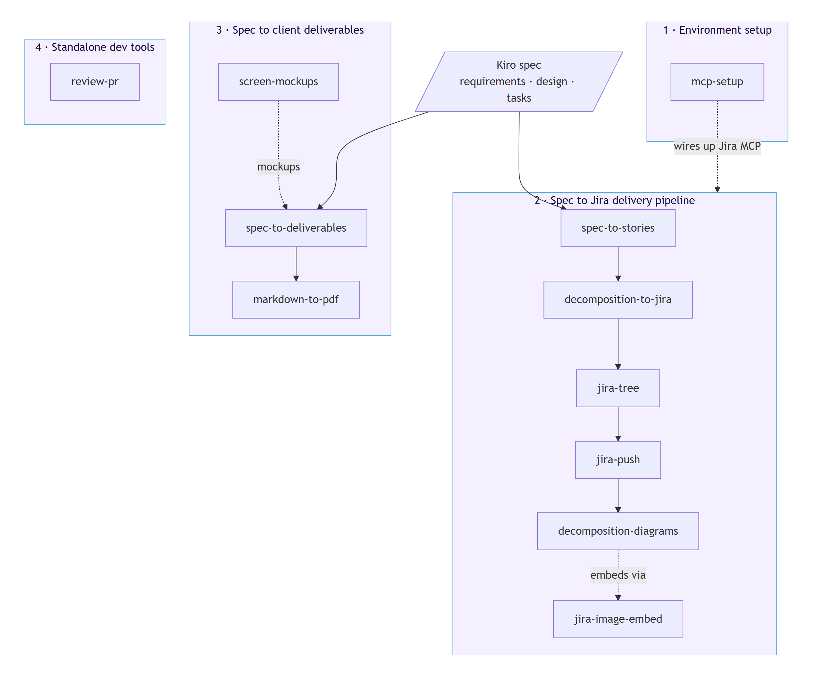
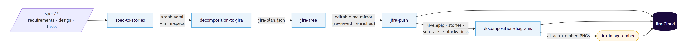
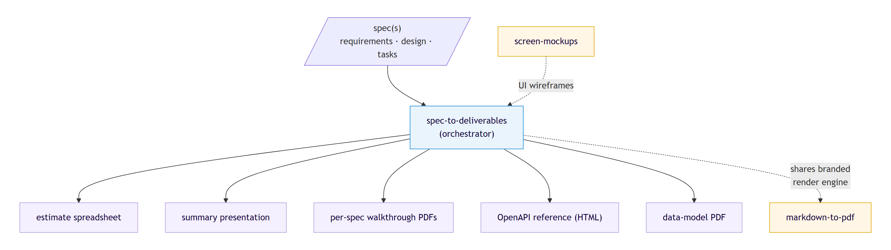

# Kiro Skills — Developer Guide

This guide documents the skills bundled under `.kiro/skills/`. It is written for a
developer picking these up for the first time: what each skill is for, what it takes
in, what it produces, and — most importantly — how they **chain together** into a few
end-to-end workflows.

## What a skill is

Each skill is a self-contained folder under `.kiro/skills/<name>/` with a `SKILL.md`
at its root describing the workflow. Most follow the same **hybrid** pattern:

- A small **deterministic engine** (`engine/*.py`) does the mechanical, testable work —
  graph maths, plan building, rendering, config merges. It never calls out to Jira or
  the network on its own, so it can be unit-tested in isolation (`python -m pytest` from
  the bundle root).
- The **agent** (Kiro) does the judgement work the engine can't — reading a spec,
  authoring prose, and making the MCP or `gh` calls.

Skills are `inclusion: manual`: they load only when you invoke them, so they stay out
of context until needed. They fall into four groups.



At a glance:

| Group | Skills | Purpose |
|-------|--------|---------|
| 1 · Environment setup | `mcp-setup` | Get the MCP servers the other skills rely on |
| 2 · Spec to Jira | `spec-to-stories`, `decomposition-to-jira`, `jira-tree`, `jira-push`, `decomposition-diagrams`, `jira-image-embed` | Turn a spec into a live, linked Jira backlog |
| 3 · Spec to deliverables | `spec-to-deliverables`, `screen-mockups`, `markdown-to-pdf` | Turn a spec into client-facing documents |
| 4 · Standalone tools | `review-pr` | Focused, one-shot developer tasks |

---

## 1 · Environment setup

Start here. The Jira pipeline (group 2) and the browser-based rendering (group 3) both
depend on MCP servers being connected. `mcp-setup` gets a developer's machine to the
D55 baseline.

### mcp-setup

Reconciles a developer's Kiro MCP configuration with the D55 reference server set
(`playwright`, `excalidraw`, `atlassian`). It detects which servers are missing, adds
**only those** without clobbering existing servers or `autoApprove` lists, wires in
per-user secrets, and verifies each connects.

- **Use it when** onboarding a new developer, or extending an existing setup with a
  server they don't have yet.
- **Takes** the target workspace and, for the `atlassian` server, a per-user Jira email
  and API token.
- **Produces** an updated `.kiro/settings/mcp.json` (merged non-destructively) and a
  git-ignored `.kiro/settings/atlassian.env` holding the token.
- **Key traits:** additive, idempotent (re-running fills only gaps), secrets never land
  in `mcp.json` or logs.

It matters for the rest of this guide because the whole of group 2 talks to Jira through
the `atlassian` MCP server, and group 3 renders through `playwright`. If those aren't
connected, `mcp-setup` is the fix.

---

## 2 · Spec to Jira delivery pipeline

This is the flagship chain. It turns a spec we built together (`requirements.md` /
`design.md` / `tasks.md` under `.kiro/specs/<name>/`) into a live, fully linked Jira
backlog — an epic, a story per user story, a sub-task per task, and "blocks" links that
encode the dependency order. Each stage hands a concrete artifact to the next.



The golden thread through the whole pipeline is **idempotency by identity label**. Every
issue carries a stable label derived from the parent spec and its id (`s2s-<parent>-US-01`,
and so on). Every stage searches for that label before creating anything, so re-running
never duplicates issues or links.

### spec-to-stories — Stage 1 (decompose)

Reads the parent spec and slices it into **mini-specs**, one per user story, each a
self-contained Kiro spec a developer could pull into their own workspace. It builds a
component dependency graph, validates it, topologically sorts the stories into parallel
**waves**, and exports everything.

- **Takes** a spec folder `.kiro/specs/<name>/`.
- **Produces** `.kiro/specs/<name>/decomposition/`: `graph.yaml` (components, edges,
  waves), `jira-import.csv/json`, a `README.md` with a mermaid dependency graph, and
  `stories/<id>/` folders each with `manifest.yaml` plus authored `requirements.md`,
  `design.md`, `tasks.md`.
- **Gate:** generation is blocked until the graph is valid (`dec.ok`) — no dangling
  dependencies, no duplicate component owners, no cycles, and every parent requirement
  covered by some story.

The engine does the graph maths; the agent authors each mini-spec faithfully from the
parent (lift content, don't invent).

### decomposition-to-jira — Stage 2 (build the plan)

Turns the decomposition into an ordered, idempotent **creation plan** — but doesn't push
it. This is the deterministic bridge between "we have a decomposition" and "we have Jira
issues".

- **Takes** the `decomposition/` folder from stage 1 (`graph.yaml` + manifests).
- **Produces** `jira-plan.json`: the epic, stories (each with sub-tasks), the "blocks"
  links, waves, and the identity labels. The engine also prints a summary for sign-off.
- **Note:** it can also push straight to Jira via the Atlassian MCP for a quick path, but
  the richer, reviewable route is to hand the plan to `jira-tree` next.

### jira-tree — Stage 3 (review and enrich)

Renders the plan into an **editable filesystem mirror** of the Jira hierarchy — an
`epic.md`, a `story.md` per story, a file per sub-task, and a `_links.md`. Each file's
markdown **body is its Jira description**, so you can enrich, diff, and review it in a PR
before anything lands in Jira.

- **Takes** `jira-plan.json` from stage 2.
- **Produces** `.kiro/specs/<name>/decomposition/jira-tree/` with seeded descriptions
  (acceptance criteria, suggested-approach snippets) carrying `TODO` placeholders.
- **The work here:** enrich the bodies to house style, ideally via an **iterative
  sub-agent pass** that batches by story and loops until `find_placeholders` is empty and
  `validate_tree` returns `[]`. Writes are non-destructive by default, so regenerating
  never clobbers hand edits.

This is the human-in-the-loop step: the tree is the surface where a person shapes what
the Jira backlog will actually say.

### jira-push — Stage 4 (push to live Jira)

Takes the reviewed, enriched tree and creates the matching issues in **live Jira**,
idempotently.

- **Takes** the validated `jira-tree/`.
- **Produces** live issues: an epic, a story per `US-xx`, a sub-task per sub-task, and the
  "blocks" links — plus a `_placeholders.md` correlating tree keys to real Jira keys.
- **How it works:** the engine builds an ordered push plan (epic → each story → its
  sub-tasks → links) and **reconciles** it against what already exists, so a re-run
  reports all `reuse`/`skip`. After creating, it rewrites cross-references in the bodies
  from tree keys (`US-04`) to real, clickable Jira keys.
- **Guardrails:** trial against the `TEST` project first; only touch a real project (e.g.
  `BRYT`) on explicit confirmation. Writes are never auto-approved.

Why split from `jira-tree`? `jira-tree` owns authoring; `jira-push` owns delivery. Keeping
them apart lets the push logic (ordering, reconciliation) be unit-tested without a tree
generator or a live Jira.

### decomposition-diagrams — Optional final polish

Once the issues exist, this enriches them with **architecture diagrams**: a per-story
diagram (what the story builds and where it's used, derived from `graph.yaml`) and a
hand-authored epic **service-interaction** diagram. It renders them to PNG, mirrors the
explanatory prose back into the tree, and embeds each diagram **inline at the top of the
matching Jira issue**.

- **Takes** the `decomposition/` folder (for `graph.yaml` and the tree) plus the
  already-pushed live issues.
- **Produces** `diagrams/*.mmd` + `*.png` (the regenerable source of truth), enriched
  tree bodies, and inline diagrams on the Jira issues.
- **The core learning:** Jira Cloud **cannot** embed an image from a markdown description
  — the markdown path renders a broken placeholder. So this skill delegates the actual
  embedding to `jira-image-embed`.

### jira-image-embed — Supporting utility

Embeds images **inline** in a Jira Cloud issue description via **raw ADF** with a `media`
node, talking to the Jira REST API directly (no MCP tool can do this). It attaches,
embeds, and **verifies** every write (the stored ADF kept the node, and the rendered
description contains an ``).

- **Used by** `decomposition-diagrams` to embed rendered diagrams, and directly to attach
  design mockups (from `screen-mockups`) to frontend tickets.
- **Key traits:** idempotent (attachments dedupe by filename, embeds by media URL),
  read-before-write (inserts into the real ADF rather than overwriting).

---

## 3 · Spec to client deliverables

Where group 2 is developer-facing (a backlog to build from), group 3 is **client-facing**:
polished documents that explain and cost the work.



### spec-to-deliverables — Orchestrator

The parent skill. It reads one or more specs, decides which deliverables apply, and
delegates to focused child skills that live alongside it. It bundles a generalised,
brand-configurable render engine (Playwright + D55 branding) shared by all children.

- **Takes** one or more spec folders and an optional output root (default
  `deliverables/<spec>/`).
- **Produces**, per what the spec supports:
  - an **estimate spreadsheet** (the single source of truth for day figures),
  - a **summary presentation** (branded HTML deck),
  - per-spec **walkthrough PDFs**,
  - an **OpenAPI reference** (Redoc HTML) where a spec defines an API,
  - a **data-model document** where a spec defines entities.
- **Pattern:** establish the estimate spreadsheet first (so figures are never hardcoded
  twice), then build the rest, then a `regenerate_all.py` so one command rebuilds
  everything.

### screen-mockups — Feeds the deliverables

Turns a prompt, design doc, or spec into hand-drawn-style **UI wireframes** — one
self-contained HTML file per screen, each screenshotted to a PNG, indexed from a
`screen-mockups.md`. The deliberately sketchy look keeps reviewers on layout and flow
rather than pixels.

- **Use it when** you want low-fidelity wireframes to validate structure with
  stakeholders — fast and throwaway, not pixel-perfect comps.
- **Feeds into** the walkthrough sections of `spec-to-deliverables`, and the mockups can
  be embedded onto frontend Jira tickets via `jira-image-embed`.

### markdown-to-pdf — Shared rendering foundation

Turns any Markdown file into a branded, standalone A4 PDF (D55 cover, logos, typography,
tables, callouts) with a single command. Free-standing — it bundles its own converter and
brand assets.

- **Use it when** the source is already Markdown and you just want it rendered to a
  branded PDF (this very guide is rendered with it).
- **Takes** a `.md` file plus optional cover fields (via CLI flags or YAML front matter).
- **Produces** a self-contained HTML and an A4 PDF.
- **Note on diagrams:** it renders a ` ```mermaid ` block as a plain code block, so
  diagrams meant for the PDF should be pre-rendered to images and embedded with
  `` — which is exactly what this guide does.

---

## 4 · Standalone developer tools

### review-pr

Fetches a GitHub Pull Request (via the `gh` CLI), performs an iterative, resumable code
review, and produces a findings summary plus a polished, postable PR comment.

- **Takes** a PR URL or `owner/repo #number`.
- **Produces** `PRs/<repo>-<number>/`: `context.md`, `state.md` (for resume), `summary.md`
  (working notes), and `review-comment.md` (the comment to post).
- **How it works:** a deterministic engine renders the comment (findings table, positives,
  verdict table) from structured findings so the format is always consistent and testable;
  the agent does the reviewing. Posting is never auto-approved — it always confirms first.

It's standalone (no pipeline), but shares the house pattern: a tested engine for the
mechanical rendering, the agent for judgement.

---

## Putting it together

A typical end-to-end run looks like this:

1. **`mcp-setup`** once, so the `atlassian` and `playwright` servers are connected.
2. Build a spec with Kiro under `.kiro/specs/<name>/`.
3. For delivery: **`spec-to-stories`** → **`decomposition-to-jira`** → **`jira-tree`**
   (enrich) → **`jira-push`** → optionally **`decomposition-diagrams`** (which leans on
   **`jira-image-embed`**). The result is a live, linked, diagrammed Jira backlog.
4. For the client: **`spec-to-deliverables`**, pulling in **`screen-mockups`** for
   wireframes and **`markdown-to-pdf`** for any ad-hoc branded document.
5. Throughout code review: **`review-pr`** on each PR.

The two big chains (groups 2 and 3) both start from the same spec but serve different
audiences — one produces the work plan, the other explains and costs it.
